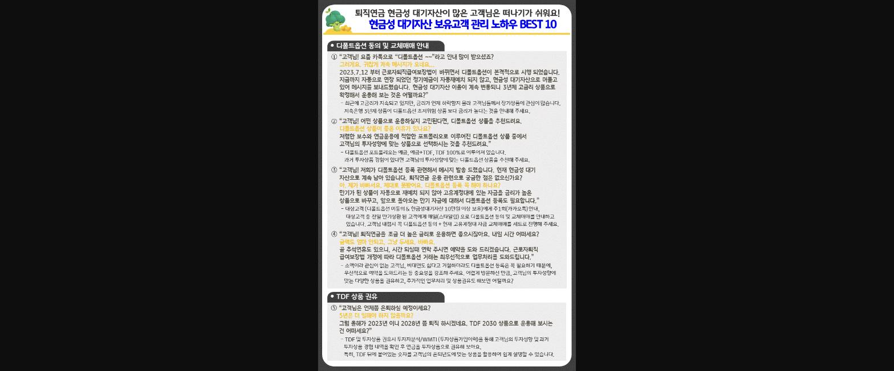
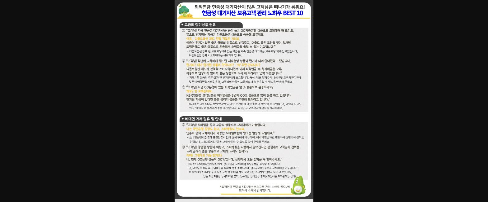

※ 이 게시글의 본문은 별도 텍스트 없이 아래 이미지 2장으로만 구성되어 있습니다.

> **이미지1 설명**: "퇴직연금 현금성 대기자산이 많은 고객님은 떠나기가 쉬워요! 현금성 대기자산 보유고객 관리 노하우 BEST 10" 카드뉴스 1페이지. 두 개 섹션으로 구성.
>
> **[디폴트옵션 동의 및 교체매매 안내]** (노하우 ①~④, 고객 응대 화법 형식)
> ① 2023.7.12부터 근로자퇴직급여보장법 개정으로 디폴트옵션 본격 시행 — 정기예금이 자동재예치되지 않아 현금성 대기자산으로 머무는 자금을 3년제 고금리 상품으로 확정 운용 권유 (저축은행 3년제 상품이 디폴트옵션 초저위험 상품보다 금리가 높다는 점 안내).
> ② 디폴트옵션 상품 추천 화법 — 저렴한 보수와 연금운용에 적합한 포트폴리오로 이루어진 디폴트옵션 상품 중 고객 투자성향에 맞는 상품 선택 권유 (포트폴리오는 예금, 예금+TDF, TDF 100% 구성).
> ③ 디폴트옵션 등록 안내 메시지 발송 후 후속 상담 화법 — 만기가 된 상품이 자동 재예치되지 않아 고유계정대에 있는 자금을 금리 높은 상품으로 바꾸고, 돌아오는 만기 자금에 대해 디폴트옵션 등록 필요. 대상고객(디폴트옵션 미동의 & 현금성 대기자산 10만원 이상 보유)에게 주1회 카카오톡 안내, 매월(스타알림)으로 디폴트옵션 등록 동의 및 교체매매 안내. 디폴트옵션 동의 + 고유계정대 자금 교체매매를 세트로 진행 권장.
> ④ 바쁘다는 고객 응대 화법 — 근로자퇴직급여보장법 개정에 따라 디폴트옵션 거래는 최우선적으로 업무처리하며, 소액이라 관심 없는 고객·비대면도 싫다고 거절하더라도 디폴트옵션 등록은 꼭 필요함을 강조하고 예약 도와드리기.
>
> **[TDF 상품 권유]** (노하우 ⑤)
> ⑤ 은퇴 예정 시기 질문으로 시작하는 TDF 권유 화법 — "2023년이니 2028년쯤 퇴직하시겠네요, TDF 2030 상품으로 운용해보시는 건 어떠세요?" TDF 및 투자상품 권유 시 투자자분석/WMTI(투자상품가입이력)을 통해 고객의 투자성향·과거 투자상품 경험 내역 확인 후 은퇴년도에 맞는 TDF 상품으로 권유 (TDF 뒤 숫자를 고객 은퇴년도에 맞춰 활용하면 쉽게 설명 가능).

> **이미지2 설명**: 같은 카드뉴스 2페이지. 두 개 섹션 및 마무리 안내로 구성.
>
> **[고금리 장기상품 권유]** (노하우 ⑥~⑧)
> ⑥ 현금성 대기자산을 금리 높은 저축은행 상품으로 교체매매하고, 앞으로 만기되는 자금은 디폴트옵션 상품으로 등록해 드리는 화법 — "예금이 만기가 되면 좋은 금리의 상품으로 바꿔주고, 대출도 좋은 조건을 찾는 것처럼 퇴직연금도 좋은 상품으로 운용해서 수익률을 올릴 수 있는 기회입니다." (디폴트옵션 등록 전 고유계정대에 있는 자금은 계속 현금성 대기자산으로 남아 있으므로 디폴트옵션 등록 + 교체매매는 세트 거래).
> ⑦ 작년에 교체매매 해드린 저축은행 상품 만기 시 안내전화 화법 — 디폴트옵션 제도 시행으로 퇴직연금 내 정기예금이 자동연장되지 않아 같은 상품으로 다시 해드리려고 연락. 저축은행 상품은 상환 전 만기안내가 중요하며, 매월 첫째주에 만기 도래 고객 명세를 통한 만기예약변경거래로 고금리 계속 운용 안내.
> ⑧ 타행 퇴직연금 보유 고객 공략 화법 — "지금 OO은행에 있는 퇴직연금은 몇 % 상품으로 운용하세요? KB국민은행 고객님들은 퇴직연금을 3년제 OO% 상품으로 많이 운용하고 있습니다." 타사에 현금성 대기자산이 있다면 '자금'이 이전하기 가장 좋은 조건이 될 수 있으므로 타사 자금 이전에 관심 갖기.
>
> **[비대면 거래 권유 및 안내]** (노하우 ⑨~⑩)
> ⑨ 모바일 교체매매 권유 화법 — "국민은행 통장도 없고 스타뱅킹도 안 쓴다"는 고객에게 인증서 없이 교체매매 가능한 모바일브랜치 링크 발송. 메시지 발송자로 권유자 지정 시 실적 인정되며, 고유계정대 자금을 교체매매할 수 있도록 많이 안내 권장.
> ⑩ 영업점 방문이 어렵고 스타뱅킹도 사용하지 않는 고객 — 본점에서 고객에게 전화로 금리 높은 상품 교체 상담 지원. 화면 [04-12-660](상담연계등록)에서 【퇴직연금 교체매매】 상담등록 요청 가능. 단, 고객과의 상담 후 상담내용을 상세히 작성 부탁드리며 원리금보장상품으로의 교체매매만 가능. ※ 유의사항: 마케팅 동의 등록 고객 중 이메일 정보 보유 또는 스타뱅킹 인증서 보유 고객만 가능, 단순 디폴트옵션 등록거래만은 불가, 등록직원 실적인정 불가(KPI 실적은 계좌관리점 실적).
>
> 마무리: 『퇴직연금 현금성 대기자산 보유고객 관리 노하우 공모』에 참여해 주셔서 감사합니다.
