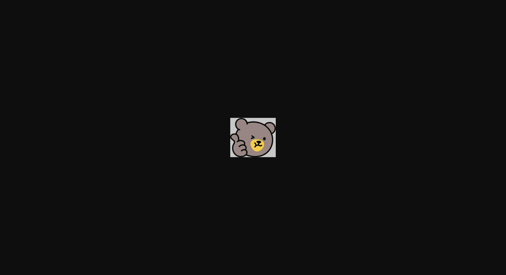

**안녕하세요^^*  수지PB센터 김희경 계장입니다.**

**"2025년 퇴직연금" ****추진시 꼭 알아두어야할 핵심내용 알려드려요.**

**기억하고 가세요~**

**가장 중요한 건, **

==**고객 이탈이 불가피할 시 KB계열사로~**==

**(KB금융그룹으로 이전된 건은 이전금액의**** ****70% 보전)**

**꼭 기억하세요!!**

**

> **이미지1 설명**: 귀여운 곰 캐릭터 스티커 이미지 (장식용, 별도 텍스트 정보 없음)**

**이 밖에 보너스 팁 @@**

- **- 이미 신규된 ****개인형 IRP도 추가 입금****하면 우리지점(PG) 실적**
- **(단, 비대면입금 시에는 고객이 입력한 권유부점 또는 권유직원 소속부점)**

**-퇴직연금 수수료 ****비이자수익****에 영향**

- **- ****상반기**** 추진시 유리**

**관련 문서 첨부합니다**

**다같이 힘내요 우리 모두 화이팅~!!**