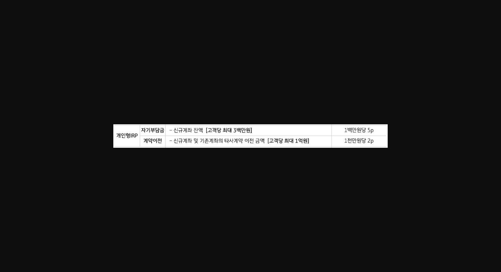
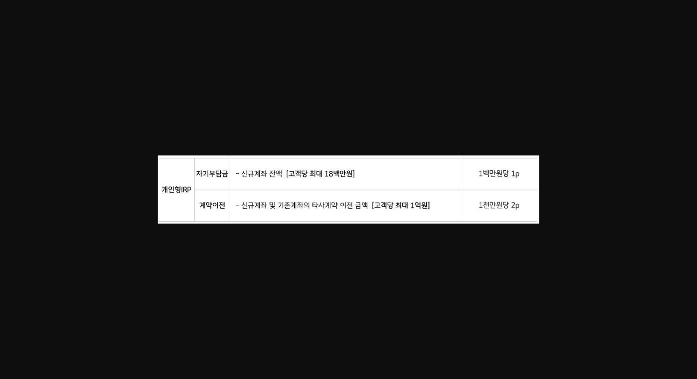
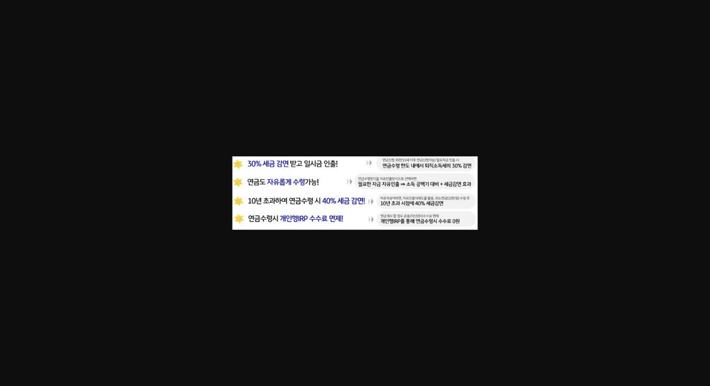
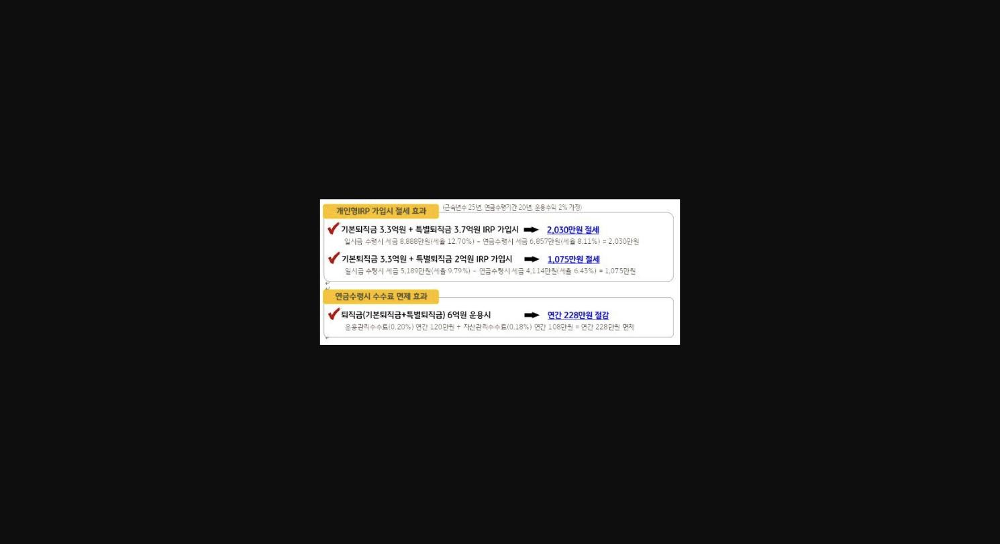
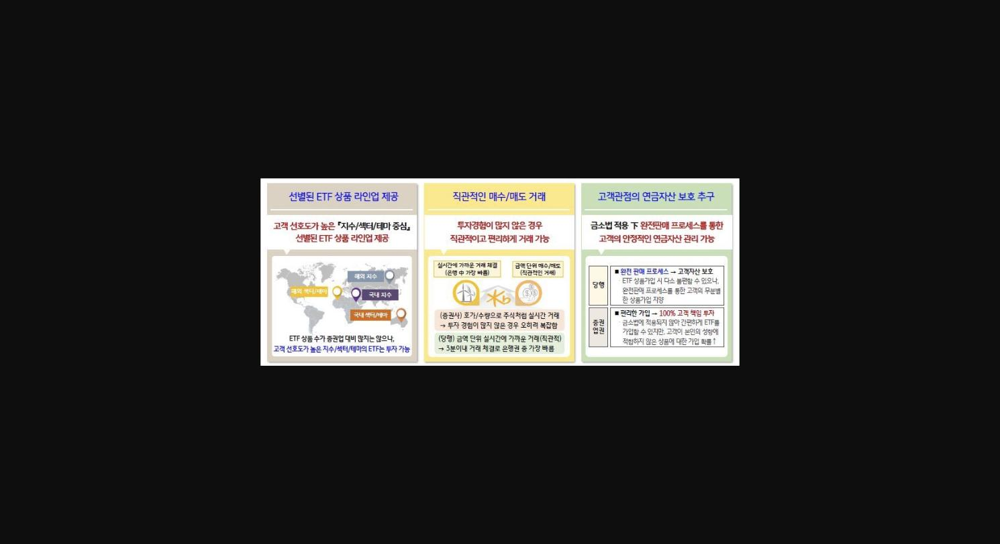
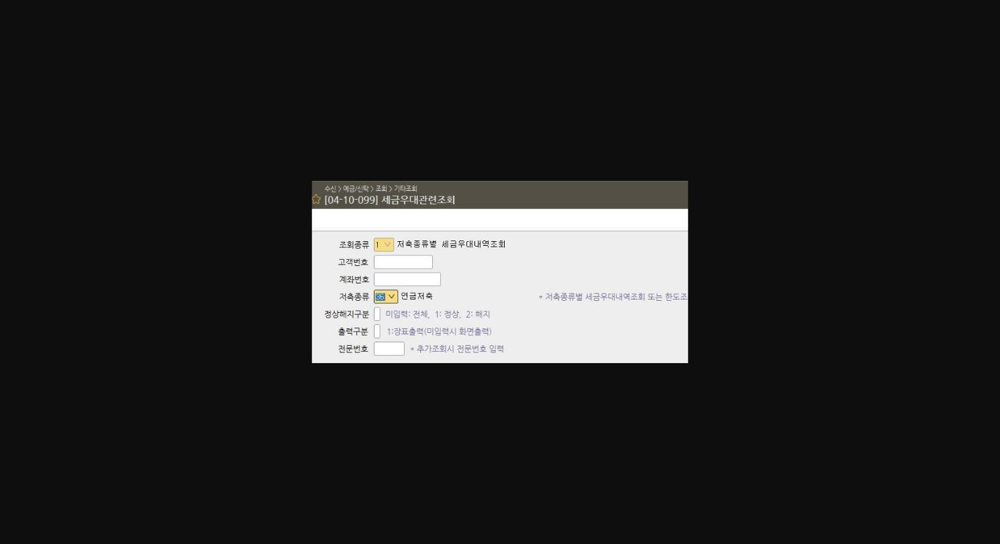

**** 어느덧 2025년도 새해가 밝았습니다****.**** ****<u>빠르고 강한 출발</u>****을 위해 **

**퇴직연금 IRP HOT-TIP을 준비하였습니다. **

**KPI -> 개인형 IRP KPI 평가배점 30점(연간평가)**

**<****개인리그테이블****> **

> **이미지1 설명**: 개인형IRP 리그테이블 배점표: 자기부담금(신규계좌 잔액, 고객당 최대 3백만원) 1백만원당 5P, 계약이전(신규·기존계좌의 타사계약 이전금액, 고객당 최대 1억원) 1천만원당 2P

**<WM리그테이블 >**

> **이미지2 설명**: 개인형IRP 리그테이블 배점표(변형): 자기부담금(신규계좌 잔액, 고객당 최대 1,800만원) 1백만원당 1P, 계약이전(고객당 최대 1억원) 1천만원당 2P

**<u>[1. 개인형 IRP 유치 시 상황별 응대 방안]</u>**

1. ==**1. 곧 퇴직금 수령하려고 하는데 국민은행은 IRP 운용 관련 수수료가 비싸다고 들었는데, 어떤가요?! (DC -> IRP로 퇴직금 입금하려고 하는 고객. )**==

:**  고객님 현재 만 55세 이상이시면 IRP로 퇴직금이 입금된 후 연금 개시하실 경우, 수수료가 면제되십니다. 당장 연금을 수령하실 계획이 아니시라면, **

**수시 인출 등록하여 매년 1회씩 10만원 이상만 인출하셔도 수수료가 전부 면제됩니다. 저희가 꾸준하게 IRP 운용관련해서 도움을 드리도록 하겠습니다. **

**(수수료면제와 상품 수익률 관리에 대해서 강조)**

**                                                                                       [개인형 IRP 마케팅 포인트]**

> **이미지3 설명**: 개인형IRP 세제혜택 4가지 요약: ①30% 세금감면 후 일시금 인출 ②연금 자유수령 가능 ③10년 초과 연금수령 시 40% 세금감면 ④연금수령 시 개인형IRP 수수료 면제

**** 퇴직소득세 30% 감면이라고 했는데, 대략적으로 얼마인지 궁금합니다!**

**= [ 국세청-> 세금모의계산-> 퇴직소득세액계산] 을 통해 미리 확인해보실 수 있어, **

**고객에게 금액을 실제로 제시하여 감면 받는 세금금액이 크다는 것을 인식시켜야 합니다.**

**[절세 및 수수료 면제 효과]**

> **이미지4 설명**: 개인형IRP 가입 시 절세효과 계산 예시: 기본퇴직금 3.3억+특별퇴직금 3.7억 IRP가입 시 2,030만원 절세, 기본퇴직금 3.3억+특별퇴직금 2억 IRP가입 시 1,075만원 절세, 6억원 운용 시 연금수령 수수료 면제로 연간 228만원 절감

[**출처 : 연금사업부32문서]**

==**2. 요새 증권사 IRP는 비대면 개설 시 수수료가 면제된다던데, 증권사에서 개설하는게 낫지 않나요?! **==

**: 오히려 증권사 중 일부는 연금 수령 기간동안 수수료가 붙는 경우도 있으니 잘 확인 후 개설하시는게 낫습니다. 또한, KB국민은행에서 거래를 하셔야 은행 실적으로 **

**인정되어 추후 대출이나 기타 수수료 발생 거래 시 도움을 받으실 수 있습니다. 퇴직연금은 노후자금 운용을 목적으로 하는 것이기에 증권사보다는 은행에서 안전하면서도  **

**중장기적인 수익을 보고 관리받으시는게 좋습니다. **

== ** [ 증권사 대비 당행 퇴직연금 ETF 강점 ]**==

> **이미지5 설명**: ETF 상품 특징 인포그래픽 3항목: ①선별된 ETF 상품 라인업 제공(지수/섹터/테마 중심) ②직관적인 매수/매도 거래(실시간 체결, 3분이내 은행권 중 가장 빠름) ③금소법 적용 하 완전판매 프로세스로 고객관점 연금자산 보호

**                                                                                                                          ****[출처 : 연금사업부 퇴직연금 종합 안내 자료]**

**[2. 연금저축보험 보유 고객, 타사 이전 대상]**

> **이미지6 설명**: 스타뱅킹 화면번호 [04-10-099] 세금우대관련조회 입력 화면: 조회종류/고객번호/계좌번호/저축종류(연금저축 등) 입력 필드

**고객님 내점 시 무조건 [04-10-099] 세금우대관련조회 화면에서 저축종류를 연금저축(36), 개인형 IRP(55) 넣고 조회함. **

***<u>조회 시 연금저축 상품 보유중으로 나오면  딱 2가지만 확인하면 됩니다!</u>***

:== **만 55세 이상 & 가입일 5년이상**==

==*<u>확인했으면 이제 당행 IRP로 권유를 해야겠죠..!</u>*==

**[ 권유 시 IRP로 이전해야 하는 **==**강점2가지를**==** 제시 ]**

*   *

* *** **==**1) 연금저축은 공시이율로 하나의 상품만으로 운용 /  개인형IRP는 여러 상품의 분산 투자 가능 **==

**보험사 연금저축은 현재 공시이율이 2% 내외로 이율이 굉장히 낮다는 점을 강조..! **

**하지만 당행IRP는 2024년도 3분기 말 기준 퇴직연금 개인형 IRP 실적배당상품의 최근 1년간 운용수익률이 은행권 전체 1위 달성했음을 강조드리며, **

**고객의 성향에 따라 다양하게 분산 투자가 가능함을 말씀드리며 당행 IRP를 꼭 해야되는 이유를 상기시키기!**

**  **==** 2) 디폴트옵션 운용을 통해 상품 운용 효율성 대비 수익 극대화 가능함을 강조**==

** 2024년도 2분기 디폴트옵션 주요 현황 공시에서 은행권 디폴트옵션 상품 중 연간 수익률 1위를 기록했음을 안내드리며, **

**       타사 대비 고수익을 내고 있음을 안내. 디폴트옵션 운용을 통해 고객에게 상품 운용에 대한 부담감은 낮추면서 수익을 극대화 할 수 있는것을 주강점으로 권유. **

> **이미지7 설명**: 뉴스 스크랩: "국민은행, 디폴트옵션 고위험 상품 수익률 1위" (파이낸셜뉴스 2024.08.19) - 퇴직연금 디폴트옵션 고위험 포트폴리오 2024년 2분기 은행권 연간수익률 1위, 3분기 연속 은행권 선두

**   이러한 Tip들을 바탕으로 2025년 IRP도 다함께 달성해봐요~~!**

==**[IRP = KB국민은행...☆]**==

**IRP하면 고객들이 바로 KB국민은행을 생각할 수 있도록 화이팅~~!**