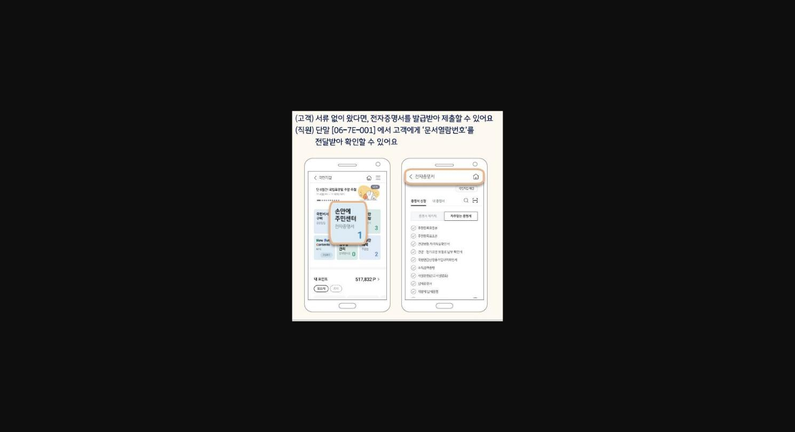
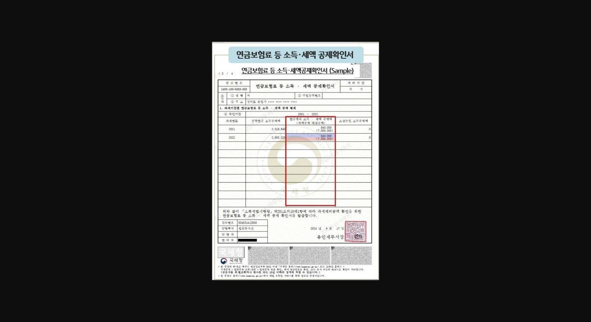
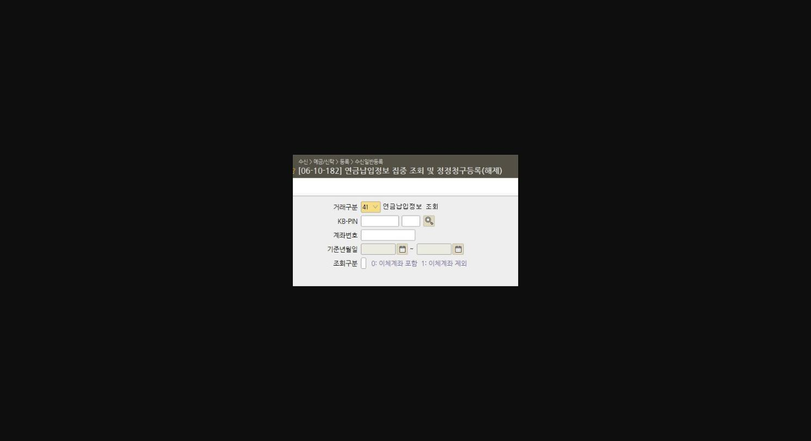
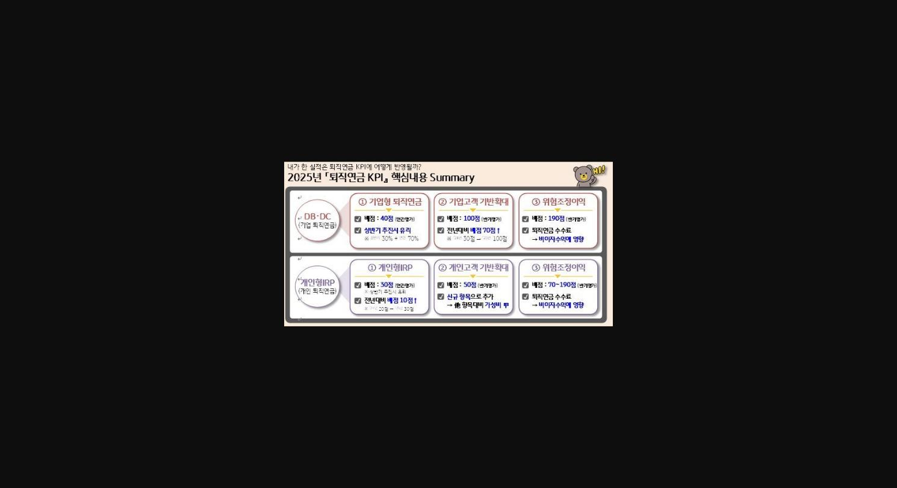

==**<u>※ 개인형 IRP 계약이전 섭외 시 이건 모르셨죠?! ※</u>**==

==**<u>Chapter 1) 고객의 연금납입현황 확인하기. </u>**==

- *** 보통 다들 잘 알고 계시는<u> [ 04-10-099 ] 세금우대관련조회 </u>화면에서 **

**연금보유현황을 대략 먼저 확인해주시고, <u>고객에게 운을 띄웁니다!</u>**

==**예시 상황 1)**==

**<u>(</u>**==**<u> A : 직원</u>**==**<u> , </u>**==**<u>B : 고객 )</u>**==

**ex) **==**A : 고객님, 이번에 연말정산 조회해보셨을 때 환급 받으시나요?!**==

==**B : ( 1. 환급받았습니다  or  2. 추징금나왔습니다 )**==

==**A: 그러시군요. 매년 납입하시는 연금 상품의 금액이 어느정도 되실까요?!**==

==**B: ( 1. 특정금액 or 2. 잘 모르겠습니다 ) -> 보통 (2. 잘 모르겠다)는 고객이 대다수 **==

==**A:  그럼 저희가 확인해드리겠습니다. 현재 연금 상품들이 여러군데 분산되어 있어**==

==**고객님께서 세액공제 관련해서 확인이 어려우신 거 같습니다. **==

==**연간 납입하시는 금액과 세액공제액을 확인해드리겠습니다. **==

**※ 보통 고객들은 본인이 얼마를 납입하고, 공제받는지 모르는 경우가 많음. **

**-> 여러 기관 가입은 되어있지만 관리가 안되어있는 경우가 많으니 이를 타켓으로 하여 **

**관리해주겠다고 말씀드리며 강조. **

==**STEP 1.  스타뱅킹 국민지갑 전자증명서를 통해 세액공제액을 확인해보자.**==

**( 생활제휴 > 국민지갑 > 전자증명서 )**

> **이미지1 설명**: 모바일 신분증 전자증명서 발급 안내: 고객이 서류 없이 방문 시 "국민지갑" 앱에서 전자증명서 발급 가능, 직원은 화면번호 [06-7E-001]에서 고객의 문서열람번호를 전달받아 확인

**[출처: 문서번호 스타뱅킹영업부(P) 512]**

**전자증명서 수취를 통해서 <u>연금보험료 등 소득 세액 공제확인서</u>를 출력할 수 있어요~! **

**고객이 스타뱅킹에서 ( 생활제휴>국민지갑>전자증명서) 서류를 보내면 ~**

**직원은 단말 화면 [06-7E-001]에서 출력하면 됩니다!**

**출력 후 **==**<u>연간 소득 세액공제 대상액과 실질적인 세액공제 금액</u>**==**을 확인할 수 있습니다!**

> **이미지2 설명**: "연금보험료 등 소득·세액공제확인서" 국세청 발급 샘플 서식 이미지 (개인정보 마스킹 처리, 과세기간별 연금계좌 소득·세액공제 대상금액 표 양식)

**[출처: 업무상담 챗봇(퇴직연금)] **

==**STEP 2. 연금 납입액과 해당 금융기관들을 파악해보자.**==

- **[06-10-182] 연금납입정보 집중 조회 및 정정청구등록(해제)**

> **이미지3 설명**: 화면번호 [06-10-182] 연금납입정보 집중조회 및 정정청구등록(해제) 입력화면: 거래구분/KB-PIN/계좌번호/기준년월일/조회구분 입력 필드

**※고객에게 금융거래정보제공요청동의서 받고, 해당 화면을 통해 연금납입정보현황을 파악. **

==**연간 고객이 납입했던 연금 내역과 금융기관들을 확인할 수 있습니다~!**==

**※ **==**STEP 1. 과정과 STEP 2. 과정**==**을 통해서 연금납입액 대비 받고 있는 세액공제액을 안내드리고, **

**<u>현재 여러기관으로 분산되어 있는 연금을 당행 IRP로 모아서 관리해드리겠다고 자신있게 권유!</u>**

==**[ 그렇다면 이제 계약이전을 진행해야겠죠~! ]**==

**계약이전 프로세스는 다들 잘 알고계실거라고 생각하여 진행 중 ****<u>주의사항 몇가지</u>**** 말씀드리려고 합니다. **

1. ==**1) 비대면 프로세스 주의사항 : 계약이전 시 당행 IRP 보유 유무에 따라 신규 탭이 다릅니다. **==

- ==*** 당행 계좌 미보유 고객 : 상품가입 > 퇴직연금 > 타기관 연금계좌 가져오기**==
- ==*** 당행 IRP 계좌 보유 고객 : 가입상품관리 > 퇴직연금 > 퇴직연금 계약이전**==

**** 또한, 계약이전 과정 중 이전 방식을 실물이전으로 선택을 해야 , 실물이전불가 상품 외에 나머지 상품이 그대로 넘어오니 주의!**

==**2) 대면 프로세스 주의사항 : 본인 내점이 어려워 대리인 거래로 진행해야 하는경우!**==

==**※이전받는 당행이 아닌 전출하는 금융기관에**==

==**방문해야지만 진행이 가능합니다. **==

**※2025년 [퇴직연금 KPI] 핵심내용※**

> **이미지4 설명**: 2025년 퇴직연금 KPI 핵심내용 Summary: DB·DC(기업형퇴직연금) - ①기업형퇴직연금 배점40점 ②기업고객기반확대 배점100점(전년대비70↑) ③위험조정이익 배점190점 / 개인형IRP - ①배점30점(전년대비10↑) ②개인고객기반확대 배점50점(신규항목) ③위험조정이익 배점70~190점

**[출처: 문서번호 연금상품부 10]**

**** IRP는 **==**세액공제 + 노후자금 마련 목적**==** 상품이기에**

**고객이 장기간 납입하고 신경쓰는 상품입니다~!**

**계약이전 후 지속적인 운용상품 관리 등을 통한 꾸준한 고객관리 실현 가능!**

**-> 현재 당행에서 강조하는 **==**<u>진심으로 고객을 케어링(Caring)하여 '금융전문가 = KB' </u>**==**를 실현하는데 있어 **

**중요한 발판이 될 수 있을것이라고 생각합니다~!**

** **