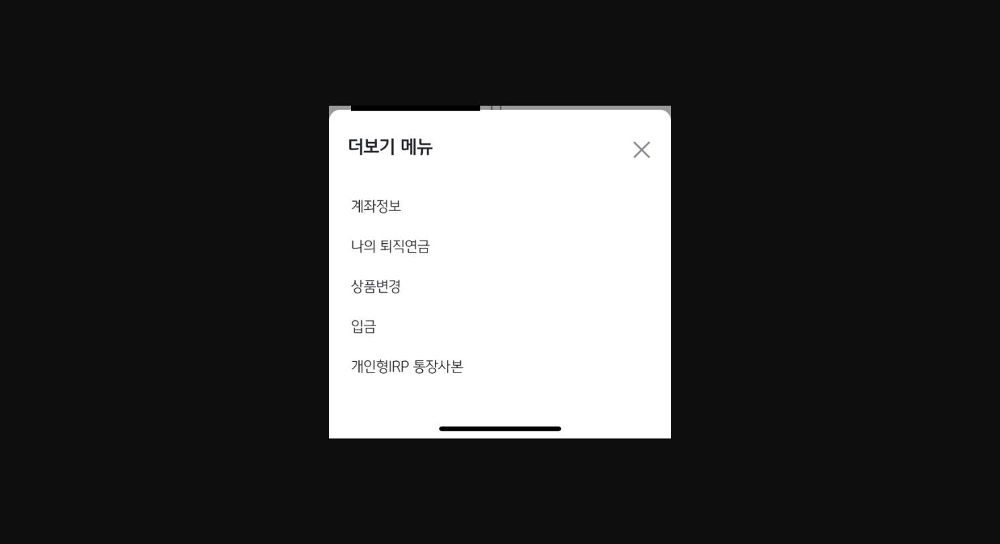
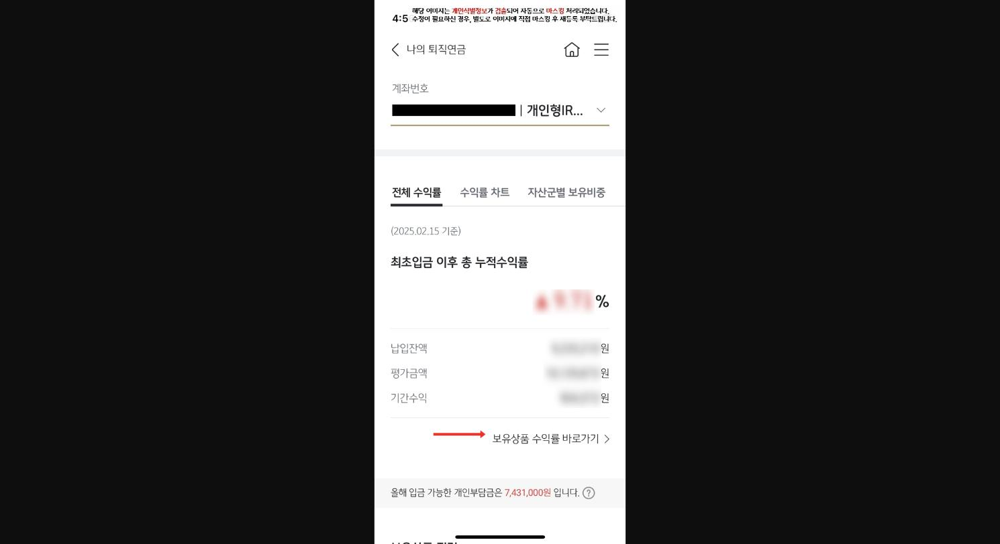
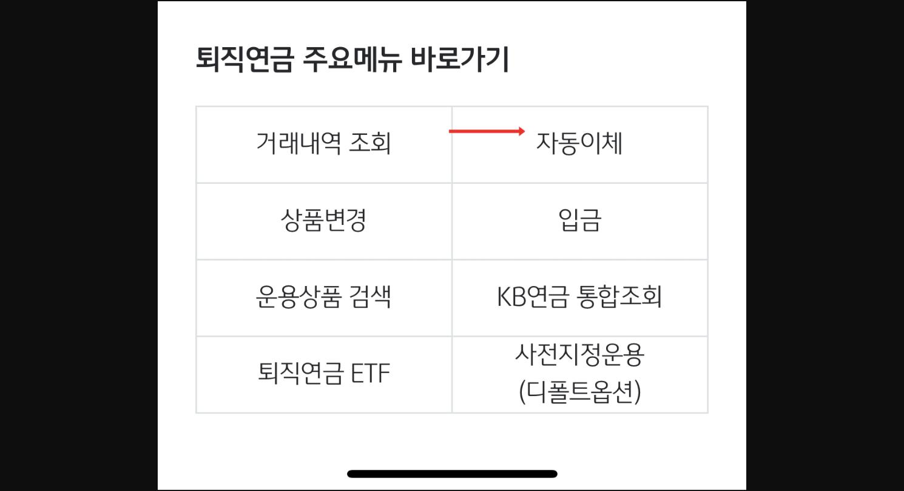
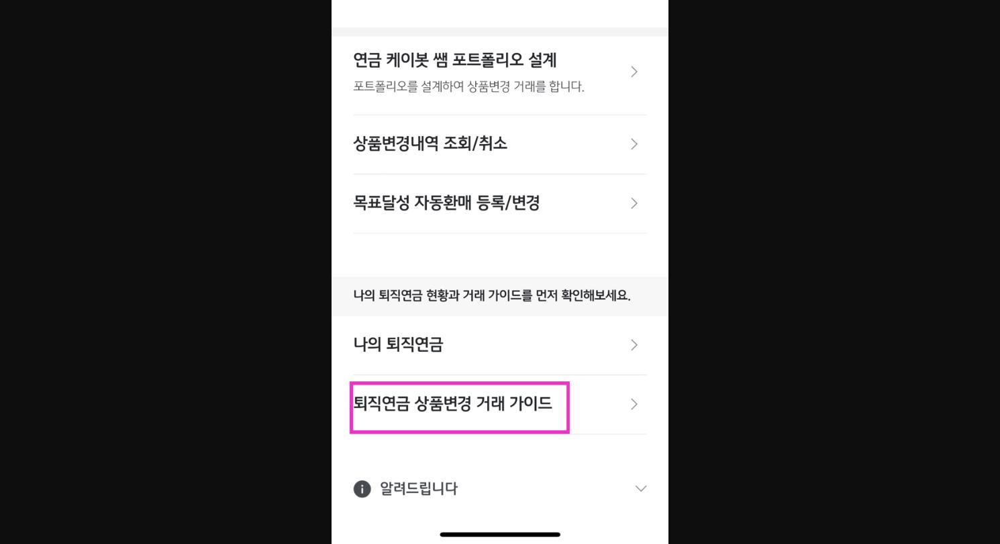
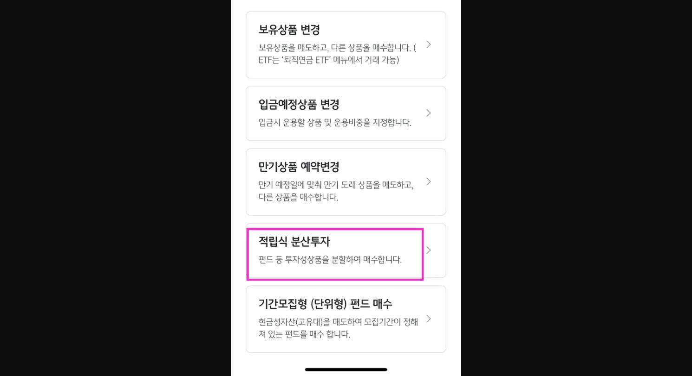
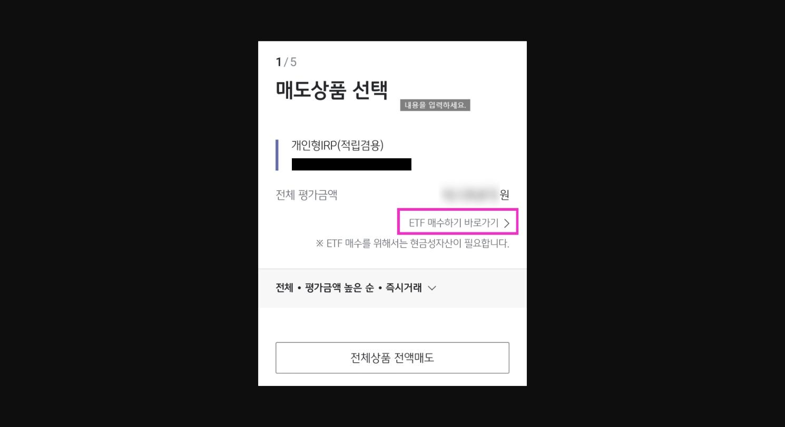

**■ 고객님이 가장 많이 궁금해하는 스타뱅킹을 이용한 개인형IRP (퇴직연금)사용방법**

스타뱅킹을 통한 퇴직연금은 메인화면에서 상단 오른쪽 선 3개를 선택하여 들어가는 경로와

화면하단 '전체계좌' 에서 '퇴직연금' 텝을 선택하여 들어가는 경로 2가지가 있습니다.

고객님이 기억하기 쉽고 직관적으로 이해하기 쉬운 두번째 방법으로만 설명하겠습니다.

※ 사진배열이 맞지 않는점 양해 바랍니다. 이용방법을 잘 모르겠네요 ^^

스타뱅킹 로그인 – 화면 하단 ‘전체계좌’ 선택 – ‘퇴직연금’ 항목 선택- 오른쪽 점세개 누르기에서

거의 모든것을 할수 있습니다.  점세개 선택시 나오는 '더보기 메뉴'에서 보는것을 기본으로 안내하겠습니다.

> **이미지1 설명**: 스타뱅킹 앱 "더보기 메뉴" 화면: 계좌정보, 나의 퇴직연금, 상품변경, 입금, 개인형IRP 통장사본 메뉴 목록

<u>질문1.</u><u> 나의 보유자산현황과 수익률은 어디서 보나요?</u>

' 나의 퇴직연금' 화면을 열면 ‘전체수익률’ 아래 작은 글씨로 ‘보유상품 수익률 바로가기’가 있습니다.

클릭하면 내가 어떤 상품을 보유하고 있는지  상품별 수익률과 평가금액을 알수 있습니다.

> **이미지2 설명**: 스타뱅킹 앱 "나의 퇴직연금" 화면(2025.02.15 기준): 전체수익률 탭에서 최초입금 이후 총 누적수익률, 납입잔액/평가금액/기간수익 확인 가능(예시 화면, 금액 마스킹). 올해 입금 가능한 개인부담금 7,431,000원 표시 예시

<u>질문2. </u><u>자동이체 금액 또는 기간을 변경하고 싶어요.</u>

더보기 메뉴에서 ‘나의 퇴직연금’을 선택 후  아래로 내리면 퇴직연금 주요메뉴 바로가기가 있습니다.

‘자동이체’ 텝을 선택하여 금액 및 기간을 변경할수 있습니다.

> **이미지3 설명**: 스타뱅킹 앱 "퇴직연금 주요메뉴 바로가기" 목록: 거래내역조회, 자동이체, 상품변경, 입금, 운용상품검색, KB연금통합조회, 퇴직연금ETF, 사전지정운용(디폴트옵션)

<u>질문3. </u><u>상품을 변경하고 싶어요.</u>

더보기 메뉴에 바로  ‘상품변경’ 텝이 있습니다.

상품변경 텝 선택시 상황별 변경 방법이 나옵니다.

보유하고 있는 상품을 변경하고 싶을때는 ‘보유상품변경’ 선택

입금되는 상품을 변경하고 싶을때는 ‘ 입금예정상품 변경’

만기예정인 상품을 미리 변경하고 싶은때는 ‘만기상품 예약변경’을 선택합니다.

만기예정 상품 변경은 한달전부터 가능합니다.

참고로 위 세가지에 대한 거래 가이드가 화면 하단에 별도로 나와 있습니다.

‘상품변경’화면을 아래로 내리면 ‘퇴직연금 상품변경 거래 가이드’가 있으니

고객님께 안내드리면 많은 도움이 됩니다.

> **이미지4 설명**: 스타뱅킹 앱 화면: 연금 케이봇 쌤 포트폴리오 설계, 상품변경내역 조회/취소, 목표달성 자동환매 등록/변경, 나의 퇴직연금, 퇴직연금 상품변경 거래 가이드 메뉴 목록

상품변경 방법은  모두 동일하니 보유상품 변경에 대해서만 말씀드리겠습니다.

‘보유상품 변경’ - 보유하고 있는 상품중 매도하고 싶은 상품을 선택후  ‘매도상품선택완료’

‘상품추가’ 를 선택후 ‘투자상품 또는 투자상품 + 원리금보장상품 으로 구성’ 선택

정기예금만 원하실때는 ‘원리금보장상품으로만 구성’ 선택

투자성향 분석다시하기 또는 분석결과 재사용 선택 후 사용자암호 입력

상품 테마는 TDF 가 선택되어 있으며 수익률 높은 순으로 상품이 추천됩니다.

상품 테마를 누르면 다양한 종류의 테마를 확인후 선택 가능합니다.’

가입을 원하는 상품이름을 알고 있다면 직접검색으로 찾을수 있습니다.

한가지 상품을 선택후 추가로 여러 상품을 담을 수 있으며 각 상품의 합계가 100%가 될수 있도록 운용비율을 입력합니다. 100%로 설정되면 다음으로 넘어갈수 있으며 이후 필수 체크사항을 모두 확인후 진행하시면 완료 됩니다.

<u>질문4. </u><u>정기예금을 모두 펀드로 운용하고 싶은데 한번에 넣기는 부담스러워요.</u>

고객님이 수익 실현한 펀드나 만기된 예금 그리고 고유대상품으로 보유 중인 상품을 기간을 나누어 투자하길 원하신다면 ‘적립식 분산투자’를 활용하시면 됩니다.

> **이미지5 설명**: 스타뱅킹 앱 화면: 보유상품 변경, 입금예정상품 변경, 만기상품 예약변경, 적립식 분산투자, 기간모집형(단위형) 펀드매수 메뉴 목록 (각 메뉴 설명 포함)

보유상품을 모두 고유대상품으로 변경후 보유자산을 적립식 분산투자로 매월 원하는 기간만큼 나누어서 입금 할수 있습니다.

‘보유상품 변경’ – 매도 원하는 상품 선택 – 상품추가 – ‘100% 현금성자산(고유대상품)으로만 구성 선택 – 다음 선택후 매도 자산이 입금 되는 날 확인 – 고유대상품으로 상품이 변경되면 ‘ 적립식분산투자’ 선택 – 원하는 분산기간 선택 후 원하는 투자상품을 선택하면 자동으로 나누어 적립이 됩니다.

단, 연금개시중인 고객은  추천드리지 않습니다. 고유대 자금이 투자상품으로 잠기지 때문에 연금수령액이 줄어듭니다. 제가 낭패를 본 경험이 있어 연금수령 예정이거나 수령중인 고객은 하지 마세요.

‘적립식분산투자’ 이용시간은 평일 8시~22시 까지 입니다. 주말 및 공휴일 이용 불가합니다.

<u>질문5.</u><u> ETF로 매수 하고 싶어요~</u>

더보기 메뉴에서 상품변경 선택하면 상단에 아주 작은 글씨로 ‘ETF 매수하기 바로가기’ 가 있습니다.

> **이미지6 설명**: 스타뱅킹 앱 "매도상품 선택" 화면(1/5단계): 개인형IRP(적립겸용) 계좌의 전체 평가금액 표시, ETF 매수하기 바로가기 버튼, 전체상품 전액매도 버튼 (금액 마스킹)

ETF 매수를 위해서는 현금성자산이 필요합니다.

우선 보유상품을 변경하실때는 모두 현금성자산(고유대상품)으로 변경하고 완료되면 ETF 상품을 매수 할수 있습니다.

ETF 매수가능금액을 확인후 ETF 상품추가를 선택하면 수익률이 높은 순서로

볼수 있으며 원하는 상품을 선택후 거래 합니다.

ETF는 바로 매수 매도 되지만 체결시간을 15분 정도 차이가 있다고 하니 참고 바랍니다.

요즘은 퇴직연금 ETF 상품이 빠르게 업데이트 되고 있어 증권사 못지 않게 다양하고 이슈가 되는 ETF들이 많으니 적극 추천하시길 바랍니다.

조선주, 방산주, 금현물 등 생각보다 최근 핫한  ETF가 많습니다.

이상 많이 하는 질문 위주로 요약해보았습니다.

고객님이 사용하기도 쉽고, 보기도 쉬워야 한다고 생각합니다.

고객이 퇴직연금을 자주 이용할 수 있도록 우리가  관심을 가진다면  타행이전도 줄어들지 않을까 생각합니다.

퇴직연금 보유고객 내점시 스타뱅킹 이용방법을 적극 안내하시면 고객님도 만족하시고 수익률도 올라갈것 같아요^^ 화이팅!