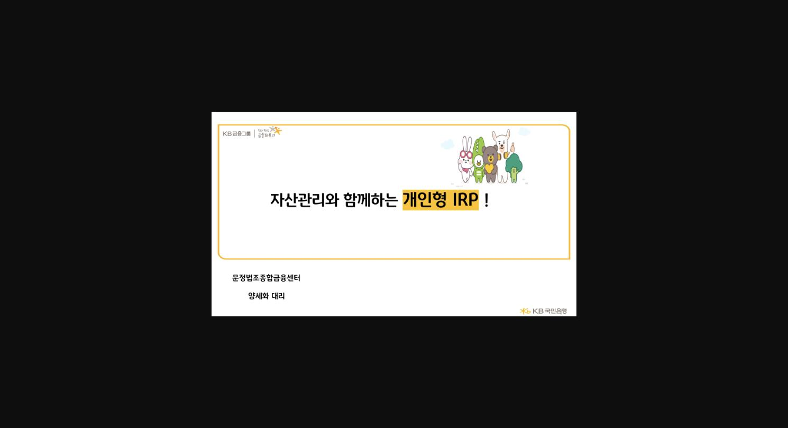
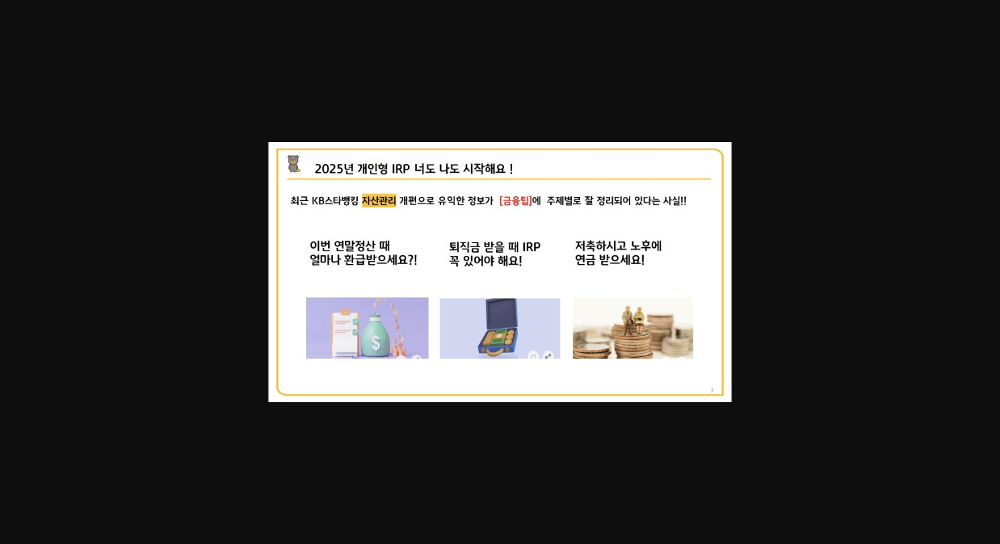
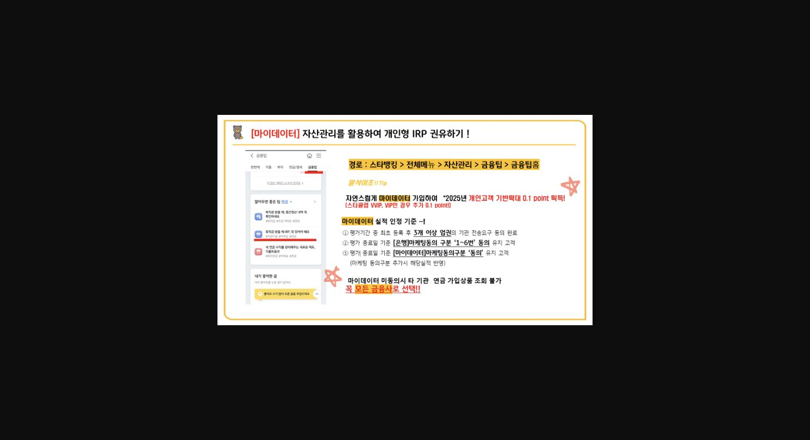
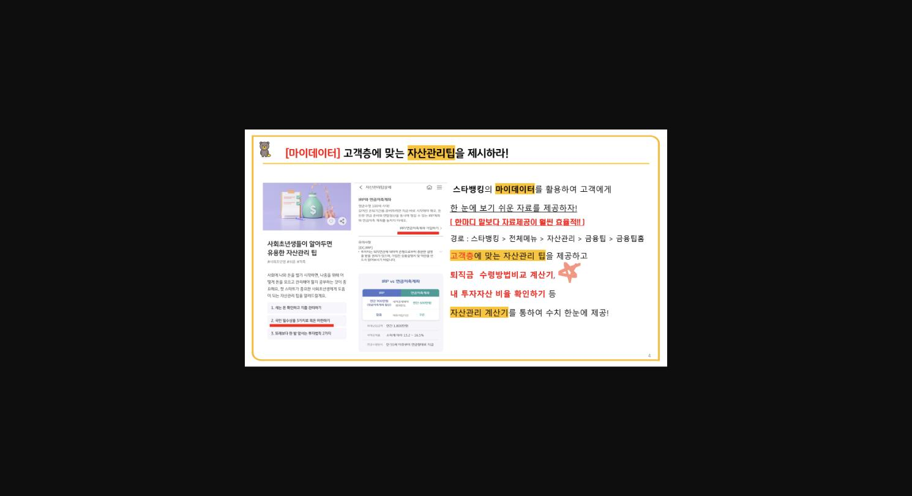
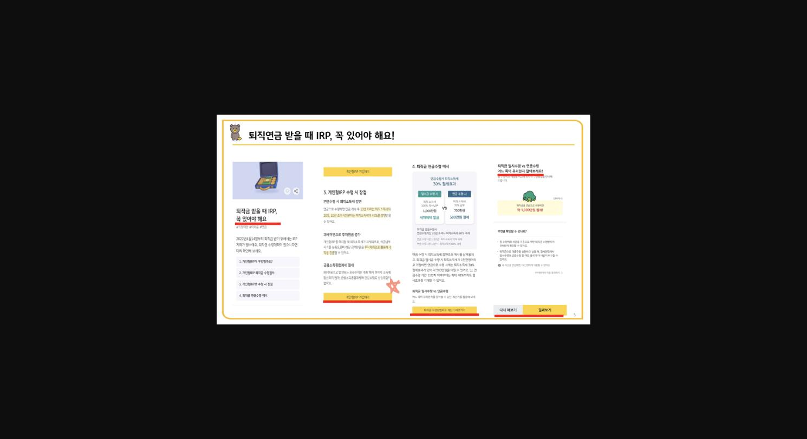
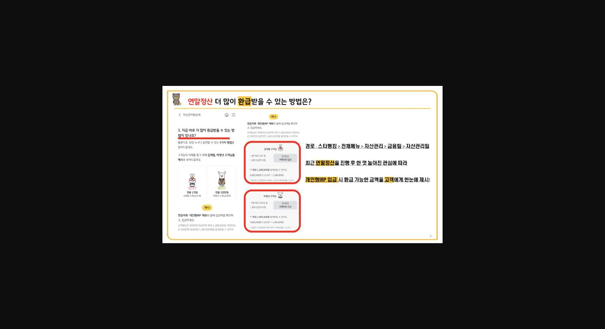
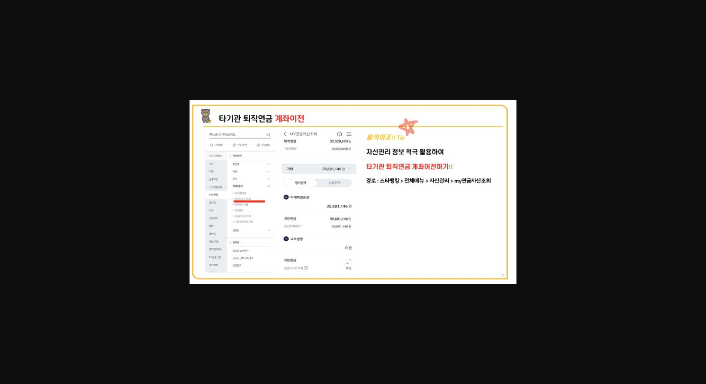
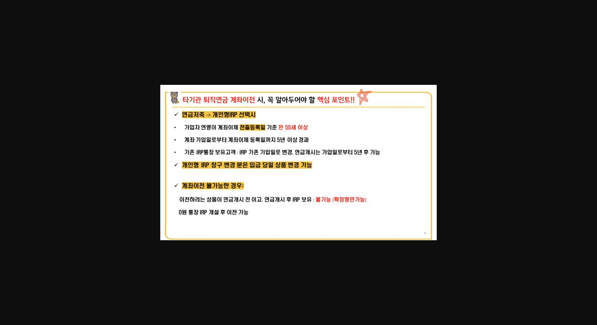
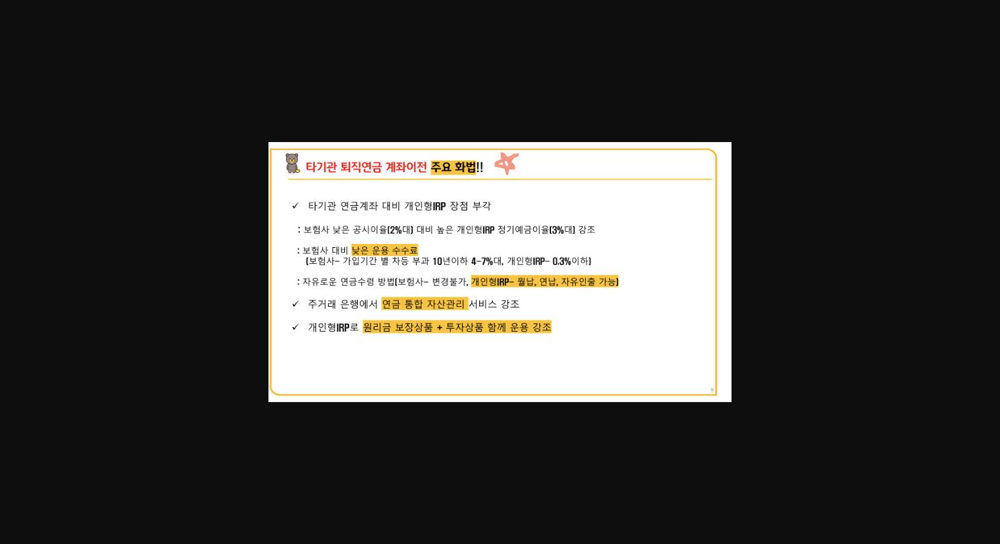

> **이미지1 설명**: PPT 표지: "자산관리와 함께하는 개인형 IRP!" - 문정법조종합금융센터 양세화 대리

> **이미지2 설명**: PPT 슬라이드: "2025년 개인형 IRP 너도 나도 시작해요!" - KB스타뱅킹 자산관리 개편으로 [금융팁]에 주제별 정보 정리, 3가지 주제(연말정산 환급/퇴직금 IRP/노후연금) 소개

> **이미지3 설명**: PPT 슬라이드: "[마이데이터] 자산관리를 활용하여 개인형 IRP 권유하기" - 경로: 스타뱅킹>전체메뉴>자산관리>금융팁>금융팁홈, 마이데이터 가입 시 2025년 개인고객 기반확대 0.1point 획득, 실적 인정기준 3가지(3개이상 업권 동의, 은행 마케팅동의 1~6번, 마이데이터 마케팅동의) 안내

> **이미지4 설명**: PPT 슬라이드: "[마이데이터] 고객층에 맞는 자산관리팁을 제시하라" - 스타뱅킹 마이데이터로 고객층별 자료 제공(퇴직금 수령방법비교 계산기, 투자자산 비율 확인 등), 경로: 스타뱅킹>전체메뉴>자산관리>금융팁>금융팁홈

> **이미지5 설명**: PPT 슬라이드: "퇴직연금 받을 때 IRP, 꼭 있어야 해요!" - 개인형IRP 수령 시 장점(연금수령 시 퇴직소득세 30~40% 감면), 퇴직금 연금수령시 매매 비교, 일시수령 vs 연금수령 비교 예시(약 1,000만원 차이)

> **이미지6 설명**: PPT 슬라이드: "연말정산 더 많이 환급받을 수 있는 방법은?" - 경로: 스타뱅킹>전체메뉴>자산관리>금융팁>자산관리팁, 김재필/박청년 고객 예시로 개인형IRP 입금 시 환급액 계산(900만원 입금 시 각 1,188,000원/1,485,000원 환급 예시)

> **이미지7 설명**: PPT 슬라이드: "타기관 퇴직연금 계좌이전" - MY연금자산조회 화면 예시(금액 마스킹), 경로: 스타뱅킹>전체메뉴>자산관리>my연금자산조회

> **이미지8 설명**: PPT 슬라이드: "타기관 퇴직연금 계좌이전 시, 꼭 알아두어야 할 핵심 포인트" - 연금저축→개인형IRP 선택 시 요건(만55세 이상, 계좌이체 등록일까지 5년 이상 경과), 계좌이전 불가능한 경우 설명

> **이미지9 설명**: PPT 슬라이드: "타기관 퇴직연금 계좌이전 주요 화법" - 보험사 대비 개인형IRP 장점(정기예금이율 3%대 vs 보험사 2%대, 운용수수료 0.3%이하 vs 보험사 4~7%대, 자유로운 월납/연납/자유인출)

> **이미지10 설명**: PPT 마지막 슬라이드: "자산관리(마이데이터)와 함께하는 개인형IRP, 오늘부터 도전하세요!" (마무리 장식 슬라이드)