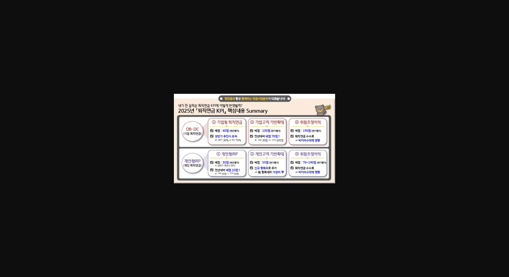
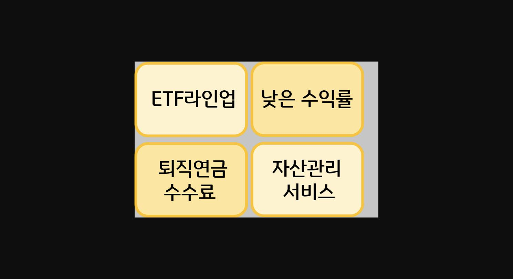
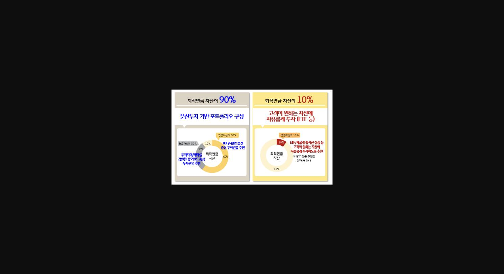
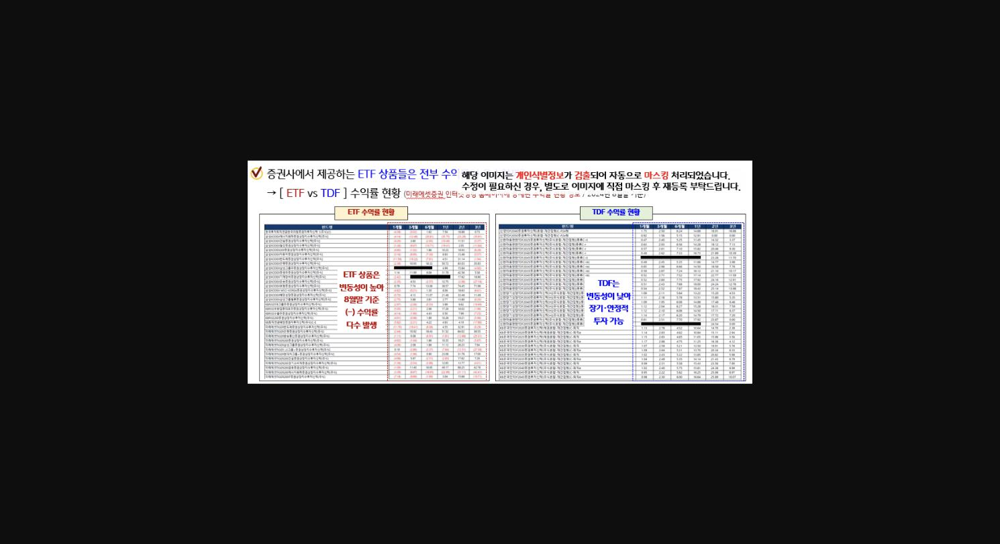
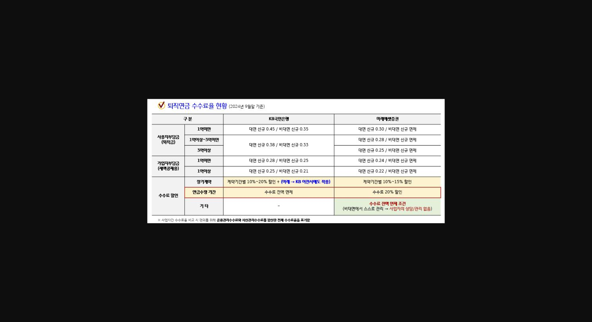
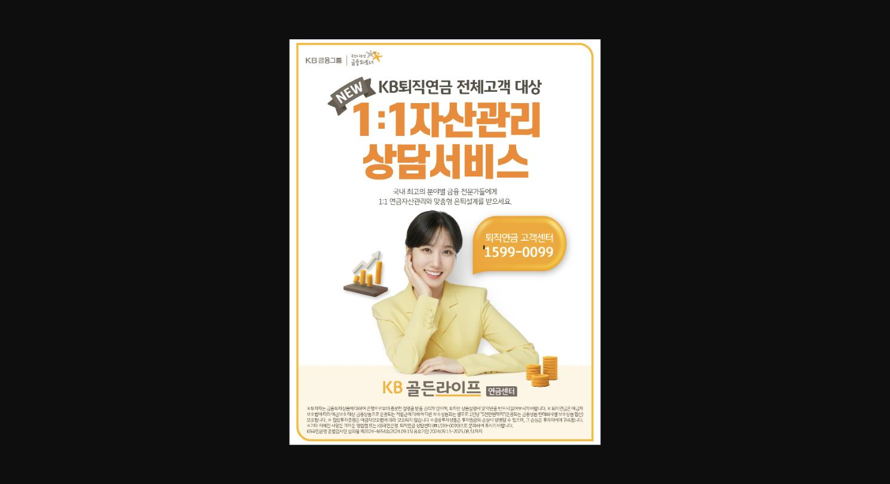
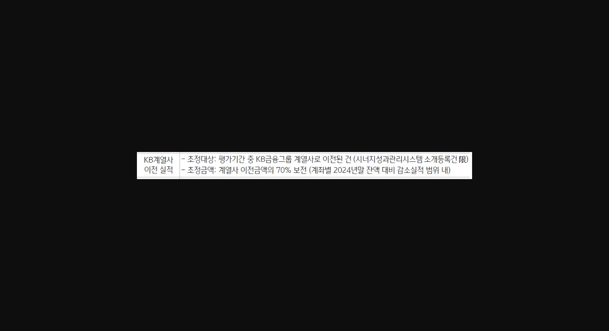

안녕하세요. 신림서지점 박주영계장입니다.

**오늘은**==** IRP**====**에 대해 **==**다뤄볼까 합니다.**

우선 ==**퇴직연금 변경 사항**==에 대해 쓱-살펴보겠습니다ㅎㅎ

> **이미지1 설명**: 2025년 퇴직연금 KPI 핵심내용 Summary (영업점과 함께하는 연금사업본부): DB·DC 배점40/100/190점, 개인형IRP 배점30/50/70~190점 등 항목별 배점 요약 (199124_04와 유사 슬라이드)

(*문서번호 : 연금상품부10)

==**기업 퇴직연금은**== **<u>기업퇴직연금 + 기업고객기반확대 + 위험조정이익</u>에 반영이** 되고,

==**개인 퇴직연금은** ==**<u>개인형IRP + 개인고객기반확대 + 위험조정이익</u>에 반영이** 되고 있네요.

KPI 곳곳에 반영되는 퇴직연금은 절대 포기할 수 없는 항목입니다!

이렇게 중요한 퇴직연금 꼭꼭 챙겨야겠죠. 어떻게 챙길 수 있을지 Hot Tip을 공유합니다!

1. ==**첫째, 하반기보다는 상반기에 추진하세요.**==

**개인형 IRP 배점은 30점**이고, **상반기30%+연간70%의 평가비율**이기 때문에 ==**상반기 영업 추진이 매우 유리**==합니다.

**DB/DC 배점은 40점**이고, **IRP와 동일하게 상반기 30% + 연간 70% 평가비율**로 ==**기업 퇴직연금도 상반기 영업 추진이 유리**==합니다.

예를 들어

**<u>저희 지점 기업퇴직연금 상반기 목표가 30억, 연간목표100억이라고 가정</u>**해볼까요?

==**(상반기 30억 신규 시)** ==상반기는 100% 목표 달성으로 12점 득점 + 연간 30% 목표 달성으로 8.4점 =**20.4점**입니다.

==**(하반기 30억 신규 시)**== 상반기는 0% 목표 달성으로 0점 + 연간 30% 목표 달성으로 8.4점 = **8.4점**입니다.

같은 금액을 신규해도 **상반기에 훨씬 더 많은 득점**을 할 수 있습니다.

**무조건 상반기에 추진하는 것이 유리합니다.**

==**둘째, 금액이 작아도 괜찮아요!**==

==**개인형IRP는 단돈 10만원으로도 득점할 수 있습니다.**==

**10만원 입금 + 자동이체 등록 = 1.0pt **

**300만원 입금 + 자동이체 등록 = 2.0pt입니다. **

**마이데이터가 0.1pt인 것에 비하면 가성비가 아주 좋은 항목**이라고 할 수 있습니다.

==**DB/DC도 소호는 5백만원, 법인은 3천만원으로 득점할 수 있습니다.**==

**소호는 5백만원 = 1.0pt , 3천만원 = 2.0pt**

**법인은 3천만원 = 1.5pt, 1억원 = 3.0pt입니다.**

여기서 중요한 점은 ==**<u>기업고객 기반 확대에서는</u> **====**'고객 수'가 중요**====**하기 때문에 **====**소액이라도 우선 신규 추진하는 것이 중요**==합니다.

소액 신규로 기업고객기반확대 먼저 챙기고 가자구요!

==**셋째. 꼼짝마 타사이전! (떠나는 고객님 설득하는 Tip...☆)**==

IRP 계좌 이전을 열심히 하는 이유는 일반 신규보다는 입금되는 금액이 더 크고 가중치가 1.5이기 때문이죠.

==**반대로 타사에서 우리 퇴직연금을 빼간다면...?**====** 가중치1.2로 차감됩니다. **==

신규하는 것도 물론 중요하지만 **<u>기존 퇴직연금을 지키는 것이 정말 중요</u>**합니다.

간다는 고객 바로 보내주실건가요? 절대 안되겠죠. 이탈 방지하는 소소한 팁 공유합니다!

**<u>퇴직연금이 이탈되는 주요 원인은 크게 4개</u>**인거 같은데요.

> **이미지2 설명**: 4개 항목 카드형 이미지: ETF라인업, 낮은 수익률, 퇴직연금 수수료, 자산관리서비스 (제목 카드, 세부내용 없음)

1. **요소 별로 이탈 방지 Tip을 정리해 보았습니다.**
2. ==**1) "ETF 라인업이 적어서 증권사로 옮길래요!"**==
3. 고객이 ETF라인업이 증권사로 떠난다고 하는데 어떻게 해야 할까요?
4. 최근 고객들이 주식처럼 단기, 직접투자를 선호하면서 **<u>퇴직연금에서도 ETF를 직접 운영하고 싶어하시</u>**는데요.
5. **ETF가 수익률이 높다는 막연한 인식**도 가지고 계시죠.

1. **ETF 상품 라인업은 당행은 약100개**, **증권사는 약900개를 제공**하고 있습니다.
2. 증권사처럼 선택할 수 있는 상품이 많다면 선택의 폭은 넓어지겠지만 무조건 유리한 것은 아닙니다.
3. ==**당행은 고객 수요가 많고 수익과 위험이 검증된 ETF상품을 선별하여 제공하고 있습니다**==.
4. 증권사에서 판매하는 상품 중에서 고객 선호도가 높은 상품은 당행에도 대부분 라인업이 되어 있습니다.
5. <u>수백개의 상품중 좋은 상품을 알아서 고를 수 있을까요?</u> ==**당행에서는 선별된 ETF를 쉽게 고르실 수 있다고 말씀 드려보세요.**==

또한 증권사에서 제공하는 ETF상품들이 전부 수익률이 우수한 것도 아닙니다. 이 내용은 밑의 2)항목에서 to be continue..!!!!!!

또한 **<u>혹시 증권사가 아닌 타은행이라면?</u>**

**타행보다 더 '실시간에 가까운' 거래 체결이 가능하다는 장점**도 있답니다.

==**당행은 3분 이내 거래 체결인데 반해 타행은 약 15분 내외 또는 다음 영업일에 거래가 체결**==됩니다.

==**2) "수익률이 너무 낮아요!"**==

오랫동안 운용했는데 **<u>수익률이 높지 않아 증권사나 타은행으로 간다고 하시는 고객님들</u>**도 많으시죠?ㅠ_ㅠ

이럴 때는 고객님 자산운용 현황을 한번 쭉 뽑아서 보여드리는게 가장 좋은데요.

**<u>수익률이 현저하게 낮은 분들은 원리금보장 상품으로만 운용하셨던 분들</u>**이 대부분이고,

증권사가 수익이 좋다는 막연한 생각에 옮기시는 분들도 많답니다.

==**개인형IRP 실적배당상품 수익률은 은행권 전체1위 **====**(24년 3분기 기준 14.61%)**==이고

==**디폴트옵션 고위험1 수익률 또한 은행권 전체 1위**== **(24년 2분기 기준 20.59%)**로 결코 낮지 않습니다.

운용현황을 보여드리며 **그동안 정기예금 중심으로 안정적인 투자를 하셨다고 말씀드리면서 수익률이 왜 낮았는지 말씀**드리고,

일부 자금은 성향에 맞는 투자 상품을 통해 추천해드리겠다고 해보세요.

물론 정기예금이 아닌 투자상품을 보유하고 계신 고객님도 계실텐데요,

**수익률이 부진한 상품은 매도하고 시황에 맞는 상품으로 리밸런싱 해드리겠다고 권해**보세요.

> **이미지3 설명**: 퇴직연금 자산배분 비교 인포그래픽: 퇴직연금 자산의 90%는 분산투자 기반 포트폴리오(TDF/전종펀드옵션 중심), 10%는 고객이 원하는 자산에 자유롭게 투자(ETF 등)

퇴직연금은 공격적인 투자보다는 장기적으로 안정적인 성과를 내는 것이 적합한데요.

때문에 **퇴직연금을 잘 관리하기 위해서는 **

**① 예측하지 말고**

**② 장기,분산투자하는 것이 중요**하다는 것을 강조하며 **<u>자산배분을 알아서 해주는 TDF 투자를 추천드리면 좋습니다!</u>**

ETF로 자금을 직접 운용하시겠다며 이탈하는 **고객님께 증권사에서 제공하는 ETF상품들의 수익률이 전부 우수한 것도 아니고 변동성이 높다는 점**과

**<u>당행의 TDF 평균 수익률과 증권사의 ETF 평균 수익률 현황을 같이 비교해</u>**서 보여드리면 조금 도음이 될 것 같습니다.

> **이미지4 설명**: ETF vs TDF 수익률 현황 비교표(미래에셋증권 인터넷 홈페이지 기준, 2024년 8월말 기준, 개인정보 자동 마스킹): ETF 상품은 변동성 높아 8월말 기준 (-)수익률 다수 발생, TDF는 변동성 낮아 장기·안정적 투자 가능

적합상품 추천이 어렵다면 디폴트옵션을 적극 활용하는 것도 좋은 방법이겠지요ㅎㅎ

==**3) "수수료 때문에 옮길래요!"**==

**증권사는 퇴직연금 수수료가 무료라서 증권사로 옮기신다고 한다면** 어떻게 잡아야 할까요?

**증권사는 비대면으로 가입한 IRP에 한해 수수료가 무료입니다.** 증권사는 수수료 면제를 통해 고객 유치 후 펀드판매 보수로 수익을 창출하는 전략을 추구합니다.

따라서 장기 안정적 투자보다는 비대면을 통해 다소 공격적인 투자를 유도하며,

대부분의 증권사는 고객 수익률 관리 및 자산관리 서비스를 적극적으로 제공하지 않습니다.

고객이 알아서 연금 자산관리를 수행하도록 하는 것이죠.

**당행은 0.21%~0.45%의 기본 수수료율을 적용하고 있지만 <u>여러 조건별 수수료 할인 제도를 적용하고 있고 연금수령시 수수료를 전액 면제</u>**하고 있습니다.

> **이미지5 설명**: 퇴직연금 수수료율 현황표(2024년 9월말 기준): KB국민은행 vs 미래에셋증권 비교 - 사용자부담금/가입자부담금 구간별 수수료율, 장기계약 할인, 연금수령기간 수수료 전액면제(KB) vs 20%할인(미래에셋)

**물론 증권사는 보통 비대면 개설로 많이 이루어지기 때문에 실질적으로 수수료가 없다는 점에서 저희보다 유리한건 사실입니다.**

따라서== **<u>저희는 </u>**==

==**<u>① 연금 수령 시 수수료가 전액 면제이며 </u>**==

==**<u>② 자산관리 서비스와 당행 거래시 혜택이 있다는 점을 강조</u>**==해야 합니다.

==**4) "관리가 너무 소홀해요! 옮길래요!"**==

소홀한 자산 관리에 서운함을 토로하시며 떠나시는 분들도 계시죠ㅠㅠ

직원들도 모든 고객님들의 퇴직연금을 하나하나 들여다볼 수 없다보니 어려움이 있는데요

그럴때는 1:1로 자산관리가 가능하다는 점을 말씀드리면서

"영업점에 오시면 제가 자산 운용을 도와드리지만 혹시 오시기 어려우시면** **==**1:1로 상담해드릴 수 있는 퇴직연금 전문 고객센터가 있다"고 안내**==**해주세요!**

> **이미지6 설명**: KB퇴직연금 전체고객 대상 "1:1 자산관리 상담서비스" 홍보 포스터: KB골든라이프 연금센터, 퇴직연금 고객센터 1599-0099, 분야별 금융전문가 1:1 연금자산관리 및 맞춤형 은퇴설계

‘KB퇴직연금 1:1 자산관리상담서비스’는 퇴직연금 전용 고객센터(☎1599-0099)를 통해

자산관리 전문가와의 1:1 전화 상담을 제공하는 서비스입니다.

퇴직연금 가입 고객은 누구나 전용 고객센터에 전화하면‘KB골든라이프 연금센터’의 전문가와 바로 상담을 받을 수 있는데요!

**<u>필요한 경우 고객은 통화한 전문가와 대면으로 추가 상담이 가능해 대면과 비대면 채널이 이어지는 심리스(Seamless)한 자산관리서비스</u>**를 경험할 수 있답니다^-^

**만약 타사이전을 피할 수 없다면 증권사 중 KB증권으로 이전을 유도하세요!**

> **이미지7 설명**: KB계열사 이전실적 조정 기준표: 평가기간 중 KB금융그룹 계열사로 이전된 건(시너지성과관리시스템 소개등록건 限), 계열사 이전금액의 70% 보전(계좌별 2024년말 잔액 대비 감소실적 범위 내)

이전금액의 70%는 보전받을 수 있으니 꼭꼭 KB증권으로 .....!!!!

**네 오늘은 절대 포기할 수 없는 퇴직연금에 대해서 Tip을 공유해보았습니다.**

**하반기보다 상반기 추진이 무엇보다도 중요한 퇴직연금! **

**<u>우리 지점 퇴직 연금 사수에 도움이 되셨으면 좋겠습니다.</u>**