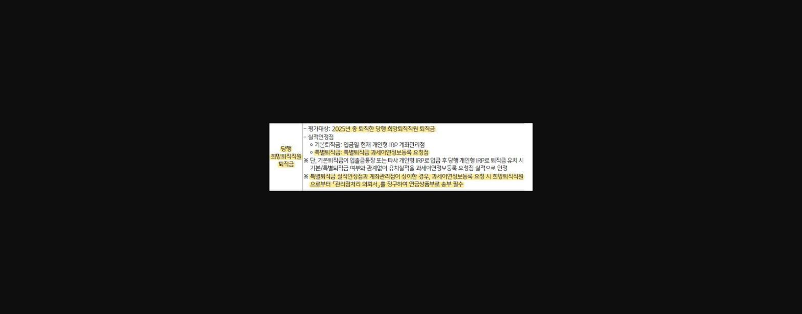
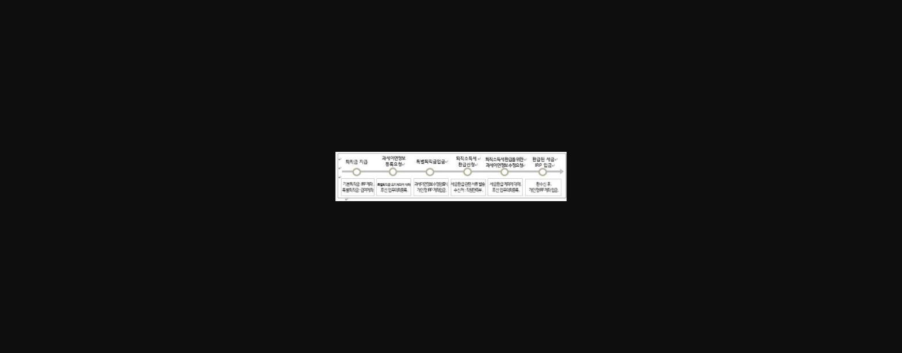
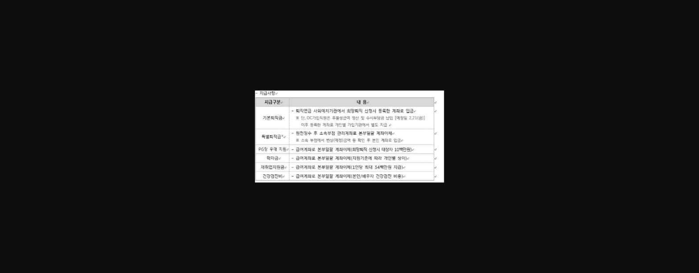
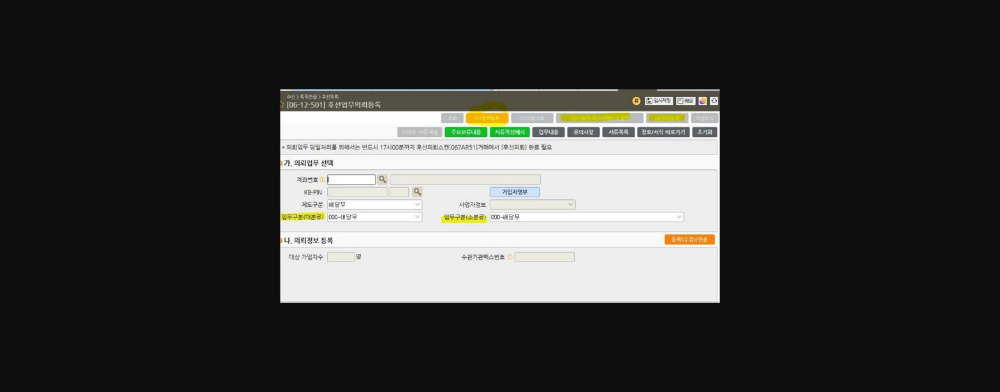
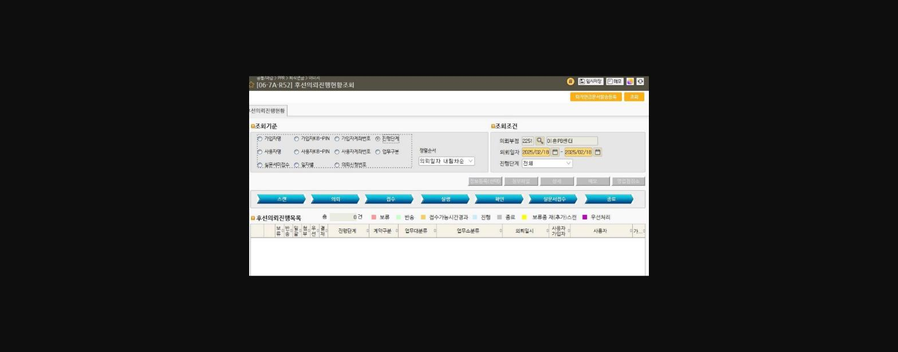
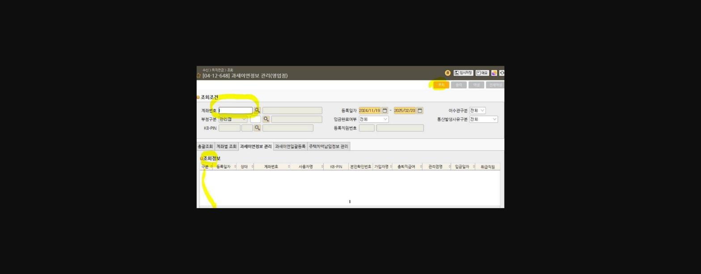
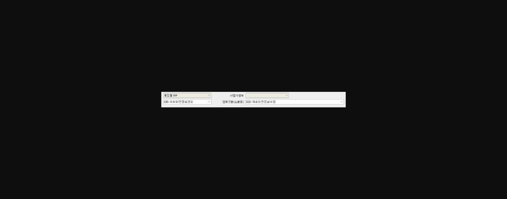
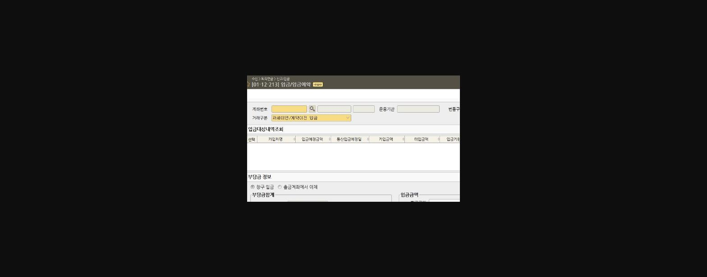

**빈칸을 채워봐~~☆**

> **이미지1 설명**: "빈칸을 채워봐!" 이벤트 안내 이미지: 핫팁이 있는데 이걸 지나친다고?! 특별퇴직금 유치 프로세스 관련 퀴즈, 기간 2025년 2월17일부터, 문의 KB국민은행 이촌PB센터 서영주 계장

**빈칸의 정답은 바로~~~~**

==**[ 특별퇴직금] 입니다~! **==

**다들 정답 맞추셨나요?! ㅎㅎ**

**2/17일 **==**희망퇴직자 기준 특별퇴직금**==**이 지급됐어요~!**

**<u>특별퇴직금은 금액 단위가 큰 만큼 꼭 유치를 해주셔야 하는데요!</u>**

==**※ 특별퇴직금 유치하면서 타금융기관 연금상품도 이전 권유하기~!**==

**(특별퇴직금 세금 환급 후 연금 개시 -> IRP 추가개설 + 타사이전)**

==**( 특별퇴직금 유치 ->  퇴직연금 KPI 획득 )**==

**  + **

==**( 연금 개시 후 추가 개설한 IRP로 타사 연금상품 이전 -> KPI 및 직원 리그테이블 실적) **==

==**일석이조의 효과를 볼 수 있습니다~!**==

> **이미지2 설명**: 당행 희망퇴직직원 퇴직금 실적인정 기준표: 평가대상 2025년 중 퇴직한 당행 희망퇴직직원 퇴직금, 기본퇴직금은 입금일 현재 개인형IRP 계좌관리점, 특별퇴직금은 특별퇴직금 과세이연정보등록 요청점 기준으로 실적 인정

**[출처 : 2025년 지역본부 및 영업점 KPI 상반기 평가기준]**

**당행 희망퇴직직원 퇴직금 중 **==**특별퇴직금은 과세이연정보등록 요청점 실적**==**으로 인정된다는 사실 모두 알고계실까요~~?**

**※ 또한, 특별퇴직금 ****<u>실적인정점과 계좌관리점이 상이할 경우</u>****, 과세이연정보등록 요청 시 희망퇴직직원으로부터**

**관리점처리 의뢰서를 징구하여 **==**연금상품부로 송부해야합니다!! 필수 ★**==

==**그 다음, 유치 프로세스**==**에 대해서 안내드리겠습니다~!**

> **이미지3 설명**: 퇴직금 지급~환급 프로세스 플로우차트: 퇴직금지급→과세이연정보등록요청→특별퇴직금입금→퇴직소득세환급신청→퇴직소득세환급을 위한 과세이연정보 수정요청→환급된 세금 IRP입금(6단계)

**[출처 : 연금사업부(기획) 15]**

==**1) 퇴직금 지급 **==

**특별퇴직금은 원천징수 후 <u>소속부점 관리계좌로 본부일괄이체!</u>**

> **이미지4 설명**: 희망퇴직직원 퇴직금 지급사항 표: 기본퇴직금(퇴직연금 사외예치기관에서 희망퇴직 신청시 등록한 계좌로 입금), 특별퇴직금(원천징수 후 소속부점 관리계좌로 본부일괄 계좌이체), PG창 우대지원/학자금/재취업지원금/건강검진비 지급 방법

**[출처 : 직원만족부 156 ]**

==**학자금, 건강검진비**==** 등 위에 항목들은 특별퇴직금 입금될 때 동시에 직원만족부에서 입금해주십니다!**

==**<u>해당 금액들도 IRP에 퇴직금 명목으로 입금할 수 있다는 사실!</u>**==

**※소속부점계좌에서 **==**특별퇴직금으로 입금해준 금액 + 직원만족부 입금금액 (PG장 우대 지원, 학자금, 재취업지원금, 건강검진비)**==** **

**모두 퇴직금 명목으로 **

**IRP에 입금이 가능합니다!! **

**개인형IRP로 퇴직금을 입금했을 때, 절세 및 수수료 면제 효과에 대해서 강조하여 **

**모든 금액을 IRP로 유치해야 합니다!!**

> **이미지5 설명**: 개인형IRP 가입시 절세효과 계산 예시(199132_04와 동일 내용): 기본퇴직금 3.3억+특별퇴직금 3.7억 IRP가입시 2,030만원 절세, 기본퇴직금 3.3억+특별퇴직금 2억 IRP가입시 1,075만원 절세, 연금수령시 수수료면제 연간228만원 절감

**[출처 : 연금사업부(기획) 15]**

**※ 당행 퇴직직원이시면, 인사시스템에서 퇴직소득원천징수영수증/지급명세서 발급이 가능해요 ※**

==**인사 > 급여 > 퇴직금 > 퇴직소득 지급 명세서**==

==**2) 과세이연정보등록요청**==

> **이미지6 설명**: 화면번호 [06-12-501] 후선업무의뢰등록 화면: 계좌번호/KB-PIN/제도구분/업무구분(대분류·소분류) 입력 필드, 의뢰업무 당일처리를 위해 17시00분까지 후선의뢰스캔[067AR51]거래에서 후선의뢰 완료 필요 안내

==**[06-12-501] 후선 업무의뢰 등록 > 업무구분(대분류) - 과세이연정보관리 > 업무구분(소분류) - 과세이연정보등록**==

**(1) 정보등록 -> (3) 사용자 마스터페이지 출력 -> (4) 의뢰등록**

**과세이연 요청 시 ****<u>과세이연정보신규등록요청서 + 퇴직소득원천징수영수증 필요</u>**

**※ 과세이연요청금액은 **

**퇴직소득원천징수영수증 상 최종 퇴직급여금액에서 **

**(38) 연금계좌입금금액, (44) 차감원천징수세액을 제외한 금액 범위내에서 **

**요청하실 수 있습니다. **

**과세이연 요청 등록의 진행 단계는 [06-7A-R52] 후선의뢰진행현황조회화면에서 가능합니다 !!**

> **이미지7 설명**: 화면번호 [06-7A-R52] 후선의뢰진행현황조회 화면: 조회기준(가입자명/KB-PIN/계좌번호 등)과 조회조건(의뢰부점/의뢰일자/진행단계) 입력, 스캔→의뢰→접수→실행→확인→실문서접수→종료 진행단계 표시

==**과세이연정보등록이 완료되었다면, ** 퇴직급여 수령일로부터 60일이내 입금이 가능합니다 !!**==

1. **1) 고객이 영업점 내점하셨다면 -> [01-12-213] > 거래구분 : 과세이연/계약이전입금**

**2) 비대면 거래 시 -> [04-12-641] 통합원장조회 화면에서**

** 퇴직용 가상계좌번호로 송금해주시면 됩니다~!**

==**IRP에 입금된 금액과 과세이연요청금액과 일치하는지 확인필수~~!**==

**<u>일치하다면 퇴직소득세 환급신청을 해야겠죠~!</u>**

==**3) 퇴직소득세 환급신청**==

**퇴직금 담당자 앞으로 과세이연신고 관련 서류들을 발송해주시면 되는데요~!**

==**저희 당행꺼는 수신부점 : 직원만족부(3917) > 수신자 : 퇴직금담당자로 해서 보내면 됩니다!**==

==**그 외에 카드사 등 계열사나 다른 기업들은 기업 HR부로 전화하여 담당자와 통화하시면 됩니다!!**==

**여기서 과세이연 기본 서류에 대해서 안내드릴께요~~**

1. ==**1.과세이연계좌신고서**==

==**2.퇴직소득원천징수영수증 ( 당행은 인사시스템에서 출력가능)**==

==**3.개인형IRP입금내역(전산에서 출력)**==

**[ 과세이연계좌신고서 출력 ]**

> **이미지8 설명**: 화면번호 [04-12-648] 과세이연정보 관리(영업점) 화면: 계좌번호/부점구분/KB-PIN 조회조건 입력, 조회정보 목록(구분/등록일자/상태/계좌번호/사용자명/KB-PIN 등)

**<u>계좌번호란에 IRP 계좌번호를 넣고, 조회 후 출력 가능합니다!</u>**

**위에 3가지 서류 모두 담당 부서로 서류 발송이 완료되셨다면, **

==**직원만족부에서 수정 후 퇴직소득원천징수영수증 발급 가능 시 쪽지를 보내줍니다!**==

==**여기까지가 퇴직소득세 환급신청 절차입니다~~!**==

**<u>쪽지를 받으셨다면, 과세이연정보수정요청 단계를 들어가야됩니다 -> 환급된 퇴직소득세 입금을 위한 단계!</u>**

==**4) 과세이연정보수정요청**==

**[06-12-501] 후선업무의뢰등록에서 업무구분(대분류)-과세이연정보관리>업무구분(소분류)-과세이연정보수정**

> **이미지9 설명**: 화면 [06-12-501] 후선업무의뢰등록 관련 드롭다운 설정 예시: 개인형IRP 선택, 업무구분(대분류) 006-과세이연정보관리, 업무구분(소분류) 033-과세이연정보수정

**** 요청 후 출력해서 나오는 마스터페이지와 밑에 3가지 서류가 모두 필요합니다~!**

**1)과세이연수정요청서**

**2) 수정 전 퇴직소득원천징수영수증(기존에 출력) **==**※ 만약 출력본이 없다면, **==

==**과세이연요청 시 최초 이미지 출력해서 사용해도 됩니다!**==

**3) 수정 후 퇴직소득원천징수영수증(인사시스템 > 급여 > 퇴직금 > 퇴직소득 지급 명세서 화면에서 출력)**

**** 모든 지점 서무계에서 출력가능합니다~!**

> **이미지10 설명**: 인사시스템 메뉴 구조 캡처: 급여 메뉴 하위 퇴직금(퇴직소득 지급명세서/부점 퇴직금 지급내역(희망퇴직용)/퇴직금 산출내역), 퇴직연금 메뉴

**(수정 후 퇴직소득원천징수영수증 출력화면)**

**과세이연수정요청까지 완료되었다면,**

==**5) 환급된 퇴직소득세 입금절차!**==

**** 과세이연신고서 제출 익월 10일 회계부에서 일괄적으로 영업점 전금을 내려줍니다. **

**환정리 후 IRP로 입금해주시면 되는데, **

**이 때 **

**[01-12-213] 입금/입금예약 화면에서 거래구분 > 과세이연/계약이전 입금으로 처리해주시면 됩니다~~!**

> **이미지11 설명**: 화면 [01-12-213] 입금/입금예약 화면: 계좌번호/운용기관/거래구분(과세이연/계약이전 당금) 입력, 입금대상내역조회 표, 부담금 정보(창구입금·출금계좌이체 선택)

**특별퇴직금 유치 프로세스가 어렵다고 느끼실 분들에게 **

**조금이나마 도움이 되기 위해서 **

**정리해보았습니다~~!**

**특별퇴직금이 타사로 이탈되지 않음과 동시에 타사에 가입되어 있으실 연금상품까지**

**이전해오기 !! **

==**퇴직연금= KB★!**==

==**모두 화이팅~☆**==

==**감사합니다~~!**==