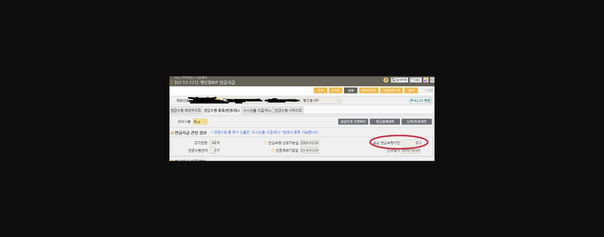

제가 작년에 고객님의 개인형 IRP 조기 연금 수령을 통해

세액공제 받은 자금을 목돈으로 받는 방법을 소개해 드린 적이 있는데요.

--------------------------------------------------------------------------------------------------------------------

IRP 세액공제 받은 자금을 목돈으로 받는 방법은 여기로!

↓↓↓↓↓↓↓↓↓↓↓↓↓↓↓↓↓↓↓↓↓↓↓↓↓↓↓↓↓↓↓↓↓↓↓↓↓↓↓↓↓↓↓↓↓↓↓↓↓↓

**세액공제 받은 IRP도 일시금으로 수령하세요~**

[https://lxp.kbstar.com/app/board/hottip-my/view/13552.F73904F15FE851B52A94718CE40E0E202FD5308C53D624871CCD53E4C520A39C](https://lxp.kbstar.com/app/board/hottip-my/view/13552.F73904F15FE851B52A94718CE40E0E202FD5308C53D624871CCD53E4C520A39C)

--------------------------------------------------------------------------------------------------------------------

이 방법의 한 가지 단점.

고객님께서 매년 연금 수령을 챙겨주셔야 한다는 점이죠.

자칫 시기를 놓치고 한 해를 넘겨버리면, 그 해는 연금수령연차로 기산이 되지 않아서 연금수령 종료년이 1년 늦춰집니다.ㅜㅜ

내가 직접 챙기는 것을 어려워 하시는 고객님이나

은행에서 이런 건 챙겨줬으면 좋겠다(^^;)고 생각하시는 고객님께

**금액지정방식을 통한 연금 수령**을 안내해 보세요~

| ==**"금액지정방식"이란?**====** **==**고객은 연금으로 받을 "금액"을 정하고, 이에 따라 연금수령 기간이 변동하는 방식** - 연금을 신청할 때 연금수령 금액을 지정하고, 적립금 소진 시까지 지정한 금액(세전금액)을 연금으로 수령합니다. |
|---|

연금수령 금액은 자유인출방식처럼 원하는 대로 금액을 설정할 수 있지만

두 가지 조건이 있어요.

1. ==**1) 최소 연금수령기간은 채울 수 있어야 하고, **==

최소 연금수령기간은 5년~10년으로 고객님마다 다른데요.

※ 고객님의 연금수령기간 확인하기: MyStar단말-개인형IRP 연금지급(02-12-221)에서 '최소 연금수령기간' 확인

[예시]

1.  > **이미지1 설명**: 화면 [02-12-221] 개인형IRP 연금지급 화면(연금수령 등록/변경/취소 탭, 개인정보 마스킹): 고객연령 64세, 연금수령연차 3년, 연금수령 신청가능일 2023/10/24, 연금계좌가입일 2018/10/24, 최소 연금수령기간 항목 강조 표시

이 고객님은 최소 연금수령기간이 8년이네요. 즉, 최소 8년은 받을 수 있는 금액이어야 합니다.

1. ==**2) 총 연금수령 예상기간이 45년을 넘지 않아야 합니다.**==

지급 기간이 과도하게 길어지지 않도록 하기 위해서 최대 45년이라는 제한이 있습니다.

그런데 연금 지급 신청은 만 55세부터 가능하다는 점을 미루어 볼 때,

연금수령 종료연령은 아무리 빨라야 만 90세일 것이기 때문에 본 제한은 크지 않을 것으로 생각됩니다.

그럼 실제로 연금수령 금액은 어느 정도 될까요? 예를 들어 보겠습니다.

| ==<예시> == 연금개시 신청일 기준 고객님의 개인형IRP 평가금액은** 20백만원**이고 최소 연금수령기간은 **10년**이라고 가정하겠습니다. 금액지정방식으로 신청할 수 있는 연간 연금수령 금액은, 연간 최대 수령금액 : 2백만원 (20백만원 ÷ 10년 = 2백만원)연간 최소 수령금액 : 약 44만원 (20백만원 ÷ 45년 = 약 44만원) 즉, 고객님은 **44만원~2백만원** 사이의 금액으로 연금수령 금액을 지정하실 수 있습니다. |
|---|

요컨대, **세액공제 받은 자금을 일시금으로 받기 위해 연금 개시를 하려는 고객님**께는

1. **1) 자유인출방식을 통해 <u>연 1회 최소금액(10만원)</u> 받기. 단, <u>매년 직접 챙겨야 함.</u>**
2. **2) 금액지정방식을 통해 <u>연간 최소금액(44만원)</u> 받기. 고객님이 챙기지 않아도 <u>자동 입금</u>됨.**

중 하나를 선택하시도록 안내할 수 있는 것이죠.

물론, 연금 수령 주기 및 시작 시기는 고객님께서 원하시는 대로 해주셔도 됩니다.

월, 분기, 반기, 연 중에서 **원하시는 주기를 선택**하실 수 있고요.

연금 최초 수령일도 연금지급 등록일의 내년 해당일까지 가능하니(**신청일로부터 1년 내 선택 가능**)

수령일로 선택할 수 있는 일자도 넉넉합니다.

그리고 혹시라도 **목돈이 필요하실 경우 1년에 한 번은 수시인출도 가능**하니

연금 수령기간 동안 자금이 묶일 걱정은 NONO!

비록 고객님은 자유인출방식을 선택하지 않았으나

내가 원하는 만큼 자금을 꺼내 쓸 수 있는 자유인출방식의 장점은 그대로 누리실 수 있습니다!

--------------------------------------------------------------------------------------

개인형IRP 연금 지급 업무는 알아보면 알아볼수록 고객님에게 소개해드릴 팁이 많은데요.

보다 많은 고객님께서 당행의 편리한 퇴직연금 서비스를 누리실 수 있도록

고객님께 다양한 퇴직연금 팁을 안내드렸으면 좋겠습니다~♪♬♪♬♪♬