**안녕하세요! 가좌공단종합금융센터 김민송계장입니다^^**

**오늘은 직장인 및 자영업자에게 꼭 필요한 개인형IRP 상품에 대해 소개하려고합니다!**

**개인형IRP는 어떻게 권유하는거지?...하는**

**신입행원분들 주목!!**

> **이미지1 설명**: "신입행원 가이드북 개인형IRP편" 표지 삽화 이미지

==**연금의 중요성!**==

**노인이 되면 경제 활동으로 돈을 벌기 쉽지 않다는 건 모두 아실 거예요**==**. **==

**좋은 일자리를 구하기 어렵고**==**, **==**건강도 예전 같지 않기 때문이죠**==**.**==

**연금은 미리 정해진 간격을 두고 지급되는 금액을 뜻하는데**==**, **==**노년기에 지급되는 연금은 경제 생활에 있어서 큰 부분을 차지하게 됩니다**==**.**==

**연금의 중요성은 갈수록 커지고 있습니다. **==**1960**==**년**==** 52.4**==**세에 불과하던 한국인의 기대 수명은 이제**==** 80***==**세를 훌쩍 넘었습니다**==**. **==

**더한 문제는 우리나라의 노인 빈곤율이**==** OECD **==**회원국 최고 수준에 달하며 은퇴 후 가난한 노후가 특히 우려되고 있는 현실입니다.**

==**그럼에도 불구하고 3050 직장인들의 연금 이해도는 100점 만점에 47.6점에 불과한 것으로 나타났다고해요..ㅠㅠ**==

==**특히, 개인형 퇴직연금인 IRP에 대한 이해도가 39.2%로 가장 낮았다는 결과입니다.**==

==**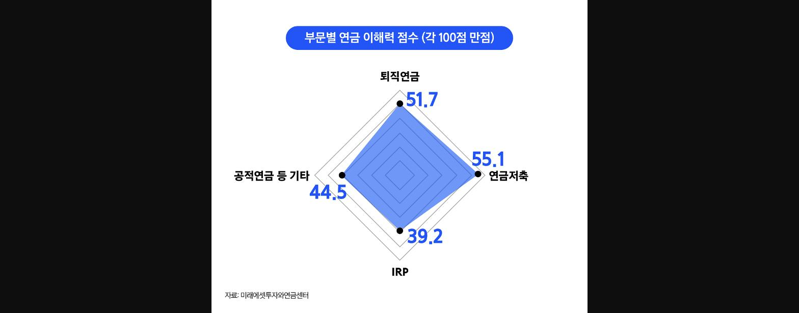

> **이미지2 설명**: 부문별 연금 이해력 점수(각 100점 만점) 레이더차트(자료: 미래에셋투자와연금센터): 퇴직연금 51.7점, 연금저축 55.1점, IRP 39.2점(가장 낮음), 공적연금 등 기타 44.5점**==

==**연금에 대한 이해 부족은 노후 생활에 심각한 위협이 될 수 있다 생각합니다.**==

==**노후에 사용할 돈을 마련하지 못한다면 은퇴한 뒤 생활에 제약이 있을 수 있기 때문입니다.**==

==**생활비는 물론이고, 병원비까지 감당해야 한다면 더 어려운 상황에 처할 수 있겠죠?**==

==**그렇기 때문에 연금에 대해 자세히 알아보고 대비하는 것이 중요하다고 할 수 있습니다.**==

> **이미지3 설명**: "IRP가 뭐길래?! 신입이라면 꼭 알아야 할 개인형IRP 모든 것" - 3층 연금구조 피라미드 설명(1층 공적연금-국민연금 등, 2층 퇴직연금-DB/DC, 3층 개인연금-개인형IRP·연금저축·연금보험)

==**개인연금**==

**개인연금은 말 그대로 개인이 스스로 노후를 준비하는 연금입니다**==**. **==

**대표적인 상품이 개인형IRP와 연금저축(신탁,펀드,방카)입니다.**

**연금저축 상품도 개인형IRP와 같이 가입 기간이**==** 5**==**년 이상이면**==** 55**==**세 이후에 연금으로 받을 수 있습니다.**

**이때**==**, **==**연금은 연간 연금수령 한도 내에서 받을 수 있고 수령하는 금액에 따라 세율이 달라질 수 있습니다**==**.**==

**이러한 개인형IRP 및 연금저축 상품을 가입한다면 다양한 세제 혜택을 누릴 수 있습니다^^**

**오늘은 개인형IRP에 대해 설명하겠습니다!**

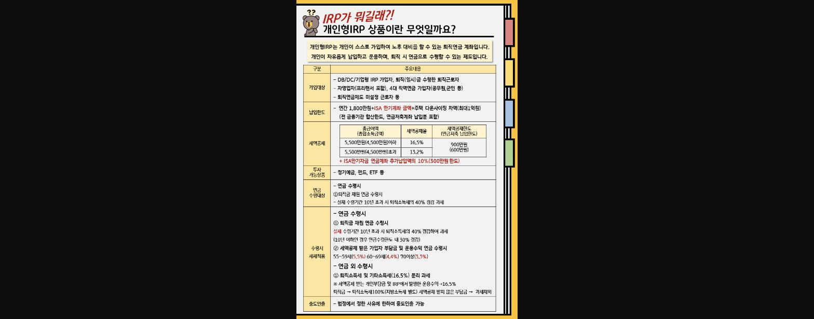
> **이미지4 설명**: "개인형IRP 상품이란 무엇일까요?" 요약표: 가입대상, 납입한도(연 1,800만원+ISA만기계좌금액+주택다운사이징차액 최대1억원), 세액공제(총급여 5,500만원 이하 16.5%/초과 13.2%, 공제한도 900만원+ISA만기자금 추가납입액 10%(300만원한도)), 투자가능상품, 연금수령대상, 수령시 세제적용, 중도인출 요건
> 출처: 연금사업부(기획)169 문서참고

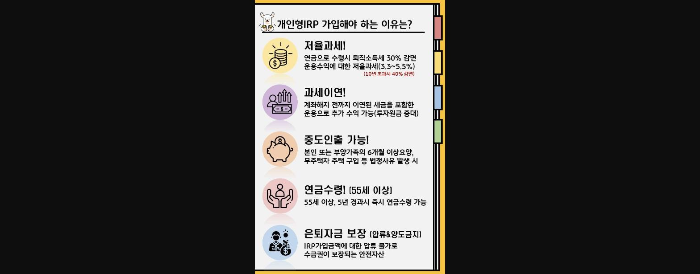
> **이미지5 설명**: "개인형IRP 가입해야 하는 이유" 5가지: ①저율과세(퇴직소득세 30%감면, 운용수익 3.3~5.5% 저율과세, 10년초과시 40%감면) ②과세이연 ③중도인출가능(요양/무주택자 주택구입 등) ④연금수령(55세이상 5년경과시) ⑤은퇴자금보장(압류·양도금지)

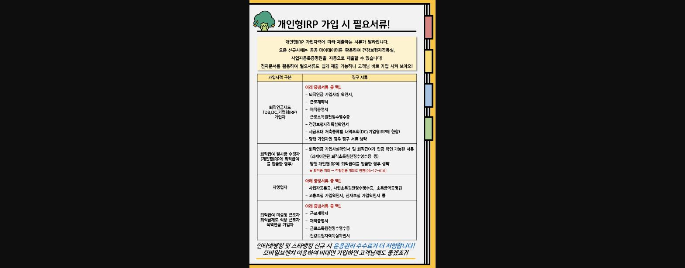
> **이미지6 설명**: "개인형IRP 가입 시 필요서류" 표: 가입자격 구분(퇴직연금제도가입자/퇴직급여 일시금수령자/자영업자/퇴직급여 미설정근로자)별 증빙서류 목록, 마이데이터 활용 시 서류 자동제출 가능 안내
> 출처: 연금사업부(기획)169 문서참고

==**왜 국민은행을 선택하여 IRP를 개설 해야할까요?!**==

**국민은행은 차별화된 고객 수익률 관리 서비스 제공으로 개인형IRP 수익률 은행권 전체 1위 달성으로**

**3분기말 기준 수익률 14.61% 달성! 증권사를 포함해도 2번째 순위입니다!**

**실적배당상품, 디폴트옵션 수익률에서 앞서가는 KB국민은행입니다!**

**차별화된 퇴직연금 고객 수익률관리 서비스를 제공하고 있습니다.**

**1:1자산관리상담서비스 또는 퇴직연금 자산관리컨설팅센터를 통해 서비스를 제공합니다.**

**체계적인 프로세스를 통해 엄격하고 엄선된 상품 선정으로 시장 변화에 맞춰 상품 제공합니다.**

**24시간 365일 운영하고 있어 쉽고 간편한 프로세스로 빠르게 가입이 가능합니다!!**

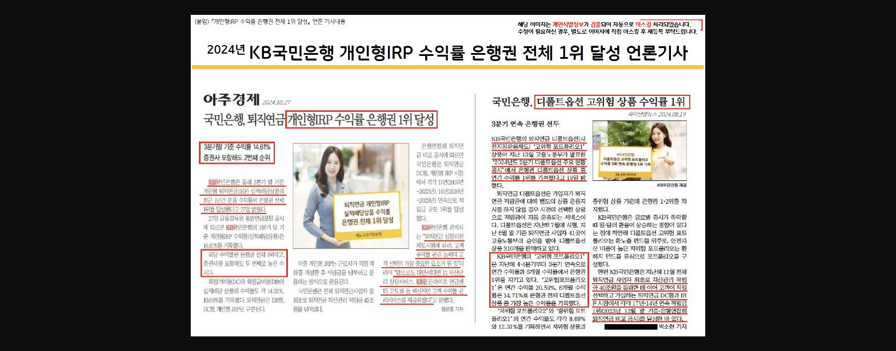
> **이미지7 설명**: "2024년 KB국민은행 개인형IRP 수익률 은행권 전체 1위 달성" 언론기사 스크랩 2건(아주경제 2024.10.27, 파이낸셜뉴스 2024.08.19) - 3분기 누적 수익률 14.61%, 증권사 포함 2위 (개인정보 자동 마스킹)
> 출처: 연금사업부(상품) 414 문서참고

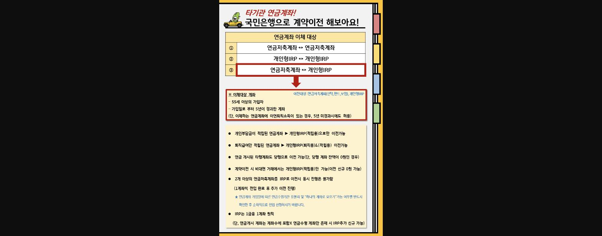
> **이미지8 설명**: "타기관 연금계좌! 국민은행으로 계약이전 해보아요" - 연금계좌 이체대상 3가지(연금저축↔연금저축, 개인형IRP↔개인형IRP, 연금저축↔개인형IRP), 이체대상 요건(55세이상, 가입일로부터 5년경과) 및 유의사항 정리
> 출처: 연금사업부(기획)169 문서참고

**2025년 지역본부 및 영업점 KPI 상반기 평가기준 55page를 보시면 **

**개인형IRP 평가 점수는 30점을 배점 받을 수 있으며**

**타사이전은 가중치를 1.5 받을 수 있기 때문에**

**CIF상 55세 이상 고객님 내점 시 필수적으로 검색해야 하는 화면이 있습니다!!**

==**<타사 개인형IRP/연금저축 보유고객 확인!>**==

==**세금우대관련 조회[04-10-099]에서**==

==**조회종류 : 1, 고객번호 입력,**==

==**저축종류(36, 55) 조회하기!**==

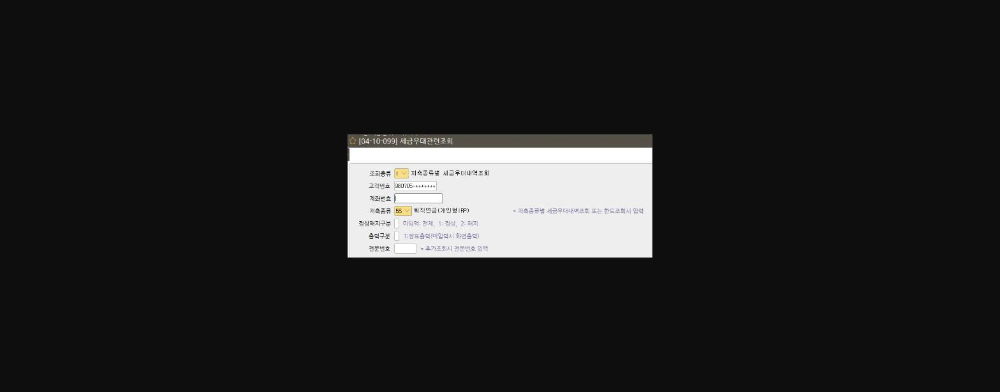
> **이미지9 설명**: 화면 [04-10-099] 세금우대관련조회 화면: 조회종류/고객번호/계좌번호/저축종류(55-퇴직연금(개인형IRP)) 입력 필드 (일부 개인정보 마스킹)

**연금저축보험으로 운영하시는 고객님들은 보험사 이율이 낮은 경우가 많고 사업비가 많이 차감 되기 때문에**

**개인형IRP로 이전하여 저축은행 상품 정기예금이 또는 TDF 상품으로 권유하시면 성공 확률이 높습니다!**

**퇴직연금 상품조회 화면을 참고하여 금리 확인 후 상담하세요!**

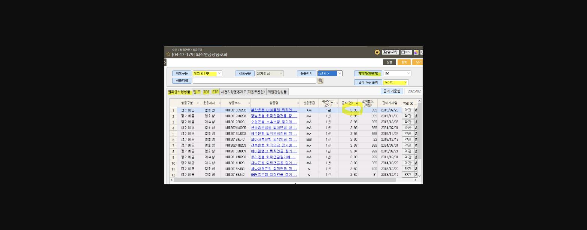

> **이미지10 설명**: 화면 [04-12-179] 퇴직연금상품조회 화면: 개인형IRP 정기예금 상품 목록(금리 Top15 순), 부산은행·장남은행·수협은행 등 타행 정기예금 금리 비교(2.5~2.95%)

**기업대출 보유 고객을 타겟으로 TM 마케팅하기 좋은 화면 번호도 알려드리겠습니다!**

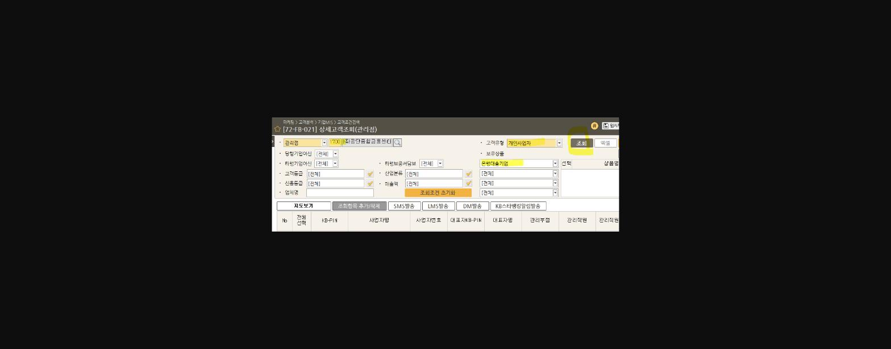
> **이미지11 설명**: 화면 [72-FB-021] 상세고객조회(관리점) 화면: 마케팅>고객분석>기업MIS>고객조건검색, 고객유형 개인사업자, 보유상품 온렌딩대출기업 조회조건 입력 화면

**관리점이 당점이고 기업 대출 보유 고객인 개인사업자를 타겟으로 조회하여 TM 마케팅하면 효과가 좋습니다!**

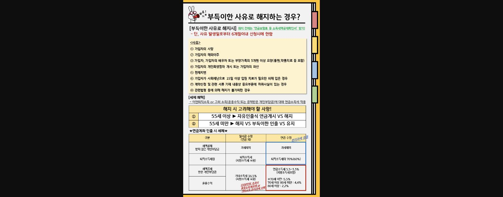
> **이미지12 설명**: "부득이한 사유로 해지하는 경우?" - 부득이한 해지사유 8가지(가입자 사망/해외이주/3개월이상 요양/개인회생·파산/천재지변 등), 해지시 고려사항(55세이상 자유인출식 연금개시 vs 해지), 연금계좌 인출시 세제 비교표(일시금수령 vs 연금수령)
> 출처: 연금사업부(기획)169 문서참고

**중도인출 사유 중 영업점에서 자주 발생하는 경우는 무주택자의 주택구입,**

**무주택자의 전세금 보증금을 위한 중도인출 등이 많이 일어납니다.**

**중도인출 서류 안내시 운용상품별 만기일 차이가 있다는 점 안내 해주셔야합니다!**

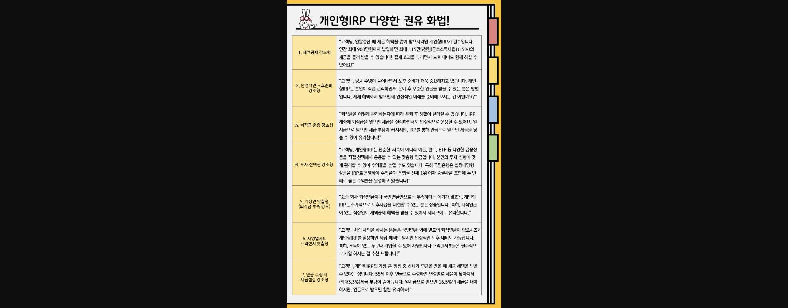
> **이미지13 설명**: "개인형IRP 다양한 권유 화법!" - 7가지 상황별 화법 예시(세액공제강조형/안정적노후준비강조형/퇴직금운용강조형/투자선택권강조형/직장인맞춤형/지명업지프리랜서맞춤형/연금수령시세금절감강조형) 각 구체적 멘트 포함

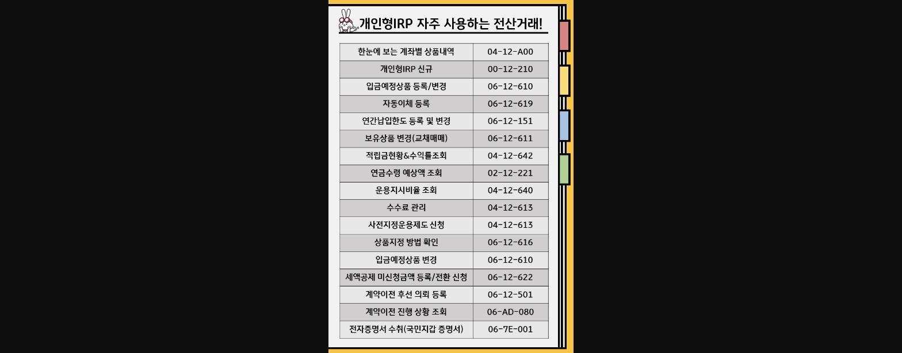
> **이미지14 설명**: "개인형IRP 자주 사용하는 전산거래!" 화면번호 목록: 계좌별상품내역[04-12-A00], 개인형IRP신규[00-12-210], 입금예정상품등록/변경[06-12-610], 자동이체등록[06-12-619] 등 15개 자주쓰는 화면번호 정리
> 출처: 연금사업부(기획)169 문서참고

**그 외에 개인형IRP 업무를 진행하며 필요한 전산코드 모음을 요약하여 함께 공유드립니다.**

**더하여 스타뱅킹으로 개인형IRP 계약이전 방법 PDF 파일도 함께 공유드립니다!**

> **이미지15 설명**: 해리포터 도비 캐릭터 밈 이미지: "일 그만하고 연금 받을꺼얌! 도비는 자유예요" (유머용 마무리 이미지)