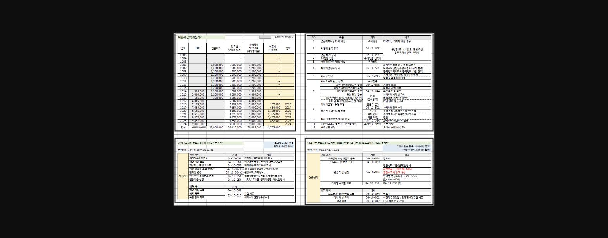
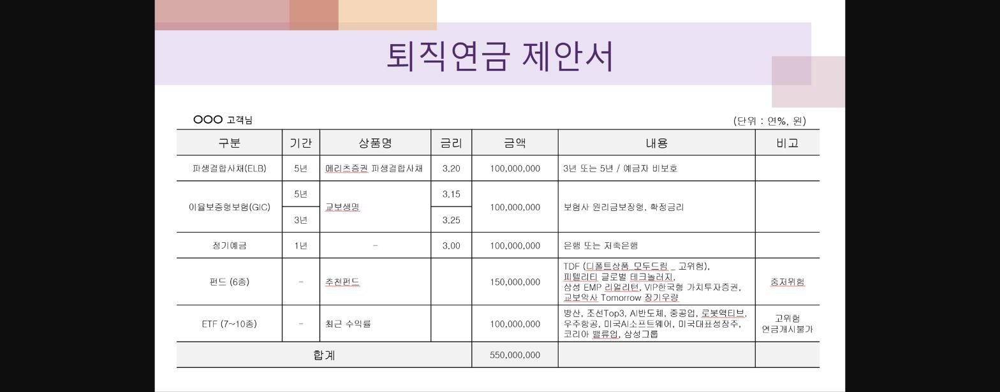

==***퇴직 직원 <퇴직금 관리> 및 <연금 상품> 상담시 활용자료 입니다**==

==***상담 순서대로 정리해 보았습니다**==

1. 1. 미공제 세액 금액 계산 (엑셀) 양식
2. 2. 퇴직금 입금에서 과세이연 등록까지 프로세스
3. 3. 개인연금저축과 연금신탁 상담 및 업무처리 요약

4. 개인형IRP 운용 제안 (예시)

*첨부파일 출력시, 한장씩 출력가능합니다

> **이미지1 설명**: 미공제 세액 계산 엑셀 표: 연도별 IRP·연금저축 납입액, 세액공제 대상금액, 미공제 산정액 계산(2003~2024년), 우측에 관련 화면번호 목록(과세이연 개좌이전/미공제 금액 통보 등)

> **이미지2 설명**: "퇴직연금 제안서" 양식: ○○○ 고객님 대상 상품 구성 예시(파생결합사채 1억, 이율보증형보험 1억, 정기예금 1억, 펀드 1.5억, ETF 1억, 합계 5.5억원) 및 상품별 금리/내용/비고