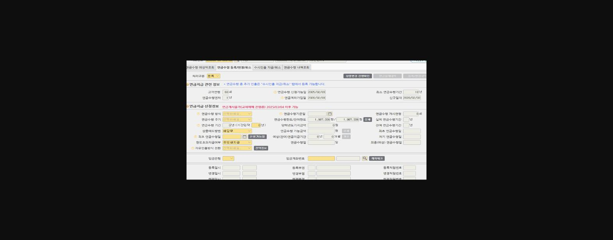

**<<연금개시>>**

**가입일로부터 5년 경과, 만 55세이후 연금지급가능.-(퇴직용은 가입기간 제한없음.)**

**연금 개시 전 확인사항**

: ) 적립용 irp일경우

화면번호 <0410099>: 35,36,55 에서 이전가능한 상품이 있는지 확인

*연금 개시 후에는 이전 불가!

**이전을 원할 경우**

이전 받을 계좌 (적립용 irp) 의 가입일이 이전하고자 하는 상품 보다 이전인지 확인.

이전일 경우- 고객님에게 세금관련 손해 x (그 계좌에 이전신청)

이후일 경우- 기존 irp를 연금개시 신청하고, 적립irp 신규 개설 후 이전(재직중이어야함)

**연금개시절차**

*준비서류- 연금보험료등 소득 세액 공제 확인서(서류 없을 경우 국민지갑에서 발급가능)

**1. 세액 미공제 한도 등록** (화면번호 0612622)

**2. 연금지급** (화면번호 0212221)

> **이미지1 설명**: 화면 [02-12-221] 개인형IRP 연금지급 화면: 연금수령 등록/변경/취소 탭, 고객연령 60세, 연금수령연차 1년, 연금수령한도/잔여한도 1,987,336원, 연금수령방식·주기·기간 설정 필드 (일부 마스킹)

***자동이체 금액 입금중이거나, 보유상품변경 진행시 거래 불가.**