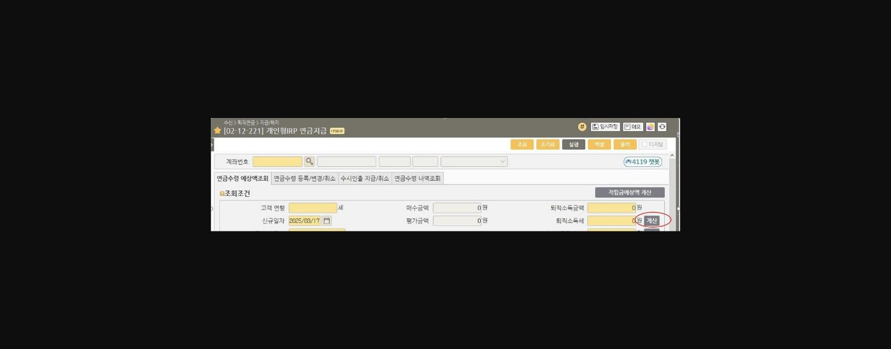
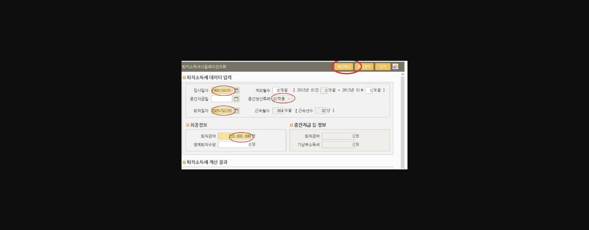
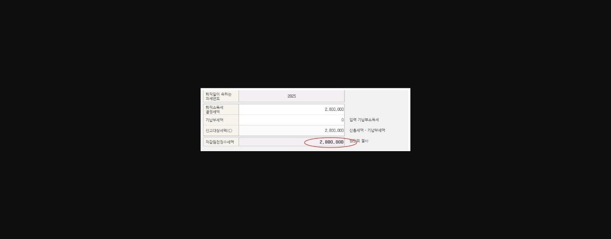

**퇴직소득세 계산 어렵지 않아요~**

1차 베이이붐(1955~1963년생)세대에 이어 2차 베이이붐(1964~1974년)세대가 법정 은퇴 연령을 맞이하면서 퇴직금 수령에 대한 상담이 예전보다 많아진거 같습니다.

퇴직금 수령시 IRP계좌를 통한 절세 가능 금액을 구체적으로 안내드리면 퇴직연금 유치에 많은 도움이 됩니다.

절세 가능금액 확인을 위하여 퇴직소득세 계산을 할 수 있다면 전문가다운 모습 뿜~뿜~ 고객 신뢰도 업! 업! 됩니다.

**퇴직소득세는 기본적으로 퇴직금 규모와 근속기간에 따라 세금이 달라집니다.**

**단말거래 [0212221] 화면에서 간단하게 퇴직퇴득세를 계산할수 있습니다.**

**                                 ** 1. [0212221] 빈 화면에 계산 클릭

> **이미지1 설명**: 화면 [02-12-221] 개인형IRP 연금지급 화면: 연금수령 예상액조회 탭, 고객연령/신규일자(2025/03/17)/매수금액/평가금액/퇴직소득금액/퇴직소득세 계산 버튼 표시

2. 입사일자/중간정산특례 적용 여부/퇴직일자/퇴직금액 입력후 세금계산 클릭

> **이미지2 설명**: 퇴직소득세 시뮬레이션조회 화면: 퇴직소득세 데이터 입력(입사일자 1993/03/01, 퇴직일자 2025/02/28, 근속월수 384개월(32년), 퇴직급여 200,000,000원)

3. 차감원천징수세액 확인

(보여지는 금액은 순수 퇴직소득세 =>== 10% 지방소득세 별도 있음 ==/ 중간정산특례 적용, 미적용에 따른 세금 차이 확인 가능)

> **이미지3 설명**: 퇴직소득세 계산 결과: 퇴직일이 속하는 과세연도 2025, 퇴직소득세 결정세액 2,800,000원, 신고대상세액(C) 2,800,000원, 차감원천징수세액 2,800,000원