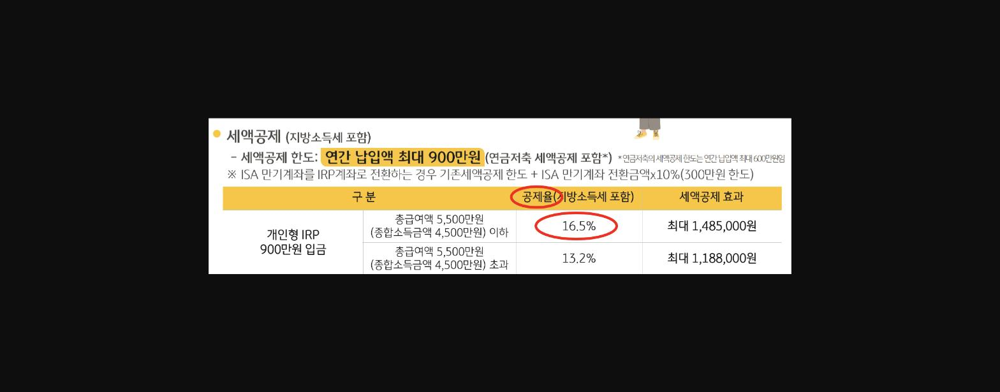
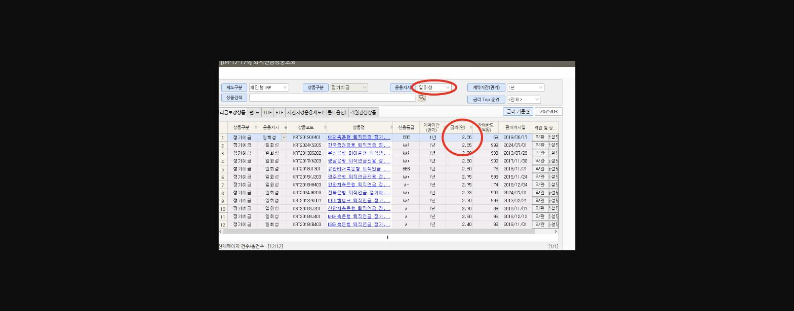

**소득이 있는 모든사람에게 권유할 수 있는 IRP**

**만 55세 이후 & 5년이상 납입 후 연금 수령이라는 점이 선뜻 권유하기 어렵게 하는데요**

**창구 내점고객(연령대)별로 거절 극복 멘트 및 권유화법을 공유하려고 합니다 ^^ **

> **이미지1 설명**: 세액공제 안내표: 개인형IRP 900만원 입금시 세액공제 한도(연간 납입액 최대 900만원, 연금저축 세액공제 포함), 총급여액 5,500만원 이하 16.5%(최대 1,485,000원 공제) / 초과 13.2%(최대 1,188,000원 공제)

**먼저 개인형IRP 안내장을 살펴보면 ****납입금액 * 16.5%****에 해당하는 금액의 세금을 환급받을 수 있고 ! **

**해당 자산을 정기예금으로 운용하면**** **==**2.8% **==**이자가 붙어요! **

**16.5% + 2.8% = 19% ****혜택이 있습니다!**

> **이미지2 설명**: 화면 [04-12-179] 퇴직연금상품조회 화면: 개인형IRP 정기예금(일회성) 상품 목록, 금리순 정렬, 오저축은행/한국증권 등 타행 정기예금 금리 비교(2.4~2.86%)

1. **1. 20대~40대 고객**

**거절 > **

**만 55세 이후 수령은 너무 길어요. 돈도 부족하고 ..중간에 해지도 어렵잖아요?**

**극복화법 > **

**고객님, 매년 내야하는 근로소득세, 사업소득세 **

**안낼 수 있는 방법 알고계신가요?**

**1년에 100만원만 납입해도 19만원 절세하실 수 있는데 안하시면 손해에요!**

**10년이면 200만원입니다**

**나중에 ****주택구입이나 전세자금 보증금 필요하실때는 중도해지 가능****하니 **

**요즘 금리가 워낙 낮아서 1년 예치하셔도 3% 금리도 받기 힘든데**

** ****19% 적금이라 생각하시****고  매년 세액공제 혜택 놓치지 말고 받으세요!**

**2. 50대 이상 고객**

**거절 > 복잡하게 말고 간단한 정기예금 해주세요. 금방 쓸 수 도 있어요.**

**극복화법 >**

**고객님, 1인당 5천만원 비과세 한도 다 소진하셔서 예금 하실때마다 15.4% 이자배당소득세 내고 계세요..**

**일반 정기예금보다 세율도 낮추고, 이자도 많이 수령하실 수 있는 꿀팁 알려드릴게요!**

**연간 900만원 초과금액은 세액공제 안받으시니까 나중에 중도인출하셔도 불이익이 없어요!**

**개인형IRP 편입 정기예금은 모든 은행의 정기예금 금리를 비교해서 가장 고금리의 상품을 선택할 수 있고 **

**일반적으로 금리가 0.1~0.2% 높아요!**

**국민연금 만으로는 노후대비가 힘든데 **

**5년 뒤에 연금으로 수령하시면서 ****3~5% 세금만 내시고 자유 인출 방식으로 연금 수령****하시면 좋아요!**

**개인고객 기반확대 & 개인형IRP 지표 둘 다 잡을 수 있는 개인형IRP!**

**장점만 콕콕 찝어 고객님께 권유해보면 좋겠습니다**

**읽어주셔서 감사합니다 :)**

> **이미지3 설명**: 곰돌이와 토끼 캐릭터가 포옹하는 하트 장식 이미지 (장식용, 텍스트 정보 없음)