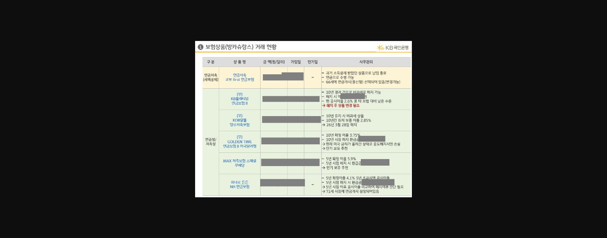
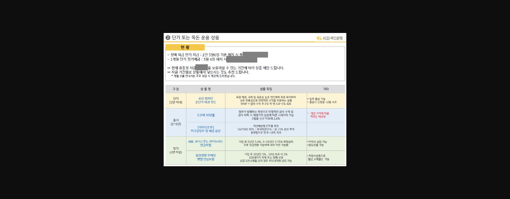
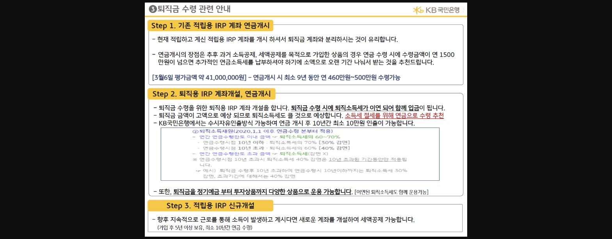

**안녕하세요.**

**국민은행 판교종금 양혜련 팀장입니다.**

**최근 내점한 고객님의 니즈를 세밀하게 파악하여 51억원의 개인형 IRP 자금을 유치하게 되었습니다. **

**고객 상담시 활용하였던 내용들을 공유해 봅니다.**

---------------------------------------------------------------------------------------------------------------

***해당 고객님은 적금 만기로 인해 당점에 내점을 해주셨습니다. ***

***한 기업의 임원이시고 자산가이신 고객님께서는 금융니즈가 다양하셨는데요.***

이야기중 핵심내용은

1. ***[고객니즈1.]****** ****** <u>보험(방카) 상품이 너무 많아서 정리</u>를 좀 했으면 좋겠다.***

***[고객니즈2.] ******만기된 <u>적금 어떤 상품을 추천</u>해줄 수 있느냐.***

==***[고객니즈3.]***====***  ***====***<u>퇴직금</u>을 받을거 같은데 어디다 받으면 되냐.***==

***저는 이부분에서 고객의 자산현황과 ******과거 상담내역으로 퇴직금이라는 [고객니즈3] 을 제일 중요******하게 보았습니다.***

***[고객니즈 3]을 안내 하기 위해 저는 다른 요구사항들을 먼저 정리하기 시작하였습니다.***

**[고객니즈1.]**** 보험상품이 너무 많은데 정리가 필요해!**

**고객님께서는 당행에 많은 보험상품을 가지고 계셨습니다. 연금저축과 다양한 거치식/ 적립식 연금보험 상품들을 보유하고 계셨는데요.**

**계좌가 많았지만 하나하나 가입제안서 체크 및 보험사에 전화하여 각각의 상품 만기일, 지급관련 내용을 정리해서 드렸습니다.**

> **이미지1 설명**: 보험상품(방카슈랑스) 거래현황표(KB국민은행, 개인정보 마스킹): 연금저축(세액공제) 및 연금성/저축성 상품(KB플래티넘 연금보험II, KDB알뜰 양로저축보험, GOLDEN TIME 연금보험II 미국달러형, MAX저축보험 스페셜, 하나로든든 NH연금보험) 별 금액/가입일/만기일/사후관리 방안

**[고객니즈2.]**** 만기된 적금에 대한 상품추천 필요해!**

**정액적금 만기 및 방카 만기 금액에 대한 과거 보유상품군을 확인하여 상품 제안서를 같이 정리해서 드렸습니다.**

> **이미지2 설명**: 단기 또는 목돈 운용 상품 안내표(KB국민은행): 정액적금 만기자금 및 단기정기예금 현황, 기간별(단기1년이내/중기2~5년/장기5년이상) 추천상품(유진챔피언 중단기채권펀드, 국고채30년물, ABL 보너스주는 하이브리드연금보험, 동양생명 무배당 앤젤안심보험 등) 특징 및 기타사항

**[고객니즈3.]**** 퇴직금 어떻게 어디다 받아야 하나!**

***<u>당점에 </u>******<u>개인형 IRP 실적</u>******<u>을 높이기 위해서 가장 중요하게 보았던 고객의 니즈입니다. </u>***

==***고객님께서는 당행에 IRP 계좌 적립겸용 상품을 가지고 계속 입금하는 중이셨고 퇴직 후 자회사로 다시 재취업 예정이시기예 적립용 IRP 계좌는 계속 필요한 것***==**이었습니다.**

**따라서 지속적인 거래와 함께 당점으로 유치를 위해서는 퇴직용 계좌로 신규개설을 하는 것이 필요하였고 그로 인한 다양한 방법을 고민해 보았습니다.**

1. **<u>1. 기존 적립용 IRP 계좌 연금개시 > 2. 퇴직용 IRP 개설 및 연금개시 > 3. 적립용 IRP 신규개설 을 제안하였습니다.</u>**

> **이미지3 설명**: "퇴직금 수령 관련 안내" 3단계 프로세스: Step1 기존 적립용 IRP 계좌 연금개시(3월6일 평가금액 약4,100만원, 최소 9년간 연 460~500만원 수령가능), Step2 퇴직용 IRP 계좌개설·연금개시(퇴직소득세 이연입금, 연금수령시 10년이하 30%감면/10년초과 40%감면), Step3 적립용 IRP 신규개설

**고객님께 위의 제안서를 보내드리고 안내한 후**

** 약 1달 뒤에 내점을 다시 해주셔서 연금 개시 후 퇴직용 IRP를 개설 하셨고 **

***그 결과***

**무려 *****<u>51억 8천만원 </u>*****이라는 금액의 퇴직금을 당점으로 유치 할 수 있었습니다.**

이 결과는 아무래도

==**고객님의 니즈를 정확하게 파악하고 꼼꼼한 제안서를 보냈던게 가장**==**  **==** **====**KICK**==** 이었다고 생각합니다. **

**특히 고객님께선 본인 업무에 바쁘셔서 퇴직금 수령방법이나 연금 개시등에 대해서 잘 모르셨던 부분에 **

** 안내를 해주고 복잡한 방카 상품등을 잘 정리해주어 감사하다고 해주셨습니다.**

***꼼꼼한 준비와 노력으로 고객을 맞이하려는 자세가 정말 중요하다는 것을 한번 더 느끼는 순간이었습니다.***

***제안서 공유 해드리니 퇴직금 관련 상담 및 유치시에 이용하시면 좋을 것 같습니다.***

***오늘도 화이팅입니다!!***