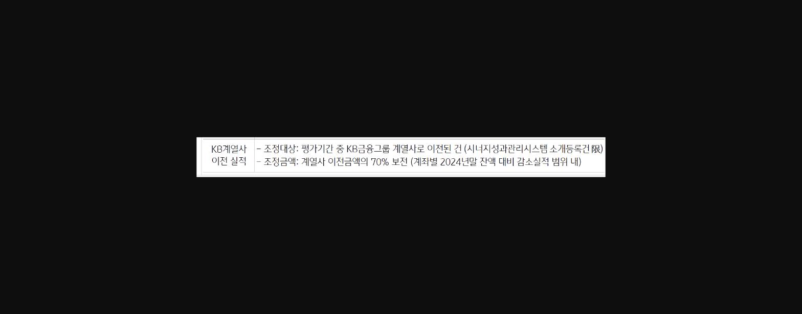
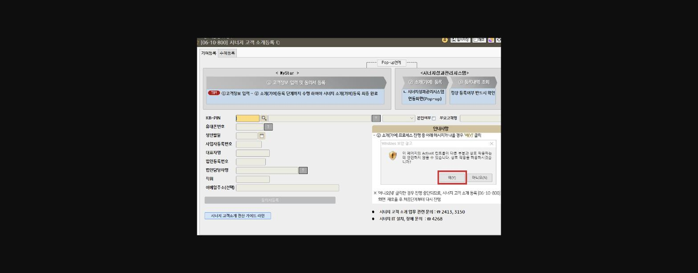
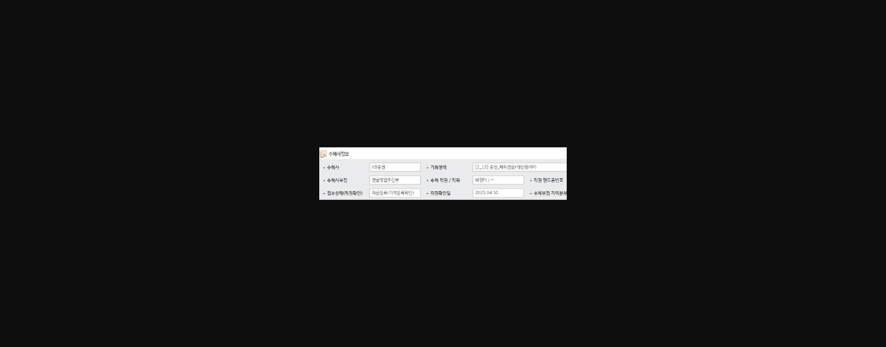
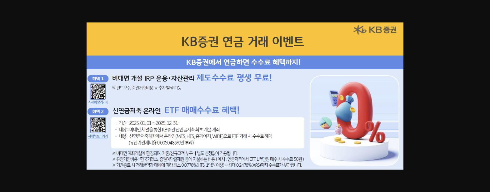

- 당행 퇴직연금 고객이 증권사(미래에*등)로 이전 하신다고 할때 최대한 방어하시다가 허탈하신 적 많으시죠? ㅜㅜ
- 증권사로 이탈할 가능성이 높은 고객을 KB증권을 소개해 보세요 !!
- 고객은 제도수수료 평생 무료(비대면), ETF 매매수수료 혜택을 누리고
- 지점은 WM고객이탈도 방어하고 KB계열사 이전 실적으로 KPI 보전 (이전 금액의 70%)하고
- 소중한 우리 고객님을 최대한 방어하실 수 있습니다.
- 시너지성과관리시스템 소개등록은 필수 입니다.

*2025년 상반기 평가기준 P55 ( 13.개인형IRP)

> **이미지1 설명**: KB계열사 이전실적 조정 기준표(200352와 동일 내용): 평가기간 중 KB금융그룹 계열사로 이전된 건, 조정금액은 계열사 이전금액의 70% 보전

1. 1.시너지소개등록방법

> **이미지2 설명**: 화면 [06-10-800] 시너지 고객 소개등록 화면: 기여등록/수혜등록 탭, KB-PIN·휴대폰번호·생년월일 등 고객정보 입력, ActiveX 컨트롤 실행 경고 팝업(예(Y) 클릭 안내)

> **이미지3 설명**: 시너지고객소개 수혜사정보 입력 예시: 수혜사 KB증권, 기회영역 [2_13]증권_퇴직연금(개인형IRP), 수혜사부점 연금영업추진부, 접수상태 유입등록(기여등록확인), 직원확인일 2025.04.30

2. KB증권 혜택

> **이미지4 설명**: KB증권 연금 거래 이벤트 홍보 이미지: 혜택1 비대면개설 IRP 운용·자산관리 제도수수료 평생무료, 혜택2 신연금저축 온라인 ETF 매매수수료 혜택(2025.1.1~12.31, 유관기관제비용 0.0050483%만 부과)

3. KB증권으로 소개시 활용할 수 있는 KB증권 소개 안내장 및 고객이벤트를 파일첨부 참고하시기 바랍니다.