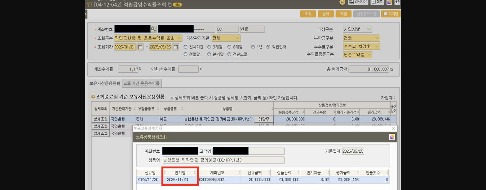
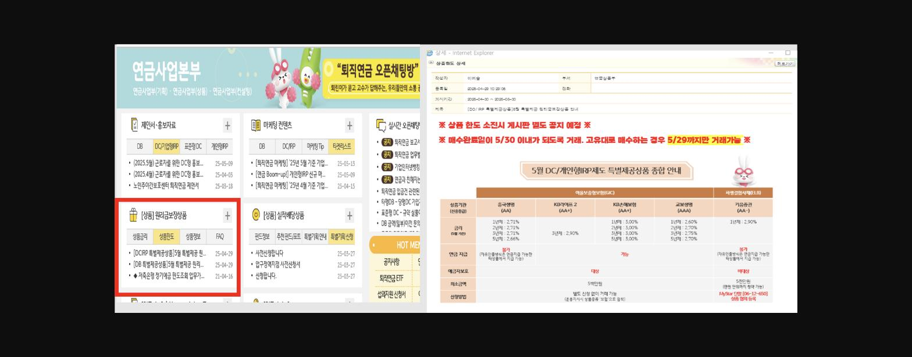
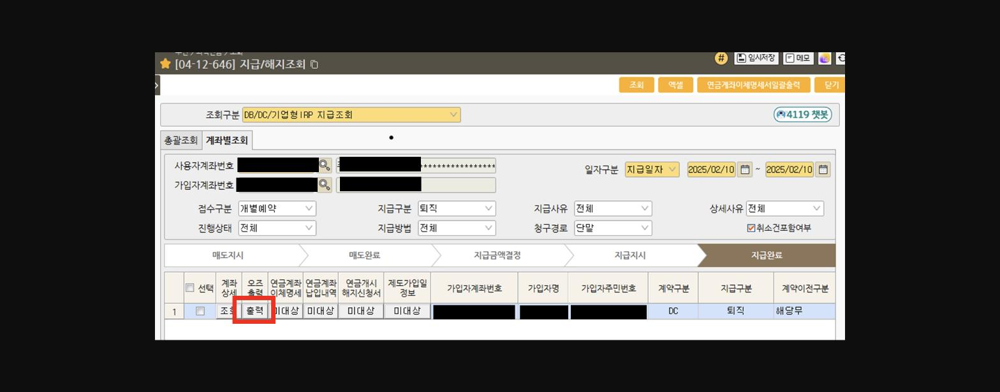
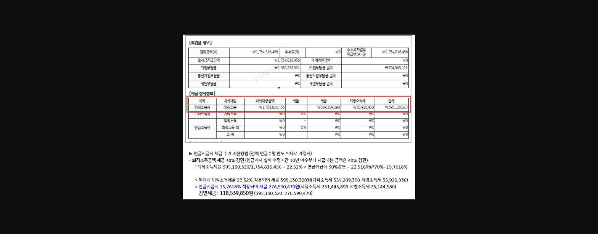
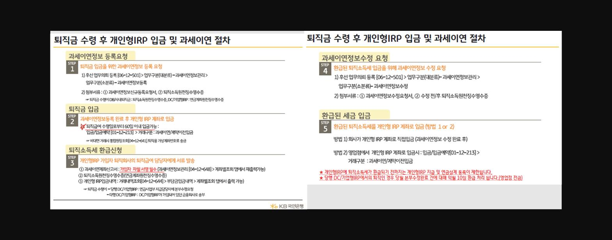

안녕하세요~

당행 개인형IRP 잔액 증대를 위해 모든 분들 타사 계약이전에 힘을 쏟고 계실텐데,

타사 자금을 유치하는 것만큼 당행의 퇴직연금 자산을 지키는 것도 중요하다는 사실~

오늘은 우리 지점의 개인형IRP 잔고를 늘리는 방안으로

**당행 기업형 퇴직연금에서 운용되던 퇴직금을 개인형IRP로 이전하는 방법**도

꽤 성공률이 높아서 소개해 드리려고 합니다~

---------------------------------------------------------------------------------------------

1. ==**1. (퇴직 전) 운용 중인 상품 만기 Check! Check!**==

아직 기업형 퇴직연금에서 퇴직 지급이 안 된 상황이라면

현재 자금이 어떻게 운용되고 있는지 체크해 보세요~

MyStar 단말 內 적립금및수익률조회(04-12-642) 화면에서 적립금 운용현황을 봅니다.

> **이미지1 설명**: 화면 [04-12-642] 적립금및수익률조회 화면: 계좌수익률 1.17%, 총평가금액 91,600,007원, 보유상품상세조회 팝업(농협은행 퇴직연금 정기예금(DC/IRP,1년), 신규일 2024/11/20, 만기일 2025/11/20, 상품잔액 20,309,446원) (개인정보 마스킹)
> 출처: 고객님~ 11월 20일이 만기인데 만기 때까지는 보유하셔야죠~

해당 화면을 자주 열어보시다 보면 상당수의 계좌가 정기예금으로 운용되고 있는 걸 아실 수 있을 거예요.

==**그 중 가장 금액 비중이 높은 정기예금의 만기를 확인하여 만기까지 보유하시도록 권유**==합니다.

정기예금으로 운용하시는 경우 중 대부분이 1년제 정기예금이라 만기까지 몇 개월 남지 않은 경우가 많아요.

자금을 사용할 계획이 있었던 고객님들도 만기 말씀드리면 멈칫 하십니다.ㅎㅎ *<u>(아, 놔둬야하나?)</u>*

**기존 운용상품을 그대로 유지할 수 있는 방법은 **

(모두 아시다시피) **개인형IRP(퇴직용)로 옮기는 방법**이죠.

퇴직으로 인해 이탈될 수도 있었던 우리 퇴직연금 자금을 개인형IRP에 옮겨

몇 개월 만이라도 KB에 락인(lock-in) 시켜봅니다.

| ==**++++ 만기가 되면 ++++**== 본 자금이 만기가 되면 바로 고객 관리 들어가야죠~ 'KB-WiseNet > Info Zone > 연금(퇴직연금) > [상품]원리금보장상품 > 상품한도' 게시판에 들어가면매달 제공되는 퇴직연금 특별공급 상품을 확인하실 수 있는데요. **GIC, 저축은행 정기예금** 등은 일반 정기예금처럼 예금자보호가 되는데도금리는 훨씬 높으니 고금리 상품으로서 소개하며 자금의 락인 기간을 늘려보세요~  > **이미지2 설명**: 연금사업본부 인트라넷 화면 캡처: 제안서·홍보자료/[상품]원리금보장상품 메뉴, 5월 DC/개인형IRP제도 특별제공상품 종합안내 팝업 - 저축은행별(증권생명/KB개인생명II/KB손해보험/교보생명) 금리 비교(1~5년 2.6~3.06%) 만약에 찾아서 써야 한다고 하시면?그 때에는 **자유인출방식으로 연금수령 **하시면 퇴직소득세 절감 된다고 안내 드려 보세요~ (세금 관련 자세한 내용은 아래 참고 ↓↓↓↓↓↓↓↓↓↓↓↓↓↓↓↓) |
|---|

==**2. (퇴직 후) 퇴직소득세 감면 내세우기!**==

한편, 이미 퇴직금을 보통통장으로 지급받으신 분들은 어떻게 상담해야 할까요?

아쉽지만 이 분들은 이미 DC/기업형IRP 운용 당시 보유하고 있었던 상품은

이미 다 매도가 되었기 때문에 위의 방법은 사용이 불가능합니다.

이 때에는 **퇴직소득세 30% 또는 40% 감면**을 강조해 보세요!

퇴직금을 이미 받았더라도 퇴직금 수령 후 60일 이내라면 IRP로 자금을 옮길 수 있는데요. (전체 금액 다 안 옮겨도 되고 일부도 가능!!)

IRP로 자금을 옮긴 뒤 연금 수령을 신청하면,

**연금 수령기간이 10년 이내일 경우 퇴직소득세의 30%**를,

**10년 이상일 경우 퇴직소득세의 40%**를 감면받을 수 있습니다.

고객님의 퇴직소득세를 얼마나 줄일 수 있는지 계산하는 방법은 아주 쉬워요.

MyStar 단말 - 지급/해지조회(04-12-646) 화면에서 '계좌별 조회' 탭을 클릭한 뒤에

폐기된 기업형 퇴직연금 계좌를 넣고 조회하면 다음과 같은 화면이 뜹니다.

> **이미지3 설명**: 화면 [04-12-646] 지급/해지조회 화면: DB/DC/기업형IRP 지급조회, 계좌별조회 탭, 매도지시→매도완료→지급금액결정→지급지시→지급완료 진행단계, 퇴직 지급구분 표시 (개인정보 마스킹)

빨간 네모로 해 둔 '출력' 버튼을 누르면 다음과 같은 보고서가 생성되는데요.

두 번째 장으로 넘기면 다음과 같이 보고서에서 '세금 상세정보'를 확인할 수 있습니다.

> **이미지4 설명**: 적립금 정보 및 세금 상세정보표: 결제금액 1,754,816,456원, 기업부담금 1,550,253,331원, 퇴직소득세 395,130,320원(22.52%) - 연금지급시 15.7618% 적용시 세금 276,590,470원, 감면세액 118,539,850원

※ 출처 : [필독] 퇴직연금 신임 담당자를 위한 「퇴직연금 실무 Easy-Up 화상연수」안내 (연금상품부 63, 2025-02-04) 붙임 3 자료 中

숫자가 많아서 어지러우시죠?ㅎㅎ* (저도 그랬어요.....)*

세 줄 요약해 드립니다.

| 1. 퇴직소득세(세금+지방소득세)를 과세대상금액으로 나눠 퇴직소득세율을 산출한다. 2. 1에서 계산된 퇴직소득세율에서 30% 또는 40%를 곱해서 환급될 퇴직소득세율을 구한다. 3. 2에서 계산된 퇴직소득세율을 퇴직소득세(세금+지방소득세)에 곱한다. |
|---|

이렇게 진행하면 세금 환급분을 계산할 수 있습니다. 참 쉽지요?

자자, 그럼 이제 자금을 개인형IRP에 입금하고 세금 환급 받아 볼게요.

진행하는 절차는 다음과 같습니다.

> **이미지5 설명**: "퇴직금 수령 후 개인형IRP 입금 및 과세이연 절차" 5단계: Step1 과세이연정보 등록요청[06-12-501], Step2 퇴직금 입금(60일이내)[01-12-213], Step3 퇴직소득세 환급신청, Step4 과세이연정보수정 요청, Step5 환급된 세금 개인형IRP 계좌 입금
> 출처: 복잡해 보이지만 차근차근 해보면 어렵지 않아요~

※ 출처 : [필독] 퇴직연금 신임 담당자를 위한 「퇴직연금 실무 Easy-Up 화상연수」안내 (연금상품부 63, 2025-02-04) 붙임 3 자료 中

STEP 5까지 다 진행 완료되면 마지막으로 연금수령등록을 진행하며

퇴직소득세 절감을 위한 첫 발을 내딛게 됩니다.

------------------------------------------------------------------------------------------------------------------------

정기예금으로 운용되던 퇴직금이 중도해지되며 만기이자를 다 못 받는다는 점,

구체적인 세금 환급분을 제시하며 고객님께서 세금 혜택을 직접 체감시켜 드리는 점은

우리의 '퇴직연금 일병 지키기' 전략에 강한 킥(kick)이 될 거라고 생각합니다♪♩♪♩♪♩♪♩