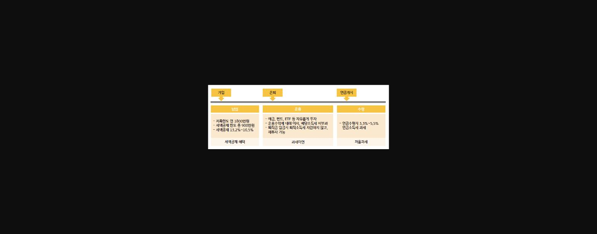
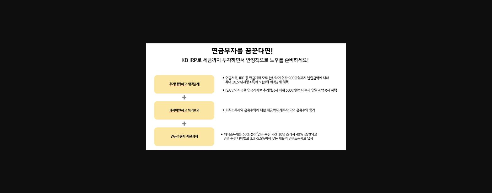
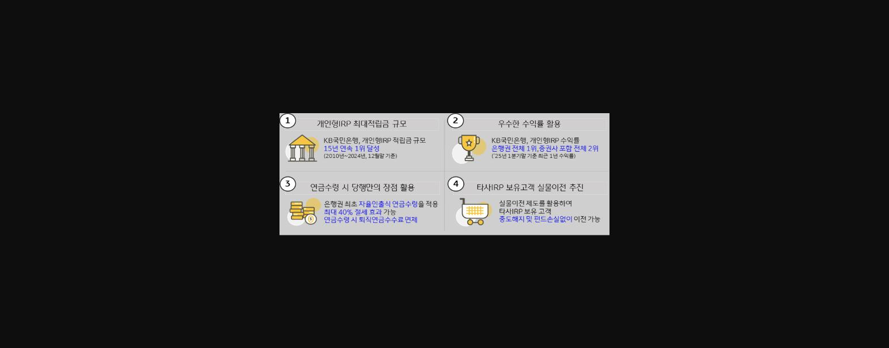
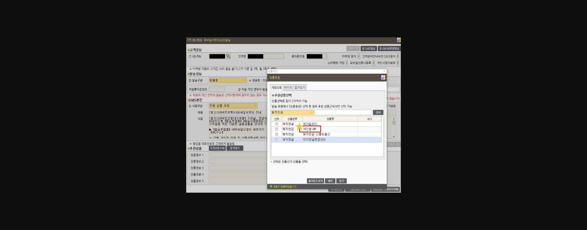
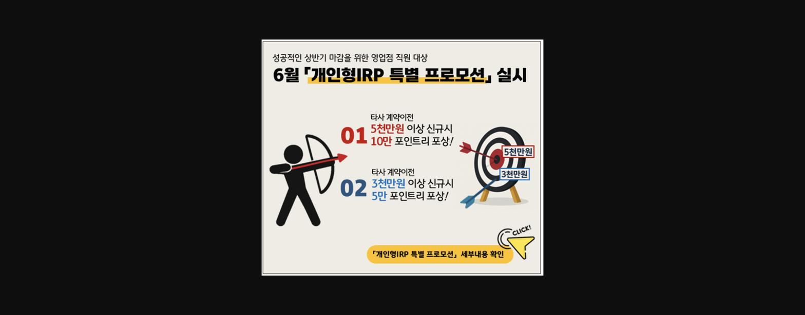

**알****면 ****권****유가 ****E****asy ◆알.권.리◆**

안녕하세요. 목동스텔라지점 장예나 대리입니다.

아마 "==개인형 IRP=="라는 상품에 대해서는 대부분의 직원분들께서 잘 알고 계실텐데요.

그래서 상품 내용보다는 바로 이 **IRP를 좀 더 자신 있게 권유하는 방법**에 대해 공유해보려고 합니다.

그래도 우선 IRP가 어떤 통장인지 간단하게 개념을 짚고 넘어가 볼까요?

> **이미지1 설명**: IRP 명칭 풀이 인포그래픽: I=Individual(개인별로), R=Retirement(퇴직금을 넣어두는), P=Pension(연금계좌) - 퇴직/이직시 발생하는 퇴직금과 추가납입을 운용하여 만55세 이후 연금수령하는 평생 절세통장

여기서 바로 주목해야 할 것은,

**평생 절세 통장!**이라는 것입니다.

혹시 연금컨설팅부에서 진행하는 강의를 들어보신 적이 있나요?

IRP마케팅을 주제로 강의하실 때 항상 IRP의** ****E-E-T 과세체계**를 IRP의 큰 장점으로 강조하십니다.

IRP를 3단계로 나누어보면,

**1단계 : 돈을 입금하는 단계 (납입)**

**2단계 : 그 돈을 운용하는 단계 (운용)**

**3단계 : 그동안 운용했던 돈을 꺼내는 단계(수령)**

로 말씀드릴 수 있는데요.

> **이미지2 설명**: 개인형IRP 생애주기 흐름표: 가입(납입-저축한도 연1,800만원, 세액공제한도 900만원, 세액공제 13.2~16.5%)→은퇴(운용-예금/펀드/ETF 자유투자, 과세이연)→연금개시(수령-3.3~5.5% 저율과세)

각 단계의 과세여부(Taxed 또는 Exempt)를 살펴보면,

**1, 2단계에서는 과세를 E연**하고 **3단계 수령단계에서 과세**하는 E-E-T 구조를 지니고 있는 것이지요.

소득이 상대적으로 높은 부담금 납입단계와 적립금 운용수익 발생단계에서 과세를 이연하고

소득이 상대적으로 낮은 퇴직급여 수령단계에서 과세하므로

납세자는 과세이연에 따른 시간가치 만큼의 절세효과를 누리고

자신에게 적용되는 실질 세율이 낮아지는 효과도 얻게 됩니다.

**그래서!!**** **

IRP는 납입하고 운용하고 수령하는 전 기간에 걸쳐

**[세액공제+과세이연+저율과세] 세제혜택을 받는 평생절세통장이라고 할 수 있습니다. **

이 내용을 안다면 자신있게 IRP를 **권유해도 되고 권유할 수 있습니다!**

> **이미지3 설명**: "연금부자를 꿈꾼다면! KB IRP로 세금까지 투자하면서 안정적으로 노후를 준비하세요" - 3가지 장점(추가납입하고 세액공제/과세이연하고 복리효과/연금수령시 저율과세) 설명

그렇다면 이제 IRP의 특장점을 알았으니 내점하신 고객님께 어떻게 운을 띄워볼까요?

IRP에 I도 꺼내시지 않는 우리 고객님입니다.

**1. 소득 여부 물어보기 **

CRM의 직장정보를 참고하여 고객님의 소득여부를 확인해봅니다.

***예시)*** 고객님~ 혹시 직장인이세요? 그럼 연말정산하시겠네요?

고객님 혹시 사업 소득 있으세요? 그럼 종합소득세 신고 하시겠네요?

납입금액의 최대 16.5% 세액공제 받을 수 있는 상품 있는데 한번 소개해드릴까요?

**2. E-E-T 과세체계 어필하기**

설명하다 보면 납입금을 연금으로 수령하는 것이 부담스러워 가입을 망설이시는 분들이 종종 계십니다.

그럴 때 바로 이 E-E-T 과세체계를 어필하는 것이 중요하죠!

***예시)*** 고객님~ 노후에 국민연금만으로 안된다. "국민연금 고갈" 이런 얘기 많이 들어보셨을텐데요.

개인연금 상품이 없으시다면 지금이라도 꼭 넣으셔야 합니다.

연금은 너무 중요한데 사실 미래를 보고 준비하기가 쉽지 않기 때문에 나라에서 16.5%라는 높은 세제혜택을 주는거고요!

운용기간에는 과세를 하지 않기 때문에 이자까지 같이 운용하는 복리효과까지 누릴 수 있습니다.

금융종합소득과세에도 포함되지 않아요! (부자고객님, 사장님 어필)

그리고 수령할 때도 연금소득세가 적용되어 저율과세 된답니다!

이렇게 전 기간에 걸쳐 세금 혜택을 볼 수 있는 상품인 IRP 꼭 가입하세요~~

여기에 **당행만의 강점**을 추가 어필해주면 가입확률이 더 높아지겠죠!

> **이미지4 설명**: KB국민은행 개인형IRP 4대 강점: ①최대적립금 규모(15년 연속 1위, 2010~2024) ②우수한 수익률(은행권 전체1위, 증권사포함 전체2위, 25년1분기말 기준) ③연금수령시 당행만의 장점(은행권 최초 자율인출식 연금수령, 최대40%절세, 수수료면제) ④타사IRP 보유고객 실물이전 추진(중도해지·펀드손실없이 이전)

이미지 출처 : [연금 Boom-up!] 개인형IRP 신규 마케팅 Target 안내 | 연금컨설팅부 59 | 2025-04-30

이렇게 좋은 IRP 장점 알아보시고 가입하시는 고객님이 계시는 반면,

한번은 꼭 생각해보셔야 하는 심사숙고 고객님이 계시지요!

**그럴때도 실망 NO! 잊지 말고 안내장 교부 + 모바일 브랜치 LMS(&명함) 발송!!**

***멘트)*** 고객님~~ 비대면으로도 가입 가능하답니다.

개인형IRP 가입 URL 문자로 보내드릴게요.

생각해보시고 모바일 브랜치 통해 가입해보셔도 좋고 가입하시다가 잘 안되시면 언제든지 전화 주세요.

라고 마무리 멘트까지~!!

1.  > **이미지5 설명**: 화면 [75-08-850] 모바일브랜치LMS발송 화면: 고객정보(KB-PIN/고객명/휴대폰번호) 및 마케팅동의 여부, 상품추천 팝업에서 "개인형IRP" 상품 선택 화면 (개인정보 마스킹)

**<u>우리 모두 1일 1 IRP 해봐요!</u>**

추가로 영업점 직원 대상 6월 「개인형IRP 특별 프로모션」 도 있으니

IRP로 포인트리도 놓치지 마세요~

> **이미지6 설명**: 6월 "개인형IRP 특별 프로모션" 안내 이미지: 영업점 직원 대상, 타사계약이전 5천만원이상 신규시 10만포인트리 포상, 3천만원이상 신규시 5만포인트리 포상