> **이미지1 설명**: "짱구는 못말려" 밈 이미지: 은행 창구에서 돈을 세는 짱구(정장 차림) - 유머용 이미지, 별도 텍스트 정보 없음

**안녕하세요 여의도영업부 류수빈대리입니다 :)**==** **====**🌼**==

** **==**'과세이연**==**' **익숙한 용어라, 정리할 내용이 많을까? 했는데 생각보다 다양한 내용들이 있더라구요,

==**그래서 과세이연의 전반적인 내용과, 실무케이스에 대한 Tip을 공유하고자 합니다. **==

==** 🙄🌼 '과세이연'이란 무엇일까요? **==

- **■ 과세이연 **
- **:** **퇴직소득세 및 기타소득세(지방소득세 포함)를 원천징수하지 않고 **
- **퇴직급여액을 개인형IRP에 입금하여 운용하다가**** 계약해지, 중도인출, 연금지급 등 ****인출 사유 발생시 세금 납부하는 것**
- **ㆍ과세이연하지 않은 퇴직급여(일시금)는 퇴직소득세 및 기타소득세 원천징수 **

**ㆍ소득·세액 미공제 개인부담금은 과세이연 대상에 포함 **

**ㆍ임원퇴직의 경우 임원퇴직소득금액을 초과하여 근로소득으로 간주된 금액은 과세이연대상에서 제외 **

**ㆍ퇴직자가 연금수령을 원하는 경우에는 개인형IRP로 과세이연 후 지급 **

- **■ 과세이연 요건 **
- **:** **퇴직급여 지급일로부터 60일 이내 개인형IRP에 입금 가능 **

**(단, 2012.12.31 이전 퇴직자의 과세이연요건은 퇴직일 또는 퇴직급여 지급일로부터 60일 이내에 퇴직급여의 80% 이상 입금 가능하니 주의) **

- **■ ** **이연퇴직소득세 (=과세이연세액) **

ㆍ개인형IRP에 입금된 퇴직급여에 대한 세액으로** 개인형IRP 해지 시점에 동일한 금액이 퇴직소득세로 원천징수됨 **

**<u>ㆍDB : 원천징수의무자인 '사용자(회사)'로부터 확인하여 퇴직지급등록 시 입력 </u>**

**ㆍDC/기업형IRP : 원천징수의무자인 '퇴직연금사업자'가 계산 **

==** 🙄🌼  DB퇴직금 지급시 회사에서 징구받는 '퇴직소득원천징수영수증' 내용에 대해 같이 살펴볼까요? **==

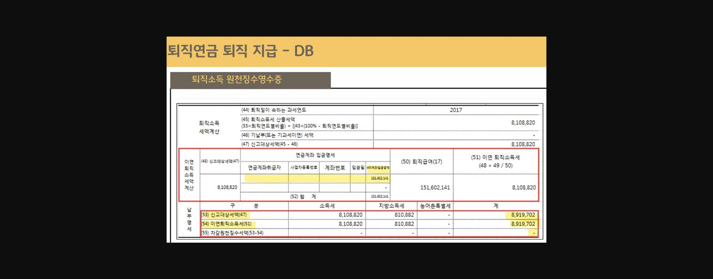
> **이미지2 설명**: "퇴직연금 퇴직지급-DB" 퇴직소득 원천징수영수증 예시: 과세연도 2017, 퇴직소득세 산출세액 8,108,820원, 이연퇴직소득세액계산(연금계좌 입금명세 151,602,141원 입금시 이연퇴직소득세 8,108,820원 전액 이연)

💡 **'과세이연하여 개인형 IRP로 지급 시'**에 **DB의 경우 원천징수영수증 발급 의무는 회사에 있기 때문에, 퇴직소득원천징수영수증을 받아 퇴직지급을 하게 되는데**

이 경우 상단 영수증 처럼 **(49)계좌입금금액에 기재 및 (54)이연퇴직소득세에 과세이연금액이 기재**되어 있어야 합니다.

**(세금납부는 IRP해지시에 되며, IRP해지 시 해지 시점에 맞는 세율을 적용하여 은행에서 원천징수영수증을 추가로 발급하게 됩니다.)**

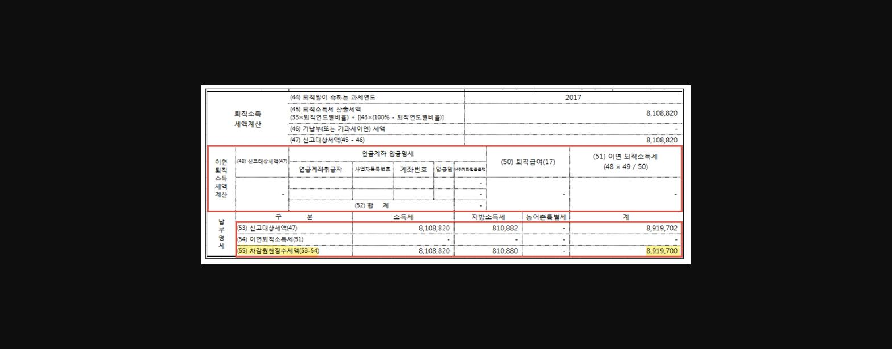
> **이미지3 설명**: 동일 원천징수영수증에서 연금계좌 입금이 없는 경우 비교: 이연퇴직소득세 0원, 차감원천징수세액 전액(8,919,700원) 원천징수 되는 사례

**💡 이 상단의 ****영수증은 '일시금(요구불 계좌로 지급하는경우)'**에 해당하며

회사에서는 퇴직소득 원천징수영수증의** (55)차감원천징수세액에 납부세액을 기재하여 주게되며, 퇴직지급 시 세금납부도 함께 이루어집니다.**

**따라서 고객에게 실제 지급되는 금액은 세후금액이며, 세금은 회사에서 세무서로 납부하게 됩니다. **

==**😎 이렇게 회사에서 징구받은 퇴직소득원천징수영수증을 한 번 알고 확인함으로써 후선센터 보완사항도 줄이고 좀 더 전문가스러운 퇴직연금 담당자가 될 수 있겠죠? **==

> **이미지4 설명**: [깨진 이미지 링크 - 원본 스타런 서버에서 404 오류 반환, 이미지 복구 불가]

==** 🙄🌼 **====**퇴직지급 시 '과세이연 대상이 되는 계좌'는 어떻게 처리되고 있을까요? **==

■** 타기관 퇴직연금→당행 개인형IRP **퇴직금 지급시 **과세이연 등록 현재 과세이연 등록업무는 연금사업부에서 처리**하고 있으므로

과세이연 등록에 필요한 퇴직소득원천징수영수증(DC/기업형IRP는 연금계좌원천징수영수증)을 **타기관에서 직접 연금사업부로 팩스발송**하시면 됩니다.

==** 😎 국민은행 연금사업부 과세이연 팩스번호 : 02)311-6571, 전화번호 : 02)3396-2380** ==

- * 연금사업부에서 유선연락이 필요한 경우가 발생 될 수 있으므로 서류

[퇴직소득원천징수영수증(DC/기업형IRP는 연금계좌원천징수영수증)] 여백에 연락 가능한 전화번호 기재 하도록 안내해 주시기 바랍니다.

■** 당행 퇴직연금→타기관 개인형IRP** 퇴직금 지급시 과세이연정보 제공

**ㆍDB : 후선업무 지급의뢰 후 사용자(회사)로부터 받은 퇴직소득원천징수영수증을 타 금융기관으로 제공해 주시면 됩니다. **

==** Tip!😎 DB퇴직지급 후선의뢰 시, 회사에서 직접 퇴직소득원천징수영수증을 타기관 과세이연후선센터로 발송해주면 좋지만 그렇지 않은 경우가 많기에**==

==**후선의뢰 등록과 동시에 제도가입일(미기재된 경우기재), 담당자 이름 및 연락처를 기재하여 퇴직금 수령기관의 팩스번호로 발송해 두면**==

==** **====**미지급발생으로 퇴직금 입금이 지연되는 것을 방지**====**할 수 있으니 참고!**==

==**  Tip!😎 통장사본에서 확인가능한 경우가 많지만, 따로 정리해둔 과세이연 팩스번호도 함께 공유드립니다. **==

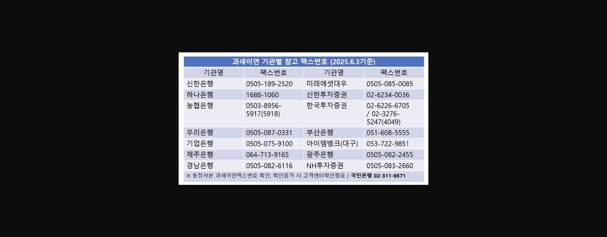
> **이미지5 설명**: 과세이연 기관별 참고 팩스번호 목록(2025.6.3기준): 신한은행/하나은행/농협은행/우리은행/기업은행/제주은행/경남은행 및 미래에셋대우/신한투자증권/한국투자증권/부산은행/아이엠뱅크/광주은행/NH투자증권 팩스번호, 국민은행 고객센터 02-311-6571

**ㆍDC/기업형IRP : 후선으로 지급업무 의뢰 시 “상대 금융기관 팩스번호”를 입력한 경우 지급완료 후 과세이연정보 서류를 후선에서 팩스발송합니다.**

**☞ 단, 후선으로 지급의뢰시 수관기관 팩스번호를 입력하지 않았다면 영업점에서 지급완료 후 직접 타사로 과세이연정보 서류를 팩스발송해 주셔야 합니다. **

==**( 미지급금이**==** 떠있는지 꼭 체크!)**

==** 🙄🌼**==== '**퇴직연금 미도입 업체'의 경우에는 어떤방식으로 지급되나요? **==

**-'22.04.14부터 퇴직연금 미도입 업체 근로자에게 퇴직금 지급시에도 개인형IRP로 지급 의무화 되었습니다. **

==**☞단, 근로자가 만55세 이후에 퇴직하여 급여를 받는 경우 또는 퇴직급여액이 300만원 이하인 경우는 가입자의 요구불계좌로 입금이 가능합니다. **==

==** 🙄🌼**==== '====**퇴직연금 서류 팩스발송 서비스**====**'(과세이연 관련 서류)에 대해서 잠깐 보고갈까요?**==

**① 퇴직연금서류 팩스송신 관리[04-12-199]**

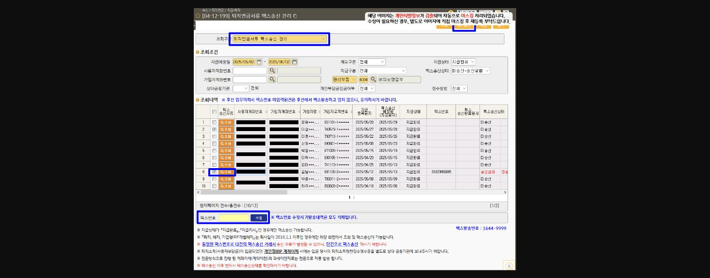

> **이미지6 설명**: 화면 [04-12-199] 퇴직연금서류 팩스송신 관리 화면(개인정보 마스킹): 조회조건(지급예정일/사용자계좌번호/원리부점 등), 조회내역 목록(팩스송신여부/등록일자/팩스송신 예정일자/지급상태/팩스번호 등)

** **

**② 조회구분 선택 **

-퇴직연금서류 팩스송신관리 : 가입자별 연금계좌이체명세서, 연금계좌원천징수영수증, 연도별 연금계좌납입내역 등

-DC/기업형IRP 이전상세내역서 : 사용자별 이전상세내역서

**③ 조회조건 확인 **

**-「지급상태 : 지급완료」만 송신 가능, 지급예정일, 관리부점 등 확인 **

**④ 팩스 발송 대상목록 선택 **

**⑤ 팩스송신 클릭 **

==**-팩스번호 없거나 후선의뢰 시 잘못 등록한 경우, 팩스번호를 직접 입력 후 수정가능합니다. **==

**⑥ 팩스 발송결과 확인 **

-팩스송신상태가 **미송신/송신실패인 경우 재발송**

==** 🙄🌼**====** 지급사유별로 '어떤 서류'가 팩스발송되는걸까요?**==

** *****대상제도 : DC/기업형IRP ***

**▶ 지급사유별 과세이연 서류 **

- **- 퇴직/계약해지 **

①연금계좌이체명세서

②연금계좌원천징수영수증

**- 퇴직(전출,분사)**

①이체명세서

②과세이연정보

**- 가입자이전, 계약이전 **

①이전상세내역서

②개인부담금 존재시 추가서류 : 연금계좌이체명세서, 연도별 연금계좌납입내역 등

> **이미지7 설명**: "짱구는 못말려" 밈 이미지 반복 게재 (201023_01과 동일 이미지)

==** Tip! 😎 과세이연 실무케이스 알아보기! **==

==**📞하루는 가입자분께서 연락이 오셔, <u>일시금으로 퇴직지급을 요청했으나,</u>**==

==**<u>다시 개인형 IRP로 과세이연하여 입금하는 것으로 변경</u>하고 싶다고며 신청내용을 수정가능하냐고 문의주신 적이 있는데요 :)**==

==**이미 지급이 완료 된 상태라, '퇴직급여 수령일로부터 60일 이내'는 다시 과세이연정보 등록하여 개인형IRP로 입금 가능함을 안내드리고 처리를 도와드렸습니다. **==

※ 과세이연 절차는 아래와 같이 연금상품부에서 올려준 자료가 있어 참고하여 업무하면 좋을 것 같습니다.

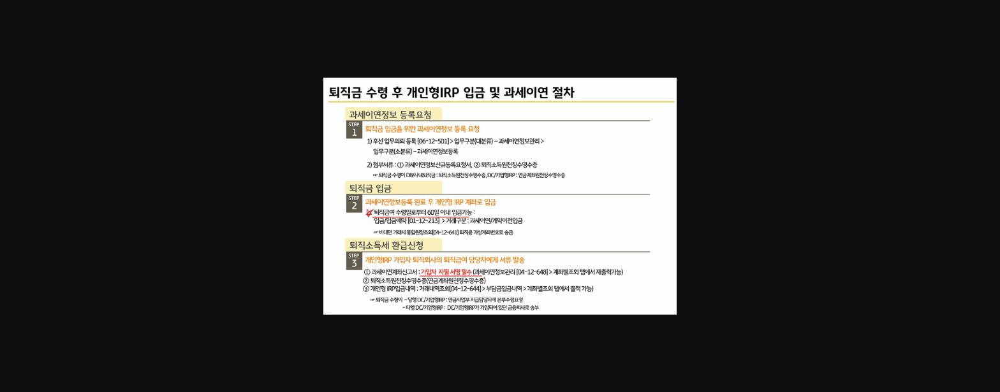
> **이미지8 설명**: "퇴직금 수령 후 개인형IRP 입금 및 과세이연 절차" Step1~3 (200911_05와 동일 내용): 과세이연정보 등록요청/퇴직금 입금/퇴직소득세 환급신청

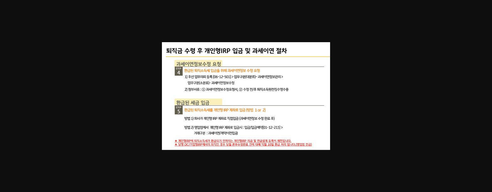
> **이미지9 설명**: "퇴직금 수령 후 개인형IRP 입금 및 과세이연 절차" Step4~5 (200911_05와 동일 내용): 과세이연정보수정 요청/환급된 세금 입금

**※ 실제로 해보지 않으면 어려울 수 있으니, 절차를 하나하나 한번 살펴볼까요?**

**저의 케이스는 ↓↓하단의 경우인데요,**

==**■ 당행 DC/기업형IRP에서 일시금 수령한 퇴직금을 개인형IRP로 재입금 **==

**1단계 : 퇴직금 입금을 위한 과세이연정보 등록 요청 **

**-후선업무의뢰등록 [06-12-501, 업무구분(대분류)- 과세이연정보관리, (소분류)- 과세이연정보등록] **

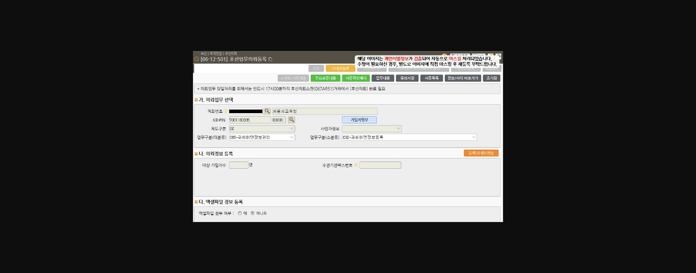

> **이미지10 설명**: 화면 [06-12-501] 후선업무의뢰등록 화면(개인정보 마스킹): 계좌번호(서울시교육청), KB-PIN, 제도구분 DC, 업무구분(대분류)005-과세이연정보관리, 업무구분(소분류)032-과세이연정보등록

- **- 첨부서류 **
- **⑴ 과세이연정보신규등록요청서**

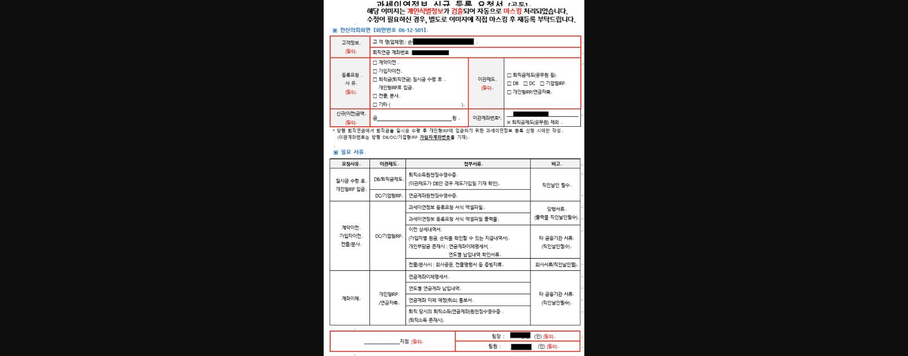
> **이미지11 설명**: 과세이연정보 등록요청서(고도화) 양식: 고객정보(고객명/퇴직금 계좌번호), 등록요청사유(계약이전/가입자이전/퇴직금 일시수령 후 개인형IRP입금 등), 이관제도, 신규(이전)금액, 필요서류 목록 표

** ⑵ 연금계좌원천징수영수증 **

☞ **원천징수영수증발급[04-12-653]에서 가입자 주민번호 입력 후 발급가능(금융거래정보제공(요청동의)서 징구)**

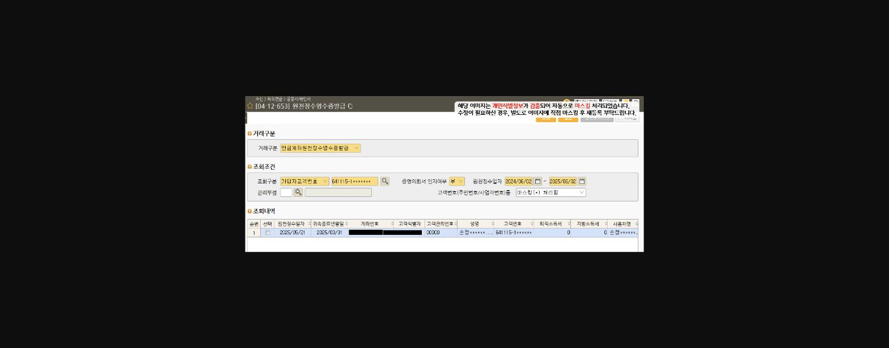
> **이미지12 설명**: 화면 [04-12-653] 원천징수영수증발급 화면(개인정보 마스킹): 거래구분 연금계좌원천징수영수증발급, 조회구분 가입자고객번호, 원천징수일자 2024/06/02~2025/05/02 조회내역

**2단계 : 과세이연정보 등록 완료 후 개인형IRP 계좌로 입금**

**※퇴직급여 지급일로부터 **==**60일**==** 이내 입금가능**

-입금/입금예약 [**01-12-213**, 거래구분- 과세이연/계약이전 입금] ** ****'과세이연이 등록되면 입금대상 내역조회에 금액이 뜨게됩니다.'**

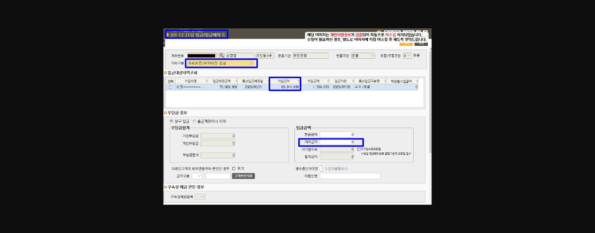
> **이미지13 설명**: 화면 [01-12-213] 입금/입금예약 화면(개인정보 마스킹): 계좌번호 개인형IRP, 거래구분 과세이면/계약이전 입금, 입금대상내역조회(기입예정금액 70,669,368원, 기입금액 68,914,696원)

**3단계 : 연금사업부 지급담당자에게 본부수정요청 **

- **- 본부수정요청 등록[06-12-626] **

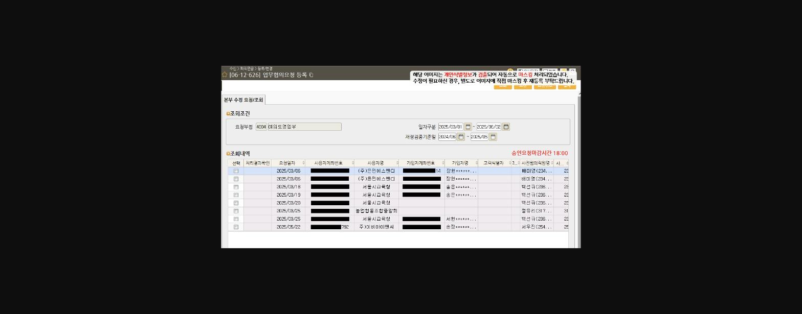
> **이미지14 설명**: 화면 [06-12-626] 업무협의요청 등록 화면(개인정보 마스킹): 본부 수정요청/조회 탭, 요청부점 여의도영업부, 조회기간 2025/03/01~2025/06/02, 조회내역 목록(요청일자/사용자계좌번호/사용자명 등)

- **- 첨부서류 **

**⑴업무협의요청서 **

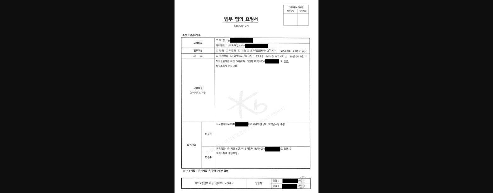
> **이미지15 설명**: 업무협의요청서 양식 화면 — 하나은행 등 타사 IRP 계좌이전 관련 업무협의 신청 서식.

**⑵과세이연계좌신고서****(가입자 자필서명) **

**☞입금 후 자동출력(과세이연정보관리 [04-12-648, '계좌별조회' 선택 후 재출력가능)**

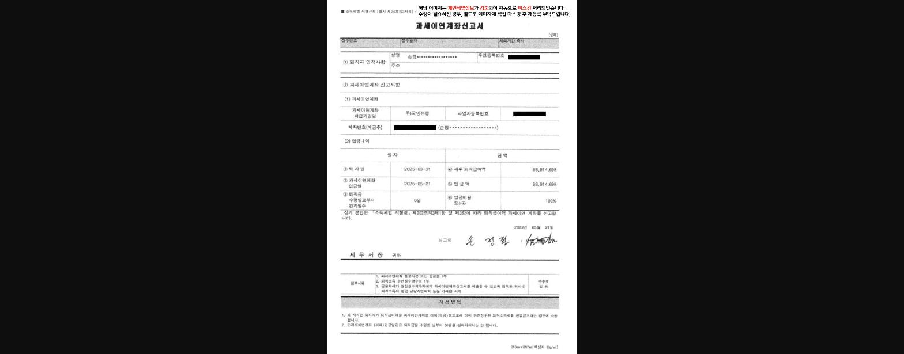
> **이미지16 설명**: 과세이연계좌신고서 양식 화면 — 퇴직소득 과세이연을 위한 계좌 신고서 서식.

**⑶연금계좌원천징수영수증**

** **

> **이미지17 설명**: 소득세 관련 서식 표 — 퇴직소득세 원천징수 관련 안내 표.

**⑷개인형IRP 입금내역 : 거래내역조회 [04-12-644, 거래구분- 부담금입금내역) **

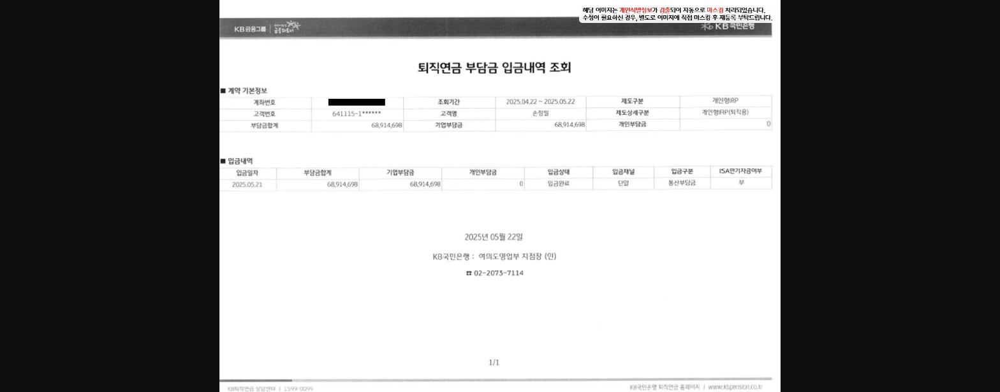
> **이미지18 설명**: 퇴직연금 부담금 입금내역 조회 결과 화면 — 입금 이력 리스트.

**4단계 : 환급된 퇴직소득세를 개인형IRP 계좌로 입금 ****(신청월 익월 10일) **

**-전금으로 퇴직소득세가 환급되면 영업점에서 입금 **

-입금/입금예약 [01-12-213, 거래구분- 과세이연/계약이전 입금]

==** 😎 저의 경우 아직 환급 전이라 미입금액이 떠있는 상태네요! **==

**※개인형IRP로 환급된 세금이 입금되기 전까지 연금수령신청 등 지급이 제한되니 가입자에게 안내는 필수!**

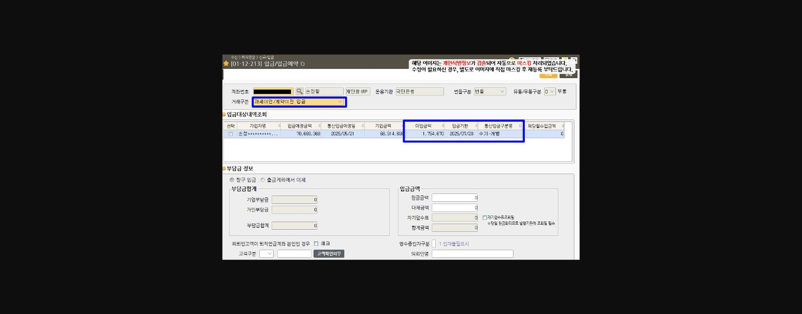
> **이미지19 설명**: 화면 [01-12-213] 입금/입금예약 조회 화면 — IRP 입금 예약 처리 화면.

**※ ****타행 DC/기업형IRP에서 일시금 수령한 퇴직금을 개인형IRP로 재입금**하거나,

**DB/사내퇴직금에서 일시금 수령한 퇴직금을 개인형IRP로 재입금** 하는 경우에도 비슷한 프로세스로 진행되기 때문에,

관련 챗봇이나 매뉴얼을 참고하여 업무하면 될 것 같습니다.

==** 🙄🌼 그리고 , '일시금 지급대상 마케팅' Tip 내용도 함께 공유해보려하는데요! **==

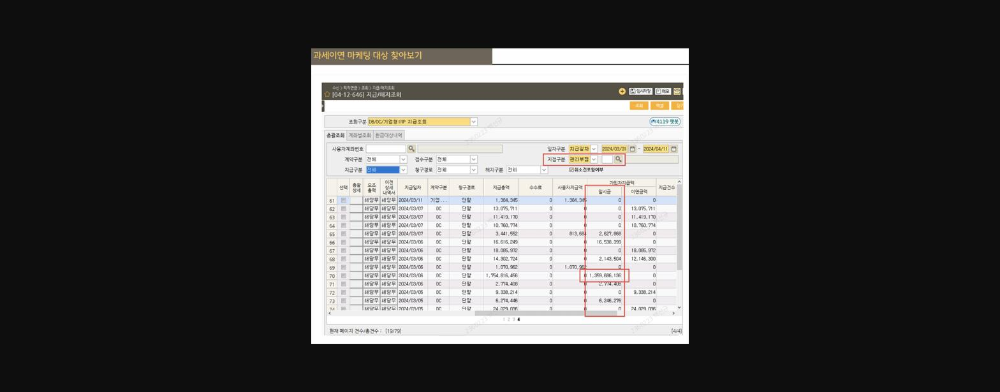
> **이미지20 설명**: 과세이연 마케팅 대상 찾아보기 조회 화면 — 과세이연 대상 고객 조회 기능.

**[04-12-646] 지급/ 해지조회 / 조회구분 : DB/DC/기업형 IRP 지급조회, 관리부점 : 해당점포**

😎** 고액퇴직금 일시급 지급이 발행한 경우 관리점 퇴직연금 담당자에게 쪽지가 가끔 오기도 했었는데요.**

==**이렇게 전산조회하여 일시금 지급액이 큰 고객 위주로 직접 확인하여 당점 IRP계좌로 입금마케팅이 가능합니다. **==

**일시금 과세이연 신청은 퇴직급여 수령일로부터 60일 이내로신청 가능하기때문에, 일자구분은**** 최근 2개월 이내****로 확인하는 것이 좋겠죠!**

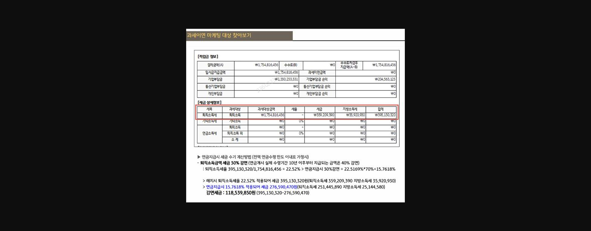

> **이미지21 설명**: 세금 상세정보 및 연금 지급시 세금 계산 설명 화면 — 연금소득세율 안내.

😎** 고객 지급내역을 확인하여 절세될 금액을 확인, 상단 이미지처럼 계산하여 안내하면 숫자로 절세효과를 실감할 수 있어 더 좋겠네요!**

※ 계산방법

고객의 퇴직소득세율 : 세금/퇴직소득금액

연금지급시 30%감면세율  : 퇴직소득세율 *0.7  > 연금지급시 세금 = 퇴직소득금액*연금소득세율

감면세금 = 퇴직소득세 - 연금소득세

**.**

**.**

**.**

**이렇게 '**==**과세이연'**==**과 관련한 업무내용에 대해 정리해보았는데**

**조금이나마 도움이 되셨을까요? :) **

**2025년 상반기 시작한지 얼마 되지않은 것 같은데, **

**벌써 6월 첫째주가 시작되버렸다니..**

**늘 느끼지만 시간이 정말 빨리 가는 것 같습니다.**

**모두 남은 상반기도 목표했던 바 달성할 수 있게 화이팅하시고,**

**더운 여름이 오기 전 따뜻하고 상쾌한 날씨도 많이 즐길 수 있는 일상 보내시기 바라겠습니다. 😉**

** **==**좋아요**==**😘❤ 한 번 눌러주시면 큰 힘이 될 것같습니다!**

**6월도 화이팅팅!🍀**

** **