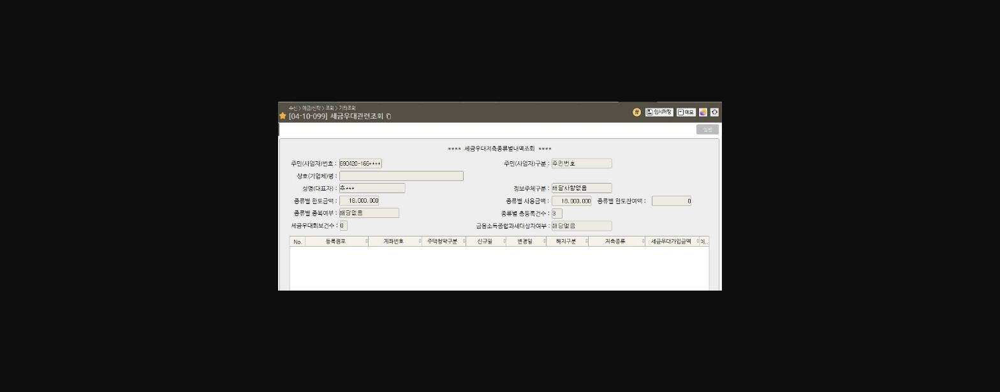

안녕하세요.

**신**대리==의 ==**통**==하는 꿀 팁(TIP) ==**방**==출합니다.==

**[신통방통]-①이븐(even)하게 구워진 「개인형 IRP」 킥 보고 가실래요~?  **

퇴직연금은 KPI에도, 리그 테이블에도 중요한 비중 차지하고 있습니다.

'2025년 퇴직연금 **<u>「KPI와 리그테이블」</u>**<u>'</u> 핵심내용을 간단하게 정리해보았습니다.

Ø  **KPI**

|  | 개인형 IRP | 기업형 퇴직연금 | 개인/기업 고객기반확대 |
|---|---|---|---|
| 배점 | 30점(연간평가)※작년대비 배점10점↑‘24년: 20점 → ‘25년: 30점 | 40점(연간평가)※상반기 추진시 유리상반기30%+연간70% | 개인배점50점(반기평가)※25년 신규항목 |
| 배점 | 30점(연간평가)※작년대비 배점10점↑‘24년: 20점 → ‘25년: 30점 | 40점(연간평가)※상반기 추진시 유리상반기30%+연간70% | 기업배점100점(반기평가)※전년대비 배점 70↑ |

Ø  **리그테이블**

|  | **개인**고객부문 | **기업**고객부문 | **WM**부문 |
|---|---|---|---|
| 개인형IRP | 신규 1백만원 5P | 신규 20만 1P | 은행평잔(AUM) 지표 內포함 |
| 개인형IRP | 계약이전 1천만 2P | 계약이전 5백만 1P | 은행평잔(AUM) 지표 內포함 |
| 기업형퇴직연금 | 신규 1천만 2P | 신규 3백만 1P |  |
| 기업형퇴직연금 | 신규 1천만 2P | 기존 5백만 1P |  |
| 6월 MISSON | 개인형IRP10만원*5좌신규 최대50P+15M(1좌당1P+3M) | 퇴직연금 지표포인트별 추가포인트최대 60P+30M | 개인형 IRP신규 및 타사이전시최대 100P+30M(1천만원당 20P+6M) |

이렇게 중요한 **<u>「개인형IRP」 ‘부담없이 권유’</u>**하는 **저만의 킥(비법) 멘트를** 공유합니다!!

**STEP1. 세금우대 조회하기** (화면번호 04-10-099)

고객님 방문시, 싱글뷰 확인 후, 세금우대관련 조회 화면부터 파악하기!

> **이미지1 설명**: 화면 [04-10-099] 세금우대관련조회 화면 — 고객 세금우대 한도 확인 화면.

**STEP2. 소득 유무 확인하고, 정부에서 가장 혜택 많이 주는 상품 강조**

**▶ 킥(비법) 멘트**

고객님~ 혹시 소득 있으신가요~?

**‘<u>정부에서 가장 혜택을 많이</u>’** 주는 세액공제 상품이 없으시네요~?

원금 이자 제외하고 정부에서 16.5%에서 13.2% 연말정산시 돌려주는 상품이 있습니다.

우리나라 국민들이 노후가 준비가 안되어 있어서, **<u>본인의 노후를 위해 장기 저축을 하고 추후에 연금으로 수령하면 정부에서 이렇게 큰 혜택을 주겠다는 취지</u>**입니다.

> **이미지2 설명**: 세액공제 한도표 — 연령/소득구간별 세액공제 한도 및 공제율 정리 표.

**STEP3. 연령별 권유 비법**

▶ **킥(비법) 멘트**

**20대-30대)** **55세 이후 연금 개시에 대해 부담을 갖는 2-30대에게 ‘자유 납입’을 강조**

언제든지 자유롭게 납입 가능하시면서, 1년동안 100만원 저축하면 165,000원 또는 132,000원 내년 1월에 당장 돌려 받을 수 있습니다. 없는 돈이라고 생각하시고 소액만 넣으셔도 혜택을 보실 수 있으세요. '**지금' 10만원 통장 만들고 가시고, 여유 자금 생기실 때마다 자유롭게 넣으세요.**

**40대)** **연말정산에 관심이 많으시기 때문에, 최대 세액공제 금액 강조**

올 초에 연말정산 얼마나 받으셨어요~? 주변 동료들과 대화해보시면 누구는 많이 돌려받고, 누구는 세금을 더 내시죠~? 저축을 통해 세금을 돌려 받을 수 있는 방법이 있습니다. 최대 900만원 저축하시면 **이자 별도로 100만원 이상** 돌려받으실 수 있습니다.

**50대)** **저축은행의 높은 이율을 강조하고, 은퇴 후 부족한 국민연금 강조**

현재 1년 정기 예금은 2.45%이나 IRP 정기 예금으로 할 경우 3.2%입니다. IRP에는 저축은행 예금까지 넣을 수 있어서 금리가 **일반 정기 예금보다 높아요**. 그리고 가입한지 5년지나고 55세 지나시면 연금으로 개시가능해서, 언제든지 원하시는 방식으로 10년동안 나눠서 연금으로 받으실 수 있으세요. 은퇴 후 국민연금으로는 생활하시기 부족하시니, 소득있으실 때 대비하세요.

일반 적금 권유하듯 부담없이 오시는 고객님들에게 부담없이 권유해서!

**6월 MONTHLY MISSION 만점** 받고!

**성공적인 상반기 마감**을 위해 우리 모두 화이팅해요~

> **이미지3 설명**: 곰 캐릭터 스티커 이미지 — 게시글 장식용 이미지, 특별한 정보 없음.

**구독! 좋아요! 알림설정~~**

**↓↓↓↓↓↓**