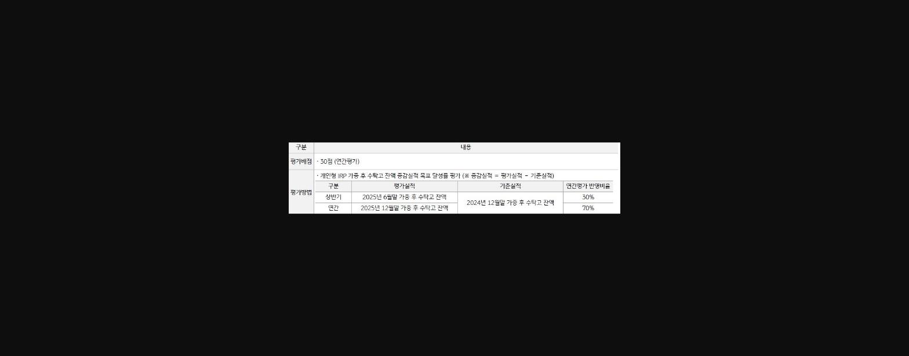
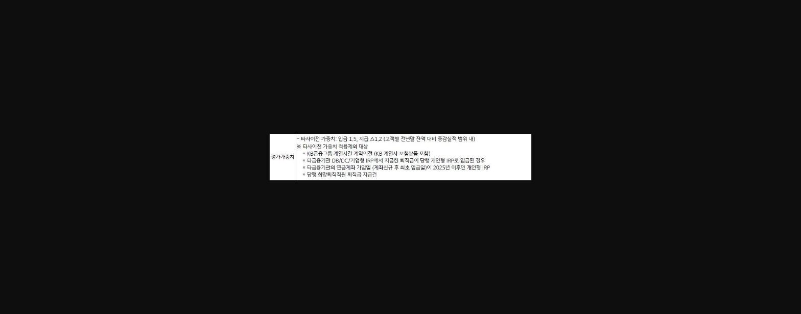
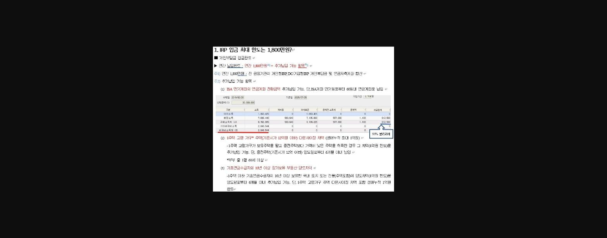
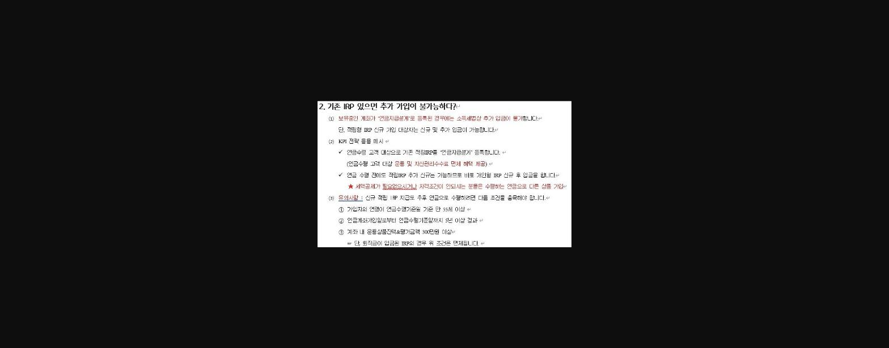
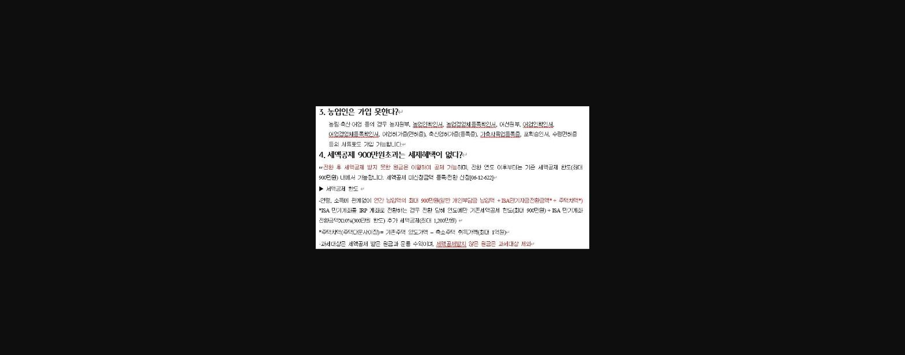
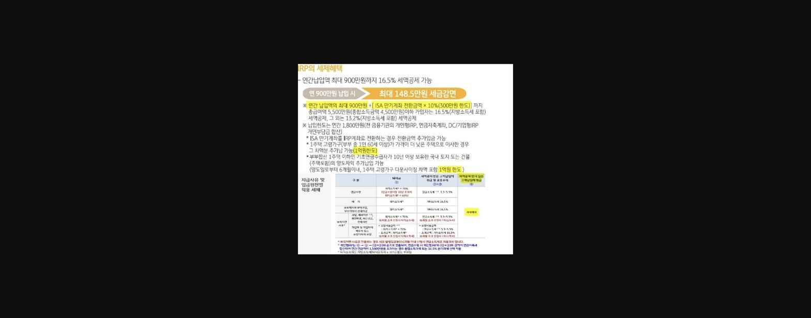

안녕하세요

2025년 하반기, 이제 마감 준비 시작할 때입니다.

개인형 IRP는 연간평가지만, 하반기 성과가 70% 반영됩니다. 지금부터 준비하셔야 11월에 수월하게 마무리하실 수 있습니다.

평가 가중치 1.5 인정되는 타사이전은 이미 잘 알고 계실테니, 이번에는 놓치기 쉬운 포인트를 준비했습니다.

- - 기존 IRP 가입자 리밸런싱 및 추가입금 전략
- - ISA 리밸런싱 노하우

이 두 가지로 올해 하반기 성과를 확실하게 챙기시기 바랍니다^^

> **이미지1 설명**: 개인형IRP 평가배점 30점 구성 설명표 — 리그테이블 배점 세부 항목.

> **이미지2 설명**: 평가 가중치 설명표 — 타사이전 가중치 1.5, 신규 가중치 1.2 등 배점 가중치 안내.

> **이미지3 설명**: Q&A 슬라이드: "IRP 입금 최대 한도는 1,800만원?" — 세액공제 한도와 총 납입한도 차이 설명.

> **이미지4 설명**: Q&A 슬라이드: "기존 IRP 있으면 추가 가입이 불가능하다?" — 복수 IRP 계좌 개설 가능 여부 설명.

> **이미지5 설명**: Q&A 슬라이드: "농업인은 가입 못한다?" 및 "세액공제 900만원 초과는 세제혜택 없다?" — 오해 해소 설명.

> **이미지6 설명**: IRP의 세제혜택 설명표 — 연간납입액 최대 900만원까지 16.5% 세액공제 가능, 연 900만원 납입시 최대 148.5만원 세금감면. 지급사유별 적용세제 표 포함.