==**퇴직연금 '신규' '관리' '이탈방지' Total Marketing 사례 공유 **==

기업 퇴직연금을 10년 정도 담당하면서 경험했던 여러 사례를 통해

기업퇴직연금 신규/관리/이탈방지 방안과 번외로 개인 고객에 대한 부수거래확대 방안까지 공유드리려고 합니다.

**(※기본적인 업무에 대한 경험은 있다고 가정하여 작성하였습니다.) **

==**목차**==

[**<u>I. 퇴직연금 관리]</u>**

**  1. 당점 퇴직연금 거래 업체 요약장부 작성 및 관리**

**  2. 퇴직연금 담당자 개별 연락처 공유 및 수시 소통**

**  3. 통일된 퇴직연금 업무처리 안내장 제공을 통한 업무간소화**

**  4. 퇴직연금 수익률 관리 **

**<u>[II. 퇴직연금 이탈방지]</u>**

**<u>[III. 퇴직연금 신규]</u>**

**<u>[IV. 퇴직연금 개인 업무 추진을 통한 부수거래 확대] </u>**

==**I. 퇴직연금 관리 **====**KeyWord**====** #소통 #효율성 #관계 #관심**==

퇴직연금의 기본은 기존업체의 관리에서 시작된다고 생각합니다.

퇴직연금 업체를 잘 관리했을 때의 장점은

ⓐ 이탈가능성도 낮고

ⓑ 이탈조짐을 조기에 발견 & 해결 할 수 있는 기회가 마련되며

ⓒ 적은 비용(기부금 등)으로 관리

할 수 있다는 3가지 큰 장점이 있다고 생각합니다.

그렇다면 관리란 무엇일까요. 단순하게 가입자 신규 - 입금 - 지급 - 추계 등

고객이 요청한 업무를 잘 처리하는 것을 의미할까요?

**<u>퇴직연금에서 관리란, </u>**

**<u>업체가 필요할 때 빠르게 소통하여 문제를 해결해주거나 대안을 제시해주는 것 그리고</u>**

**<u>도움이 되는 것을 능동적으로 제공하는 것이라고 생각합니다.</u>**

--------------------------------------------------------------

잘 관리된 업체와 잘 관리되지 못한 고객의 예는 타 기관 이탈에서 극명하게 갈립니다.

**<u>II. 퇴직연금 이탈방지 란에서 자세히 설명드리겠습니다.</u>**

--------------------------------------------------------------

그러면 퇴직연금 업체를 "잘"관리하는 방법은 무엇이 있을까요.

1. **1. 당점 퇴직연금 거래 업체 요약장부 작성 및 관리**
2. **<u>▶효과▶ (1) 업체정보 요약을 통한 빠른 확인 (2)특이사항 메모를 통한 효율적 관리 (3)인수인계 용이성</u>**

==**제안 : 지점에서 거래하는 업체 정보를 요약한 엑셀표를 만들어 활용하는 방법**==

이러한 요약 자료는 업체에 대한 중요 정보를 별도 정리 해 빠르게 색인(검색)하여 업무를 정확하게 처리하는데 도움을 줍니다.

실무적으로 업체가 서류 작성 시 中 출금계좌 번호 등을 누락하고 보내거나 오기된 경우가 있을 수 있고  이메일 주소가 변경되는 경우 실무자가 변경되는 경우 등 다양한 변수에 노출이 됩니다. 물론 그때마다 정보변경 관련 신청서를 받아 처리하면 가장 좋지만, 그러한 절차가 번거로운 것도 사실입니다. 또 업체에 대한 특이사항을 수기로 작성해 보관하는 것도 한번에 보기 어렵습니다.

그래서 저는 다음과 같이 엑셀표를 작성하여 지점 기업퇴직연금 고객을 관리하고 빠르게 확인하여 처리하고 있습니다.

특히, 입금주기나 입금예정일 등을 확인하여 놓치지 않도록, 업체에서 요청한 특이사항은 메모를 통해 확인할 수 있도록 했습니다.

업체에서 전화가와서 "XXX 업무 조회 부탁드립니다." 사업자번호가 어떻게 되세요 물어보는 것보단 빠르게 핀번호나 계좌번호 스캔에서 접근하는 모습이 고객입장에서는 더 프로같고 신뢰할만하다고 생각하지 않을까요. 매번 입금일정을 물어보거나 예정일을 물어보는 것보단 주기적인 일정을 메모하는 것도 담당자 연락처나 업체의 특이사항 등을 메모하는 것도 같은 이치라고 생각합니다.

또, 퇴직연금을 담당하다보면 퇴직연금이 입금되는 5일 10일 25일 30일(말일) 등에 이동이 어렵지만 부득이 휴가를 가게 되는 경우 대직(인수인계)를 하여야 하는데, 대직시에도 정리된 표를 전달해준다면 대직은 받은 직원도 업무를 일목요연하게 처리할 수 있어 업무처리에 실수를 줄이고 효율성을 높일 수 있다고 생각합니다.

==(예시)==

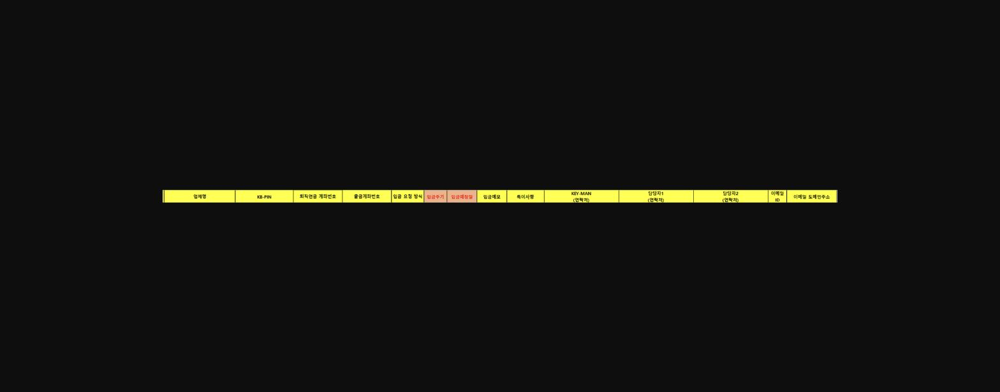
> **이미지1 설명**: 빈 양식 헤더표 — 업체명, KB-PIN, 퇴직연금 계좌번호, 출금계좌번호, 입금요청방식, 입금주기, 입금예정일, 입금예고, 특이사항, KEY-MAN, 담당자1/2, 이메일ID 등 열 제목만 있는 표.

- - 업체명 / KB-PIN / 퇴직연금 계좌번호 / 출금계좌번호 / 입금 요청 방식 / 입금주기 / 입금예정일 / 입금메모 /
- 특이사항(기부금 등) / KEY-MAN / 담당자1 / 담당자2 /이메일 ID 이메일 도메인주소

**2. 퇴직연금 담당자 개별 연락처 공유 및 수시 소통 **

1. **<u>▶효과▶ 업체 담당자와 신속한 의사소통 및 문제해결을 통한 관계개선 및 유지</u>**

==**제안 : 은행직원과 업체간 다이렉트로 소통할 수 있는 연락처 공유**==

직원들 입장에서는 개별연락처를 공유하는 것은 호불호가 있을 수 있는 영역인 것 같습니다.

개별 연락처 공유로 업무시간 외에 연락이 오거나 개인 핸드폰에 업무의 영역을 섞고 싶지 않은 것이겠죠!(충분히 공감됩니다.)

다만, 부정적인 부분은 최소화하여 활용할 수 있다면 장점이 더욱 많은 방법이라 공유드립니다.

가장 큰 장점은 유선전화가 아닌 스마트폰으로 언제 어디서든 소통할 수 있다는 것입니다.

지점 유선전화 특성상

ⓐ 업무중 유선상 부재중전화를 찾기 어렵고 누가 연락했는지 확인하기 어려운 점

ⓑ 공석인 상태에서는 즉시 받기가 어려운 점

ⓒ 고객상담 중에 받기 어려운 점이 많습니다.

이러한 점을 저는 개별연락처 안내 및 저장을 통해 관리합니다.

개인의 영역과 회사의 영역이 합쳐지는 것에 대한 부담감은 있지만, 아래와 같은 장점이 있어 효율적인 관리가 가능합니다.

ⓐ 부재중 전화가 기록되고,

ⓑ 누군지 구분이 가능하며

ⓒ 기록이 있어 연속적인 업무에 용이하며

ⓓ 통화가 어려울 때 부재중 메세지를 통해 양해를 구할 수 있고,

ⓔ 긴급한 업무의 경우, 문자/카톡으로 내용을 회신받아 확인이 가능

하다는 많은 장점이 있습니다.

업체입장에서 특히 긴급하게 해결해야 하는데 연락(전화.문자)가 안되는 것 만큼 속타는 것이 없을 것 입니다.

(우리도 은행직원임과 동시에 고객이기도 한 경험이 있으니까요.)

개인연락처 공유를 통해 고객과 연속적이고 긴밀하게 소통할 수 있고,

소통을 통해 이탈을 막고 관계를 개선시킬 수 있다면,

굳이 업체와 술을 마시고 별도관리해야 하는 더 부담스럽고 수고스러운 경우를 감소시킬 수 있다고 확신합니다.

(섭외경로, 업체의 규모에 따라 별도 관리해야하는 경우도 있습니다....)

그러면, 개인의 영역과의 분리는 어떻게 해야할까요.

기본적으로 주말에는 연락이 어려우며, 업무시간 중에 연락만 가능하다고 고객에게 사전에 정중한 안내를 통해 사전방지를 하거나

또는, 안내가 어렵다면, 그 시간에 오는 전화는 받지 않으시면 됩니다.

간혹 업무시간에 대한 인식이 없는 고객분들이 주말에도 연락하는 경우가 있습니다.

저는 그런 경우는 정말 급하거나 긴급을 요하는 경우가 아니라면 영업일 09시부터 답장을 드립니다.

(예시)

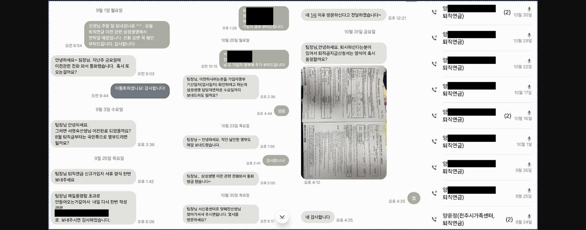
> **이미지2 설명**: 카카오톡 대화 및 통화기록 캡처 — 삼성생명 퇴직연금 이전 관련 담당자와의 상담 메시지 및 통화 목록(개인정보 마스킹).

해당업체는 유선 및 문자 연락이 빈번한 퇴직연금 업체입니다. 빈번한 만큼 퇴직연금 규모 및 기여도 또한 우수한 업체입니다.

유선으로 안되는 경우 업체에서는 지체없이 문자를 남겨주시기 때문에 서로 의사소통이 끊이지 않고 원활하게 진행 중에 있습니다.

해당업체는 퇴직연금 규모 26억원 이고, 사회공헌기부금 지원 대상으로 100만원에 관리 중에 있습니다. 별도 해당 업체의 대표자 미팅 및 접대 등 일절 제공하지 않음에도

장기간 높은 만족도로 업체를 관리 중에 있습니다.

**3. 통일된 퇴직연금 업무처리 안내장 제공을 통한 업무간소화 **

1. **<u>▶효과▶ (신규 고객) 서식오류 방지를 통한 업무처리 효율화 (기존 고객) 기존 서식 오류 정정을 통한 업무처리량 간소화</u>**

모두 알고 있지만 현실적으로 잘 안 되는 영역에 대해 관점을 바꿔본다면 기존의 업무처리 방식이 더 간소화될 것입니다.

모두 경험해보셨을 것이라 확신하는데, 50명 70명이 넘는 입금명부를 일일이 손으로 쳐보셨던 경험이 있으실 것 같습니다.

서식을 잘 받으면 되는데 왜 이렇게 비효율적으로 업무를 하게 되는 것일까요.

아주 근본적이고 원초적인 문제는 "첫 섭외 담당자가 서류를 제대로 안내하지 않았다."에서 잘못된 단추가 끼워진다고 생각합니다.

(처음 섭외하는 직원 분께서 단추를 잘 끼워주셨으면 좋겠습니다. 또는 잘 모르더라도 잘 끼우려는 노력이 필요합니다.)

그런데 근본적으로 문제가 있었으니까 계속 문제를 해결하지 않는 것도 문제입니다.

그럼 문제를 알 면서 방치하는 것은 아닐 것이고 해결되지 않는 실질적인 이유는 다음과 같다고 생각합니다.

[고객과의 친밀도] 의 문제라고 생각합니다. 친밀도가 낮기 때문에 올바른 서식으로 정정을 못하는 것입니다.

친밀도가 없는 상태에서도 당연히 고객이 정당한 서식을 작성해서 전달해야 할 의무가 있지만,

그렇게 하면 고객관리가 아니라 오히려 국민은행은 불편해 라는 인식을 심어주게 되고 이탈의 기회를 스스로 제공하는 결과로 이어지기 때문에

퇴직연금 담당자 분들께서 많은 고민이 있다고 생각합니다.

하지만,

위의 I-1과 I-2를 통해 실무자나 키맨과의 의사소통을 통해 문제를 해결하고 어느 정도 친밀감이 형성되면

서류작성에 대해 안내드릴 수 있는 기회는 반드시 생깁니다.

사람은 관성을 좋아해서 원래 처리하는 방식대로 계속 하고 싶어해서 바꾸려고 시도했을 때 업체 담당자가 짜증 낼 때도 많습니다.

"그전에는 그렇게 하지 않아도 되었는데, 굳이 이렇게 까지 해야 하나요."라는 유사한 단골 멘트 많이 들어보셨을 것입니다. .

그러면 여기서 포기할 수 없죠! 담당자에게 모바일 쿠폰을 발송하며 부탁하거나

까다롭거나 중요한 회사의 경우에는 직접 방문하여 내용을 설명하고 양해를 구하는 절차가 필요합니다.

(만약, 본인이 하기 어렵다면, 담당 팀장님께서 도움을 주셔야 합니다.)

저는 이러한 스트레스적 상황을 방지하고, 후임 퇴직연금 담당자가 업무를 되도록 간소화해서 할 수 있도록

기존업체에는 서식정정 이메일을, 신규업체 섭외시 정형화된 형식으로 고객에게 안내 및 반복 숙달을 할 수 있도록 합니다.

그런데 그런 것을 말로서 전달하는 것은 한계가 있습니다.

그래서 정형화된 틀(tool)을 통해 업체가 보고 쉽게 따라할 수 있도록 해야 한다고 생각해 아래와 같은 예시로

정형화된 양식을 만들어 업체에 전달하고 같이 보면서 설명을 드립니다.

업체 담당자들은 퇴직연금 업무가 주업무가 아니라 아주 부수적인 업무이고 매번 작성하는 것이 아니다 보니 잘 기억을 하지 못하는 경우가 많고

실무적으로 그전에 처리한 내용을 보고 처리한다고 합니다. 따라서 먼저 저희가 보고 따라할 수 있는 것을 전달해주면 업체에서 좀 더 수월하게 업무를 처리

할 수 있다고 합니다.

또 퇴직연금 은행 담당자 입장에서도 수많은 업체 새로 섭외되어 오는 업체에게 일일이 설명하는 것도 시간적으로 비효율적이라고 생각합니다.

한 번 만들어 놓은 정형화된 형식이 생기면, 이를 전달하고 최소화된 설명으로 고객의 빠른 이해를 도울 수 있음으로 훨씬 효율적 이라 생각합니다.

==(예시)==

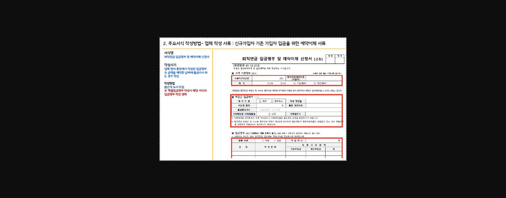
> **이미지3 설명**: 예약이체 서류 작성방법 안내 화면 — "업체 작성 서류: 신규/기존가입자 입금을 위한 예약이체 서류", 부담금 입금예약란 강조 표시.

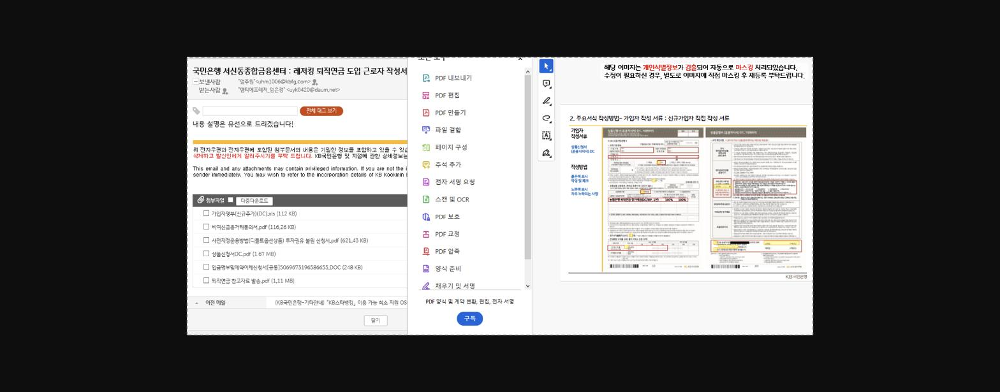
> **이미지4 설명**: 국민은행 서신동종합금융센터 이메일 및 첨부파일 목록 캡처 — PDF 도구 패널과 가입자명부 등 첨부서류 목록(개인정보 마스킹).

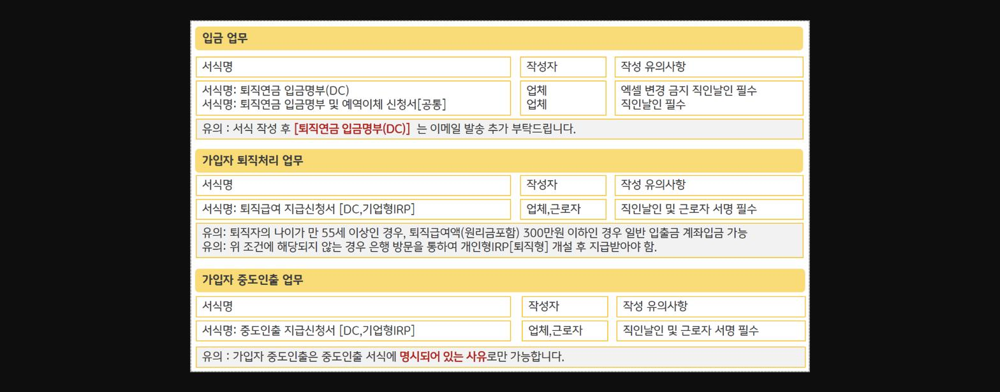
> **이미지5 설명**: 서식별 작성자/작성 유의사항 정리표 — 입금업무, 가입자 퇴직처리 업무, 가입자 중도인출 업무별 서식명과 필수사항(직인날인 등) 안내.

**4. 퇴직연금 수익률 관리 **

1. **<u>▶효과▶ 수익률 관리를 통한 관계강화 & 이탈방지 효과</u>**

퇴직연금 수익률 관리라고 하면 "고객에게 엄청 높은 수익률을 주어야 하는 것이 아닌가" 하는 엄청 전문적인 영역이라는 부담감을 갖게 되는 것 같습니다.

하지만 이 인식을 조금 바꿔보면 좋을 것 같습니다.

대부분의 고객들은 퇴직연금을 원리금보장 상품에 운영하고 있습니다.

기본적으로 투자 의사가 있는 고개분들이 비율적으로 크게 많지 않고, 있다고 하더라도 그런분들은 기본적으로 투자에 대한 자신만의 주관적 생각이 있는 경우가 많아

특별히 많은 설명을 해야한다기보다 거들어 주는 것이 필요한 경우가 많습니다.

정리하자면 정기예끔성 상품으로 운영하는 경우가많고, 퇴직연금의 특성상 안정적으로 운영하고자 하는 심리가 있어

정기예금 상품의 금리가 높은 [특별상품]으로 교체해주는 것 만으로도 고객만족도를 올릴 수 있습니다.

(물론 TDF 와 투자성 상품의 권유도 할 수 있다면 매우 좋을 것 입니다.)

퇴직연금 사업부에서는 매월 마지막 영업일에 [다음달 퇴직연금 원리금보장 특별제공상품 안내]라는 문서를 올리거나,

연금사업본부 홈페이지에 들어가면 다음달 퇴직연금 원리금보장성 상품 금리를 확인할 수 있습니다.

현재 일반적으로

KB 국민은행 디폴트옵션 안정형의 경우 3년 고정금리 2%초반에 수렴합니다.

그런데, 고객이 아래 특별제공상품을 제공받을 수 있는 기회가 있다면,

2%초반으로 재예치 되는 것이 좋을까요. 3%대로 재예치 되는 것이 좋을까요. 당연히 3%대 아닐까요.

==[퇴직연금 특별제공상품]-----------------------------------==

==KB손해보험 퇴직연금 이율보증형 보험 (3년제) GIC (예금자보호 1억원)  ==

==-----------------------------------------------------==

==2025년      금리제공기간   금리                                                        ==

==9월               3년(고정금리)  3.15%                                                  ==

==10월             3년(고정금리)  3.00%                                              ==

==11월             3년(고정금리)  3.05% ==

==-----------------------------------------------------==

모바일 및 인터넷뱅킹을 통해 바꿀 수 있는 고객님이라면 간단한 안내만으로 끝나지만, 그렇지 못한 고객님들도 있습니다.

국민은행에 퇴직연금만 거래하는 경우가 다반사인데, 그러면 인터넷뱅킹으로 처리가 되지 않습니다.

그래서 업체를 통해서 안내하거나 근로자 개별로 안내를 통해 이러한 상품으로 교체할 수 있는 기회가 있음을 안내하는 것이 매우 중요하다고

생각합니다.

세심한 배려와 관리를 통해 업체 및 소속 근로자와의 유대를 강화하여 부수거래를 확대하고 이를 통해 이탈을 방지할 수 있습니다.

퇴직연금은 일방적으로 업체에서 하고 싶다고 하여 이전할 수 없습니다. 근로자 과반의 동의 및 과반으로 구성된 노동조합의 대표의 동의가 필요합니다.

때문에 업체와의 관계유지도 중요하고 근로자와의 관계형성을 통해 타 기관으로의 이전을 막을 수 도 있습니다.

(사례)

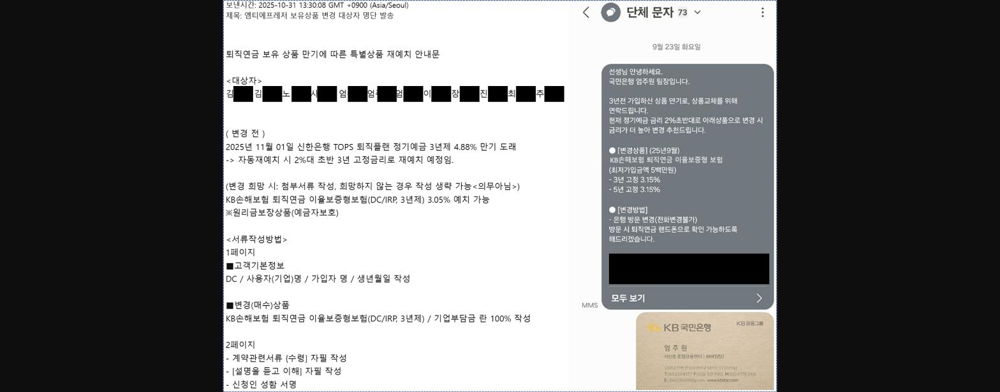
> **이미지6 설명**: 앰티에프레저 보유상품 변경 대상자 명단 발송 이메일 및 단체문자 안내 캡처 — 정기예금 만기 재예치 안내 내용(개인정보 마스킹).

2022년 8월 ~ 12월 : 원리금 보장형 정기예금성 상품 4.05%~6.50% 3년 고정금리 신규

2025년 9월 ~ 12월 : 원리금 보장형 정기예금성 상품 만기에 따른 특별상품 재예치를 위한 방문 안내

(KB손해보험 퇴직연금 이율보증형 보험 3년제) 3.00~3.15% 재예치 안내를 통한 수익률 관리

[연금사업본부] 홈페이지

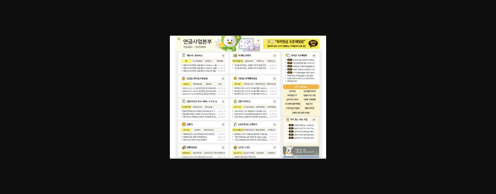
> **이미지7 설명**: KB국민은행 연금사업본부 인트라넷 포털 화면 캡처 — 재안내자료, 마케팅 컨텐츠, 실적왕 명예의전당 등 메뉴 구성.

==**II. 퇴직연금 이탈방지 **====**KeyWord**====** #관계형성 #불만사항해결 #수익률관리 #중도해지방어**==

**[이탈방지 방안1] : 관계형성을 통한 고객불만사항 접수 **

퇴직연금은 위와 같이 잘 관리되고 있다면, 손 쓸 수도 없이 순식간에 그리고 쉽게 이탈되는 경우는 거의 없습니다.

거꾸로 말하면, 퇴직연금 이탈은 기존에 관리가 소홀했기 때문에 일어나는 일이고, 그런 경우에는 손 쓰기도 어렵게 쉽게 이탈되는 경우가 많습니다.

퇴직연금 이탈 시 까지 당행에서도 신규를 유치할 때 규약수리통보서까지 받아두고 은행 신규를 마친 상태에서 상대방 입장에서 기습적이다 라고 생각이 들정도로

치밀하게 준비해서 진행하는 경우가 많습니다. 거꾸로 타행도 마찬가지 입니다.

고객과 원활한 의사소통 중이라면 적어도 타행에서 좋은 조건이 왔을 때 당행에 공유해줄 것이고 당행에서도 동일 조건 유사 조건을 제시하게 되면 이탈되는 경우는 거의 없다고 보시면 됩니다. 간혹 당행 기부금이 타행보다 적다 라고 말하는 경우가 있는데, 이런 것은 다른 요소(수익률 관리, 방문, 기타사은품 제공) 로 어느정도 커버가 가능합니다.

창구에서 현실적으로 퇴직연금 기존업체를 관리하는게 어려움이 따른다는 것을 알고 있지만, 신규 섭외 등으로 기존업체 관리에 소홀하게 되면

거액 퇴직연금 이탈로 당해년도 평가에 치명적인 타격을 받을 수 있습니다.

통상적으로 관계가 어느정도만 형성되어 있어도 , 또는 실무자와 긍정적인 관계를 갖고만 있어도!

타 기관이 방문 시 제안서도 잘 받지 않기도 하고, 받는다고 하더라도 실무자선에서 컷되거나

혹 받게되어 비교가 되는 경우 사전에 정보를 전달받아 대응할 수 있는 경우가 많습니다.

타행의 조건을 알 수 있으면 대응할 수 있는 경우가 대부분임으로! 좋은 관계를 갖고 있는 것이 매우 중요하다는 것을 기억해주세요!

==**관리되지 않은 퇴직연금 업체의 이탈은 막을 수 없다 라고 생각하고 관리에 만전을 기해주시길 바립니다. **==

**[이탈방지 방안2] : 수익률 관리를 통한 중도해지 방어 (중도해지이자 활용법)**

잘 관리된 수익률 또는 잘 관리되지 않았더라도 중도해지 시 받지 못하는 이자를 근거로, 이탈을 방어할 수 있는 방안을 사례를 통해 안내드립니다.

(사례)

2024년 경 해당 업체의 담당자는 아니었으나, 당점 거래 규모가 순위권(29억원, DB형)에 있는 기업이 타기관으로 이전하겠다고 통보가 왔다고 합니다.

해당업체의 말을 들어보니 그간 관리가 소홀했다는 식으로 이야기가 나왔다고 합니다.

앞서 말씀드린 것처럼 관리가 잘 안 된 업체는 쉽게 이탈된다고 말씀드렸고 제가 담당하는 기관도 아니었지만 그렇다고 손 놓고 바라만 볼 수는 없었습니다.

이런 경우, 무작정 방문하기 보다 업체에 대한 분석이 필요합니다.

해당업체의 퇴직연금(DB) 운용현황을 보니 아래와 같은 상품 구성으로 각기 만기일이 상이하게 되어 있었습니다.

워낙 큰 금액이기 때문에 각 금액별로 중도해지 시 받지 못하는 이자가 크다는 것을 먼저 착안하였고, 중도해지 시 그리고 만기 시 수령하는 이자를 비교표로 작성하여

고객에게 제공하여 지속적인 거래를 유도하고자 했습니다. 중도해지를 통해 받지 못하는 이자가 9천만원이라면, 고객 입장에서도 멈칫할만하지 않을까요?

또 해당 고객은 정기예금 외 상품으로 운영을 희망하지 않아 상품구성 제안 또한 어렵지 않았고, 타사 대비 경쟁력이 크게 뒤지지 않는다고 판단했습니다.

따라서, 현재 상품의 구성과 이율을 보여주며, 우리가 관리를 하고 있었음을 어필하고 더 잘 하겠다는 말로 업체의 마음을 돌려보고자 했습니다.

사실 업체 입장에서 가장 서운한 것은 이율이 아니기 때문에, 해당 금액을 적극적으로 강조하기 보다는 관리가 소홀했음을 인정하고 소통을 원활하게 하여 회사와 우호적

관계를 만들어 갈 것임을 설득하였습니다. (그러면서 중도해지 시 받지 못하는 이자가 있음으로 한 번 더 기회를 달라고 요청하였습니다.)

결국 마음을 돌려 당점과 한 번 더 거래를 진행하기로 하였으며 현재까지 우호적인 관계를 유지 중에 있습니다.

무작정 고객에게 달려가기 보다는 설득력 있는 준비와 진심어린 고객의 감정을 이해해주는 말로 고객의 마음을 돌려보아야 합니다.

==(단, 이런 방법은 1번밖에 통하지 않습니다. 2번 이상 반복되는 경우 뒤 돌아보지 않고 떠납니다. 그래서 관리가 항상 중요합니다.)==

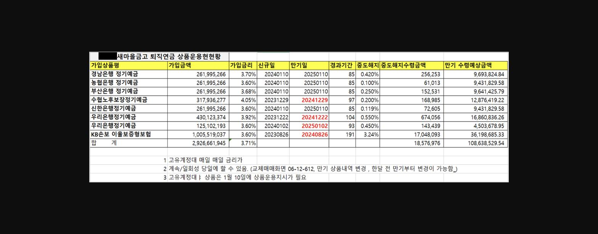
> **이미지8 설명**: 새마을금고 퇴직연금 상품운용현황 표 — 은행별 정기예금 가입금액·금리·만기일·중도해지수령금액 정리(기관명 마스킹).

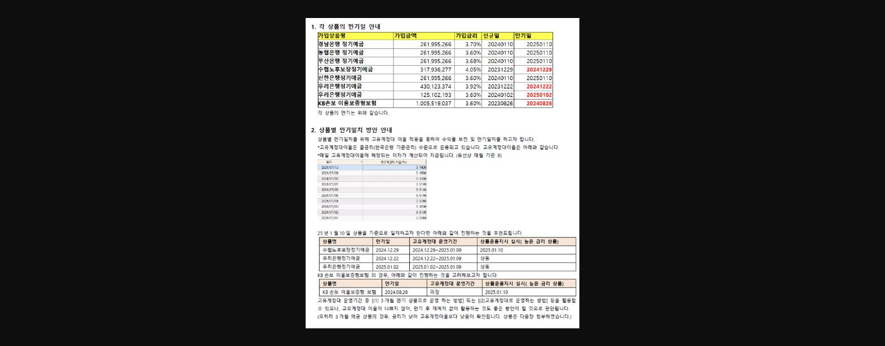
> **이미지9 설명**: 퇴직연금 상품 만기일 안내 및 고유계정대이율 표 — 상품별 만기일, 고유계정대 운영기간, 상품운용지시 실시일 정리.

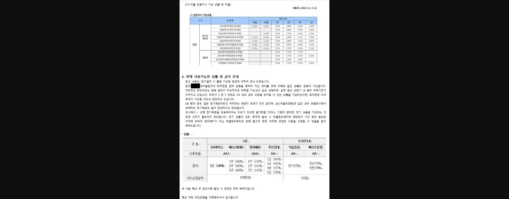
> **이미지10 설명**: 3개월 운용지시 가능 상품 및 이율표(DB형) — 은행별 정기예금 금리 비교, 하단에 GIC/ELB/DLB 상품 신용등급·금리·최소신청금액 비교표.

==**III. 퇴직연금 신규 **====**KeyWord**====** #퇴직연금이탈을거꾸로바라보기**==

지금까지 퇴직연금 관리와 이탈방어에 대해 말씀드렸는데

퇴직연금 신규는 퇴직연금이탈을 거꾸로 바라보면 쉽게 이해하고 할 수 있습니다.

==**잘 관리되지 않은 업체를, 그간 관리 받지 못해 받지 못한 이자가 얼마인지 활용하여 마케팅 한다면 고객의 마음을 쉽게 얻을 수 있습니다. **==

사례를 통해 설명 드리겠습니다.

[2022년 사례]  OOO건강가정지원센터

> **이미지11 설명**: 고객 전체계좌 조회 화면 — 예금잔액 2,648,244,378원, 신탁 확정기여형(DC) 계좌 상세정보(계좌번호 일부 마스킹).

2022년 여성가족부와 업무협약 체결에 따라 국민은행 퇴직연금 마케팅 기회가 있었던 해가 있었습니다.

지점 옆 OOO건강가정지원센터가 있었는데 매년 방문하여 인사했으나 타기관 퇴직연금 이전이 쉽지 않았습니다.

2022년 여성가족부와의 협약을 근거로, 다시 한 번 4월 경 해당 기관 센터장을 방문인사하였는데 우연찮게 퇴직연금 설명회 기회를 주신다고 하였습니다

다만, 센터의 개입없이 근로자의 선택에 따라 도입여부를 결정할 것이라는 조건을 주셨습니다. 종업원 수가 많아 경쟁 PT는 7월부터 10차례에 걸쳐 진행된다고 하였습니다.

그 기간동안 해당 기관의 노동조합 대표와 면담을 하며 현재 거래중인 기관이 삼성생명임을 알게되었습니다.

가장 먼저 확인 한 것은 10년간 상품 리밸런싱을 받은 경험이 있는지 였습니다. 이미 리밸런싱과 고객과의 관계가 양호하다면 이런 상황에서는 진행하기가 어렵습니다.

다만, 어느 퇴직연금 관리기관든그렇듯 관리에 소홀하였습니다. 거래기간 10년간 한 번 도 상품을 교체하거나 교체하라는 안내를 받은 적이 없다는 것이었습니다.

저는 그 점을 파고 들었는데, 20분이라는 짧은 설명회 시간동안 어떤 부분을 전달해야 각인될지에 대해 고민하다

한 선생님의 삼성생명 퇴직연금 운용현황서를 받아 볼 수 있었습니다.

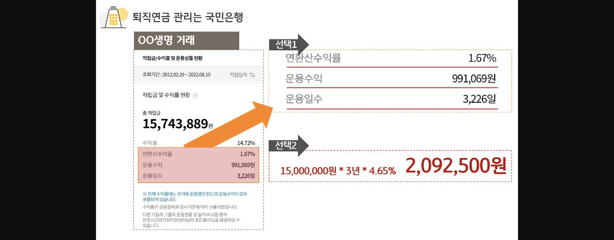
> **이미지12 설명**: 퇴직연금 관리 비교 인포그래픽 — 특정 고객 사례의 연환산수익률 1.67% vs 대안 상품 수익률 비교(선택1/선택2 시나리오).

10년 간 거래를 하였는데 10년간 총 붙은 이자가 99만원이다 라는 건 매우 자극적인 타이틀이 될 수 있겠다고 판단했습니다.

물론 적금식 적립과도 유사한 부분이 있어 초기에 이자가 많이 붙지 않는 경향이 있지만, 일정수준이 되면 목돈이 되어 정기예금만 잘 운영하더라도

저정도 수익이 나오진 않을 것이라 판단했습니다.

설명회 때는 이를 10년간 거래해서 받은 이자가 99만원이면, 제가 3년 동안 200만원 2배를 만들어주겠다고 말씀드렸습니다.

이를 통해 초회차 14억원(145명) 가입자 이전을 실시하였고 이후 꾸준한 가입자이전과 신규전입 등으로 현재 26억원 수준으로 당점 주요 퇴직연금 업체 중 하나로

거래중에 있습니다.

업체의 전입이 사업주에 의해 결정된 것이 아닌, 근로자에 의해결정된 사례로, 사업주에게 큰 비용지불없이 현재 우호적인 관계 유지 중에 있습니다.

혹 사업주가 기관변경을 희망하더라도, 22년 당시 가입한 상품 만기로 고객의 만족도가 매우 높고, 현재 앞선 수익률관리에서 보신바와 같이 만기상품 특별상품 재예치 안내를 통해

고객의 만족도가 높아 쉽게 이전할 수 없는 상황에 있습니다.

[2023년 사례] OOO가족센터

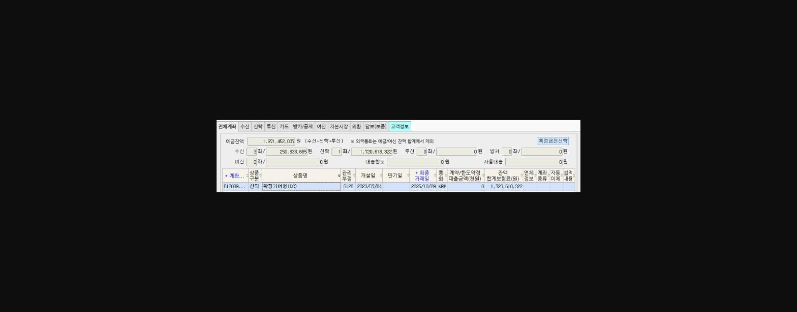
> **이미지13 설명**: 고객 전체계좌 조회 화면 — 확정기여형(DC) 신탁 잔액 1,971,452,007원, 최종거래일 정보(계좌번호 일부 마스킹).

이 사례는 [2022년 사례]  OOO건강가정지원센터  사례를 활용하여 농협은행 거래중인 OOO가족센터 퇴직연금을 가입자 이전을 통해 거래를 성사시킨 케이스입니다.

역시 농협은행에서도 별도의 관리가 없었고 이점을 파고들어 앞선 22년 노하우와 관리사례를 바탕으로 조금 더 수월하게 큰 금액을 유치할 수 있었습니다.

[2025년 사례] OOO수협

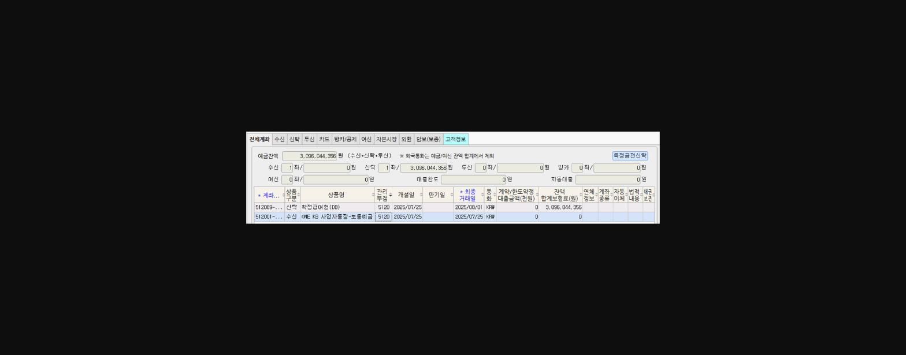

> **이미지14 설명**: 고객 전체계좌 조회 화면 — 확정급여형(DB) 신탁 및 사업자통장 보통예금 잔액 3,096,044,356원(계좌번호 일부 마스킹).

해당업체의 경우, 센터장님께서 오랜기간 섭외 시도를 했던 기관이었습니다.

실무자 및 키맨까지는 모두 동의가 되었는데 최종의사결정권자의 결정이 쉽지 않은 상황이었습니다.

다만 해당업체의 경우에도 기존 퇴직연금 거래 기관의 관리를 잘 받지 못하고 있는 상태였습니다.

이에 대해 삼성생명 - 국민은행 - 신한은행 간 비교가 필요하시다 하여 아래와 같이 원페이퍼로 구성하여 고객에게 전달하였습니다.

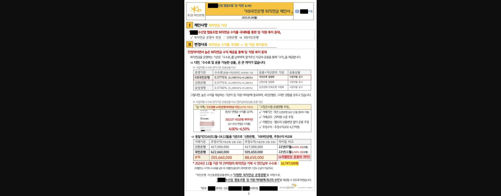
> **이미지15 설명**: KB국민은행 퇴직연금 이전 제안서 표지/요약 — 수수료 비교표(KB국민 0.5775% vs 신한 0.5775% vs 삼성생명 0.5740%), 실제 사례 수익률 비교(8년간 연평균 1.67% vs KB국민 이전시 4.00~6.50% 추정), 연간납부 수수료 약 1,674만원 등 수치 제시.

**이 제안서의 핵심은 그간 받지 못한 이자도 손해다 **

라는 관점으로 접근하여 고객을 설득했던 사례 입니다. 퇴직연금 수수료를 내면서 관리를 받았다면, 동일 기간동안 수익률 차이가 정기예금만으로도 큰 차이가 날 수 있었는데

그런 기회를 놓친 것이다. 국민은행은 적절한 리밸런싱을 통해 수익률을 극대화하고, 그러한 경험을 22년 23년 등에 걸쳐 갖추고 있고 사례가 있음을 강조하여 설명하였습니다.

이를 통해 고객을 설득하여 당점으로 거래를 유치할 수 있었습니다. (물론 센터장님의 적극적인 영업활동의 기여도가 더 컸습니다.)

==**IV. 퇴직연금 개인 업무 추진을 통한 부수거래 확대**==

이렇게 퇴직연금 업체를 관리 신규하다보면 자연스럽게 해당 회사의 직원들의 CRM을 보게 됩니다.

리밸런싱을 적절하게 활용하여 해당고객의 급여이체 - 개인형 IRP - 기타 부수거래 등을 유치할 수 있는 기회는 언제든 열려있습니다.

특히, 22년 신규건에 대한 25년 3년 고정금리 만기 고객을 내점 요청하여, 위 와 같은 부수거래를 추가 창출하고 있습니다.

해당 사례는== 《★ 25-10회차 공모 : 나만의 개인형IRP 마케팅 노하우 》 : DC/ DB 고객 활용법 ==을 참조 부탁드립니다.

https://lxp.kbstar.com/app/board/hottip-biz/view/203623.D019931C22E9E8242CA295C141BBC86DE0D492BC2C894135BC098017017E9BAC

> **이미지16 설명**: QR코드 이미지 — 관련 설문/링크 접속용 QR코드로 추정, 텍스트 정보 없음.

==**V. 마무리 **==

전달드리고 싶은 스토리와 사례가 너무 많은데 다 글로 설명하고 상세하게 안내드리지 못해 아쉽습니다!

오늘 공유드린 것 외에도 더 멋지고 새로운 아이디어나 사례가 더 있을 것이라고 생각합니다!

정말 중요하고 보석같은 퇴직연금 업무를 묵묵히 담당하고 처리중이신 전국에 계신 퇴직연금 담당자님들 화이팅입니다!