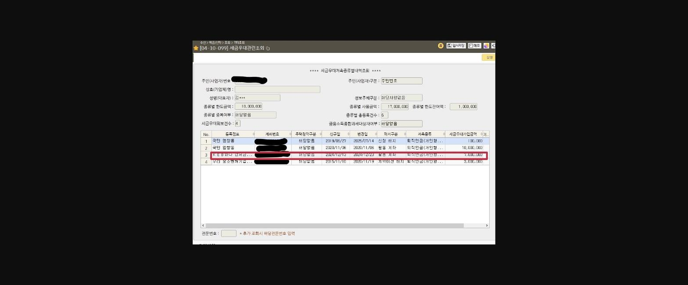
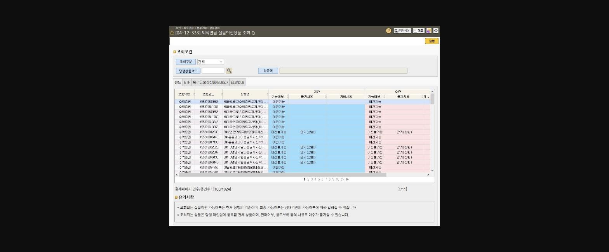
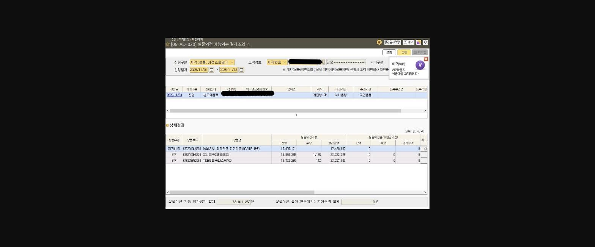
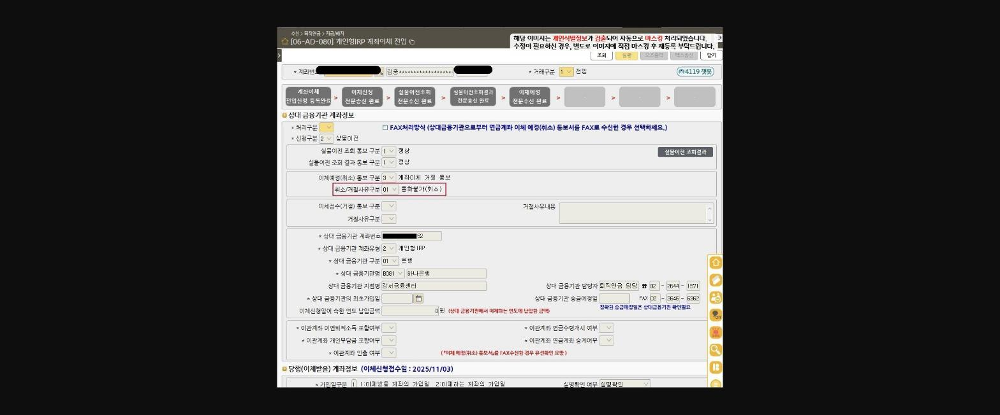

[신통방통]-⑨개인형IRP 계약이전! 나에게만 맡겨!!

안녕하세요.

**신**대리의 **통**하는 꿀 팁(TIP) **방**출합니다.

> **이미지1 설명**: 토끼 캐릭터 이모티콘(하트를 안고 있는 모습) — 게시글 장식용 이미지, 특별한 정보 없음.

'**<u>개인형 IRP</u>**'가 가장 중요한 연말이 다가왔습니다.

올해 상반기 25.6.10 업로드한

=='[신통방통]-①이븐(even)하게 구워진 「개인형 IRP」 킥 보고 가실래요~?'==

==게시물에서 '퇴직연금 킥(비법) 멘트'에 대해 올렸었는데요.==

==** **==

==오늘은 2배 인정 되는** [개인형IRP 계약이전 꿀팁]**을 방출합니다.==

==** **==

주식시장의 활황으로 퇴직연금 운용(투자)에

진심인 고객님들이 많이 있으신데요.

이런 고객님들께는 '**<u>실물 이전</u>**'의 장점을 어필해야 합니다.

이때! '무작정, 저희 국민은행에도 상품 다 있어요~'

마케팅하시면 절대 절대 안됩니다.

후폭풍이 몰려옵니다…….

> **이미지2 설명**: 토끼 캐릭터 이모티콘(우는 모습) — 게시글 장식용 이미지, 특별한 정보 없음.

요즘 창구 내점하시는 분들 마다

**싱글뷰 확인 후**** 04-10-099 **세금우대 조회

모두 하고 계시죠~??

> **이미지3 설명**: 화면 [04-10-099] 세금우대관련조회 결과 화면 — 등록계좌별 세금우대저축한도 및 잔여한도 내역(계좌번호 마스킹).

타행에 개인형 IRP이 있을 경우,

이제 계약이전 마케팅을 진행하실텐데요!!!

그 전에 **중요한 절차**가 있습니다^.^

[실물 계약 이전 전 체크 사항]

**1.     고객님의 타행 뱅킹에서 퇴직연금을 어떤 상품으로 운용하고 있는지 관심 표현을 한다.**

**-킥(비법) 멘트-**

고객님~ OO은행에 퇴직연금 어떻게 운용하고 계세요~?

**(내 퇴직연금 운용 수익율을 보여주며)**

고객님! 내가 투자해보고 싶은데 혹시 내려갈까봐 두려워서 투자 못하고 있는 ETF를 퇴직연금에 담아보세요!

어차피 못 찾는 돈이기 때문에, 장기 투자가 가능합니다.

시장은 장기적으로 상승하는 경향이 있어, 시장 추세에 편승하기 쉽습니다.

장기적인 자산 증식으로 노후 대비를 도와드릴게요.

고객님 타행 뱅킹 열어주시면 고객님 지금 어떻게 운용하고 계신지 봐드릴게요!!

**(타행 운용하고 있는 상품스캔)**

**2.    **** 04-12-333 ****단말 화면에서 실물이전상품 조회 화면에서 당행 상품 라인업을 확인한다.**

*특히 투자상품으로 운용중이신분*

**-킥(비법) 멘트-**

고객님~ 마침 고객님께서 운용하고 있는 상품들이 저희 국민은행에도 모두 있네요!

저희 국민은행으로 가져오시면! 제가! 관리해드릴게요~

국민은행은 퇴직연금 운용 규모도 크고 수익율도 굉장히 잘 내고 있습니다.

골든라이프퇴직연금 전용 센터도 있어서, 잘 관리해드립니다.

은행 예금이 현재 2.6%인데, 원리금 보장상품으로 하시면 3프로 넘는 상품도 있어요.

==**

> **이미지4 설명**: 화면 [04-12-333] 퇴직연금 실물이전상품 조회 화면 — 펀드/ETF별 이관·수관 가능여부 및 불가사유 목록.**==

**3.     계약이전 전입신청 후 ****06-AD-020**** 실물이전 가능여부 결과를 조회한다.**

*이 때, 계약이전 신청 후 최종 실물 이전 가능 상품 목록은 보내는 기관에서

'이전의사 확인'시 고객이 결과를 확인할 수 있으며, 상품 목록 확인 후 수락 또는 거절이 가능합니다.

==** **==

==** 

> **이미지5 설명**: 화면 [06-AD-020] 실물이전 가능여부 결과조회 화면 — 실물이전 가능 평가금액 합계 63,011,252원 등 상세 상품별 잔액/평가금액.**==

==** **==

==** **==

이렇게! 열.심.히 계약이전 성공했는데,

갑자기 취.소된 경험 있으신가요?

**-최근 경험담-**

타행에서 계약이전 방어가 굉장히 심합니다. ㅜ.ㅜ

최근에 창구에서 신용대출을 진행하면서

IRP 계약이전을 진행하는 과정 중에 황당한 경험이 있었습니다.

타행에서 고객님께

**1차 전화(창구직원)**를 걸어 회유했으나, 고객님께서 이전 동의 표현

**2차** **전화(타행창구팀장)**를 걸어 회유했으나, 고객님께서 2차 이전 동의 표현

마지막으로 **센터(본점)에서 이전 동의 전화**를 했는데, 고객님께서 통화 연결 안됨

'<u>센터 전화를 못 받은 이유</u>'로 계좌이전 '**<u>거절 통보</u>**'를 받았습니다.

고객님께서는 이전 동의를 완료된 줄 알고 계셨습니다….

그래서 아무리 바쁘더라도 꼭!!!

계좌이전 신청후 **06-AD-080**을 수시로 조회하여 진행과정을 확인해야합니다.

> **이미지6 설명**: 화면 [06-AD-080] 개인형IRP 계좌이체 전입 화면 — 이체예정(취소) 통보구분, 상대 금융기관(하나은행) 계좌정보 입력란(개인정보 마스킹).

이렇게 **계좌이체 거절 통보** 시에는

**1.     상대 금융기관 담당자에게 꼭 전화해서 '사유'를 확인해야 합니다.**

**2.     고객님께 ****비대면 경로****를 상세히 안내해드리고, 재 이전 신청해야 합니다.(권유직원 입력 필수)**

또는

**빠르게 고객님 내점을 유도하여 후선 의뢰****(06-12-501)****를 진행해야 합니다.(신분증 필수)**

**[실물 이전 자주 발생하는 케이스 및 해결방안]**

| 사 유 | 해결 방안 |
|---|---|
| 상품변경 진행중으로 거절 | 보유상품변경, 만기상환, 디폴트매수, ETF매수/매도 체결중 등 상품변경 완료일 확인 후 재신청 |
| 현금성자산만 보유 | 실물이전 불가하니, '현금이전'으로 재신청 |
| 실물이전 불가 ETF보유 | 실물이전 불가 ETF 고객 직접 매도 필요 |
| 환매불가상품(러시아펀드) 보유 | 이전이 불가한 계좌 |
| 퇴직금 일부가 입금 상태 | 퇴직금 전액 입금 완료 후 재신청 가능 |

끝날 때 까지 끝난 게 아닌…

IRP 계약이전!

우리 끝까지! 집요하게 해서

2배 인정 받아 2025년 화려하게 마감해요 ♡

> **이미지7 설명**: 토끼 캐릭터 이모티콘(손 흔드는 모습) — 게시글 장식용 이미지, 특별한 정보 없음.

**좋아요 꾸욱**

↓↓↓↓↓↓↓↓↓↓↓