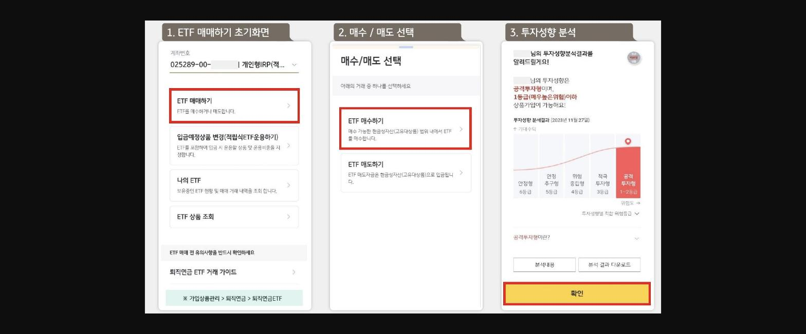
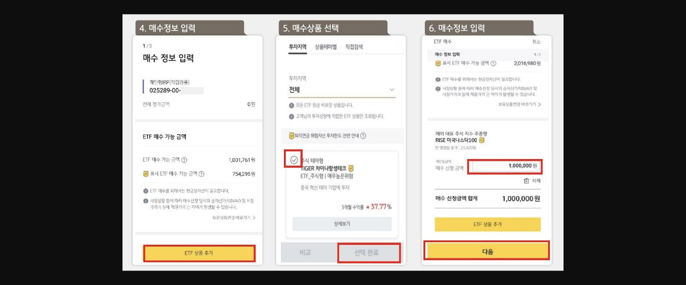

안녕하세요 ~퇴직연금 상품 운용변경 요즘 핫하죠?

퇴직연금전용상담센터 ==1599-0099== 정기예금,고유대 상품에 한하여 전화상담을 통해 운용방법 변경도 가능합니다

또 고객님이 직접전화연락 ==1833-3700==(퇴직연금자산관리 컨설팅 센터)으로도 가능하구요 .

ETF 매수는 현금성 자산으로 된 상태에서 고객님이 직접 매수~~~방법은 아래에 간단히 !!!

> **이미지1 설명**: ETF 매매 절차 안내 캡처(1~3단계) — ETF 매매하기 초기화면, 매수/매도 선택, 투자성향 분석결과(공격투자형) 화면.

> **이미지2 설명**: ETF 매매 절차 안내 캡처(4~6단계) — 매수정보 입력, 매수상품 선택(TIGER 차이나항셍테크 등), 매수 신청금액 입력 화면.

MyStar 04-12-660-상담연계등록-신규등록--상담신청 후

익영업일부터 순차적으로 퇴직연금 자산관리 컨설팅센터에서 고객에서 연락 드리니 이것도 참고 하시면 좋을 것 같아요 ~~^^