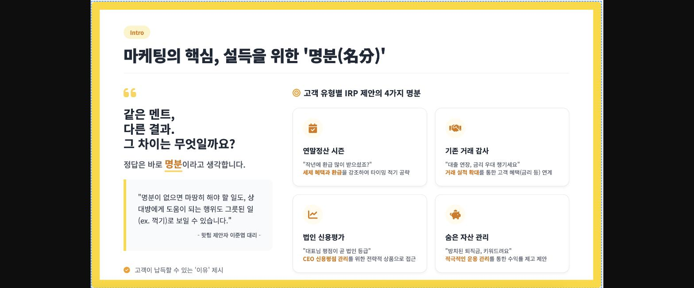
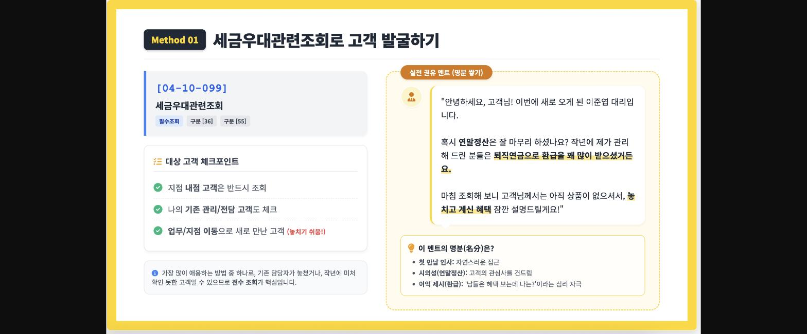
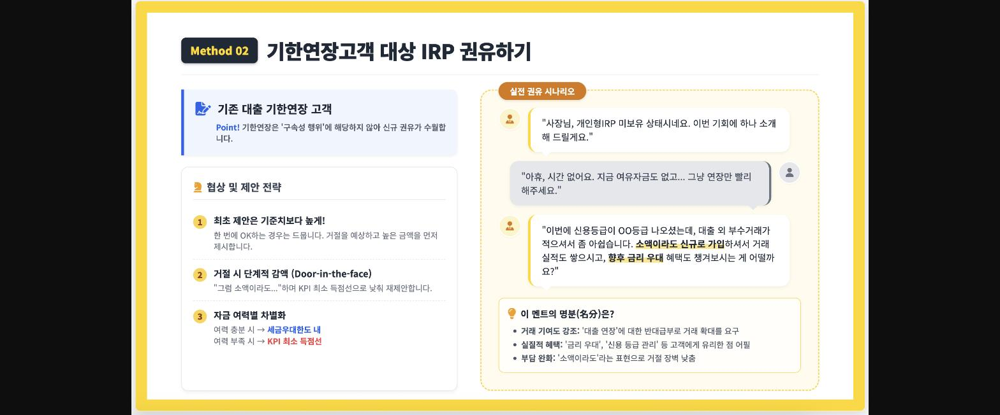
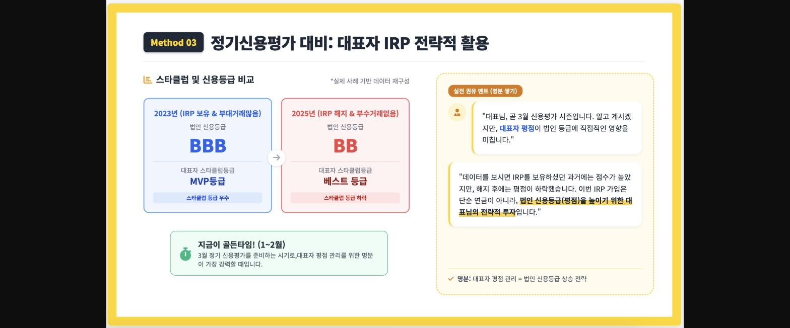
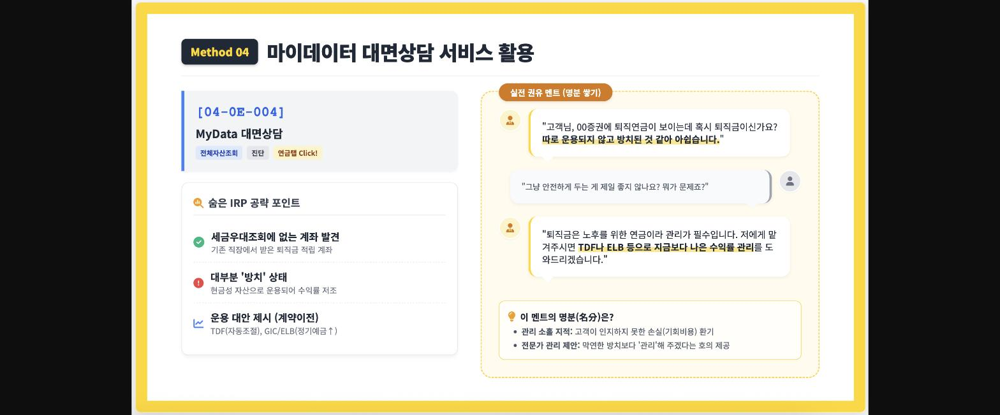
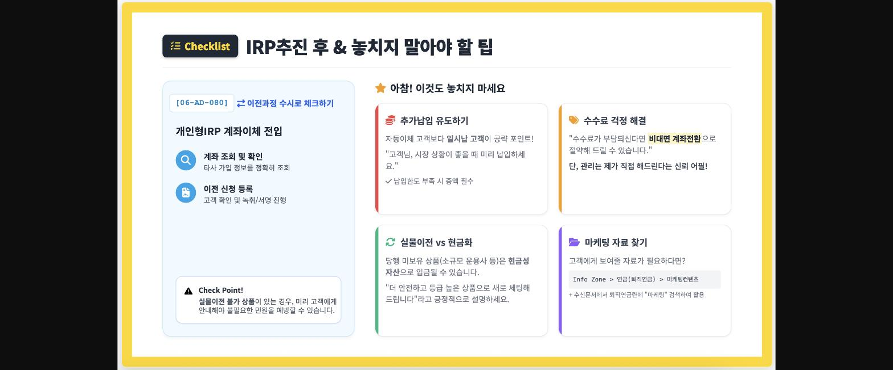

> **이미지1 설명**: 게시글 표지 이미지 — "빠르고 강한 출발!! 개인형 IRP 고객 발굴 및 권유하기" 핫팁이슈 1편, 연희동지점 이준엽 대리 작성.

> **이미지2 설명**: "마케팅의 핵심, 설득을 위한 명분(名分)" 인트로 슬라이드 — 고객 유형별 IRP 제안의 4가지 명분(연말정산 시즌, 기존거래 감사, 법인 신용평가, 숨은 자산 관리) 소개.

> **이미지3 설명**: Method 01: 세금우대관련조회로 고객 발굴하기 — 화면번호 [04-10-099] 활용법 및 실전 권유 멘트 예시(연말정산 환급 강조).

> **이미지4 설명**: Method 02: 기한연장고객 대상 IRP 권유하기 — 대출 기한연장 고객에게 신규 가입 권유하는 협상전략(3단계) 및 실전 시나리오.

> **이미지5 설명**: Method 03: 정기신용평가 대비 대표자 IRP 전략적 활용 — IRP 보유 여부에 따른 법인 신용등급 비교(BBB vs BB) 및 권유 멘트.

> **이미지6 설명**: Method 04: 마이데이터 대면상담 서비스 활용 — 화면번호 [04-0E-004] MyData 대면상담으로 방치된 퇴직금 발굴, 실전 권유 멘트.

> **이미지7 설명**: Checklist: IRP추진 후 & 놓치지 말아야 할 팁 — 추가납입 유도, 수수료 걱정 해결, 실물이전 vs 현금화, 마케팅 자료 찾기 안내.