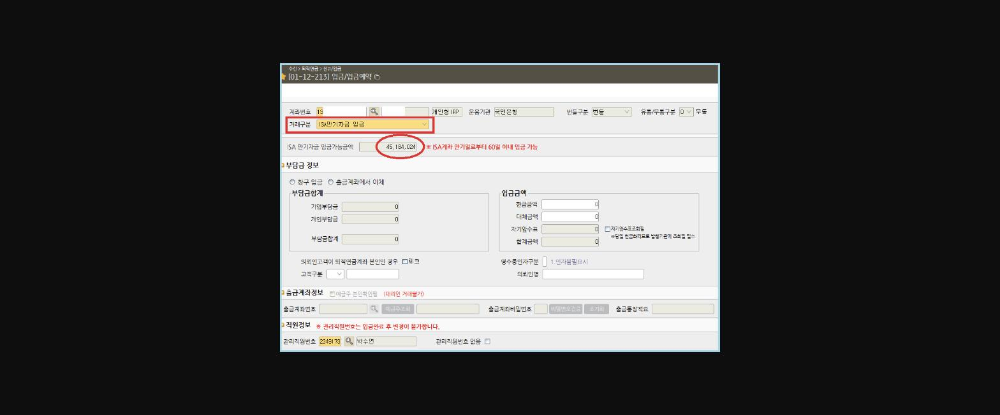
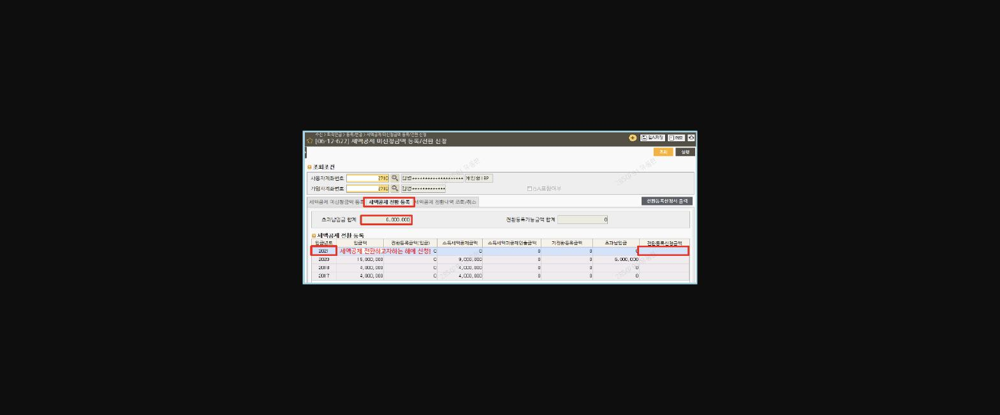
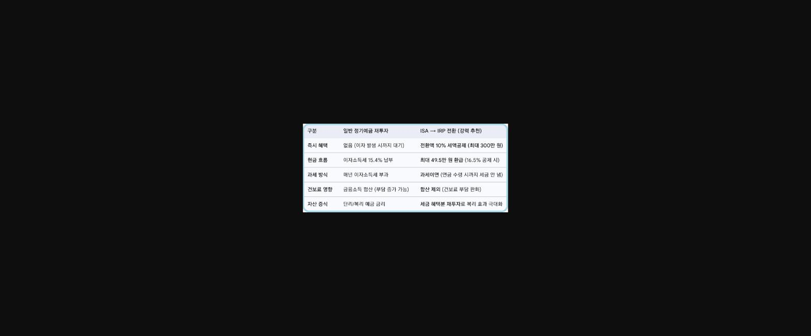
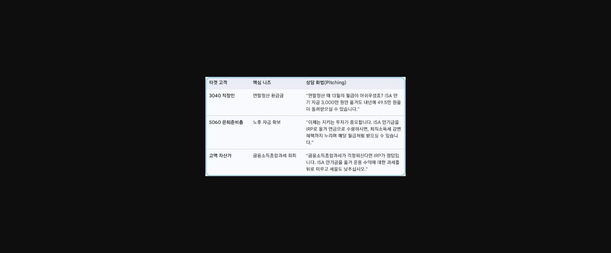
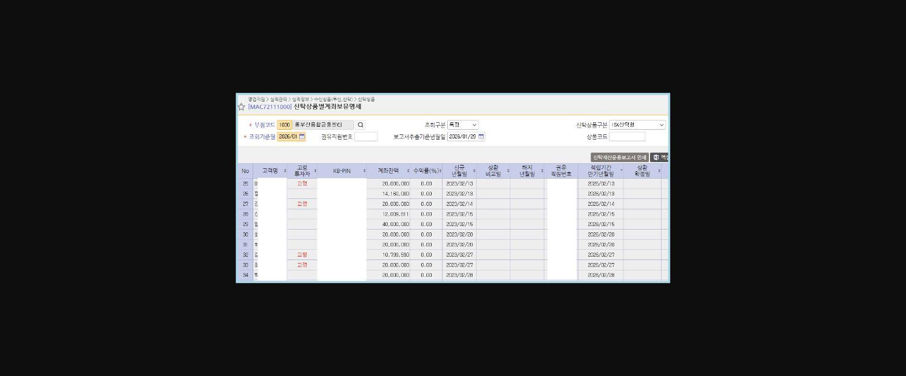

**[ **==**ISA 만기 자금 개인형IRP 전환 마케팅**==** ]**

> **이미지1 설명**: ISA → IRP 절세 로드맵 다이어그램 — STEP1 ISA 만기, STEP2 IRP 이전, STEP3 ISA 재가입, STEP4 3년 후 다시 IRP 전환의 4단계 순환 구조.

**최근 노후대비 및 절세상품에 대한 고객들의 관심이 갈수록 높아지고 있는 상황에서,, **

==**ISA 만기 고객을 개인형IRP로 유치**==**하여 고객에게는 "절세 혜택"을 주고, 우리에게 "IRP 신규/증액 실적"을 가져다 주는 윈윈(Win-Win) 전략을 소개합니다.**

**3년 마다 ISA를 통한 연금자산 불리기를 통해 고객의 절세와 노후준비를 동시에 잡을 수 있는 방법입니다.^^**

==** 1.**====**  **====** ISA 만기자금 개인형 IRP 입금 **==

● **「만기 ISA의 연금계좌로 전환입금」이란?**

==**ISA 계좌 만기일로부터 **====**<u>60일 이내</u>**====**에 **====**<u>만기자금의 전부 또는 일부 금액</u>**====**을 연금계좌로 추가 납입 허용 및 세액공제 혜택 제공**==

※ 타행 ISA 만기자금 해지 후 당행으로 입금시 증빙서류 불필요(전산확인 가능)

● **입금 횟수** : 횟수 제한 없음(추가 가입한 ISA계좌의 만기자금도 동일하게 전환 입금 가능)

● **입금 대상**

- 계약이 만료된 **<u>당행 또는 타행 ISA계좌</u>**(계약체결일로부터 3년 경과 계좌 포함)의 만기자금

● **입금 가능 금액**

- 연간 납입한도 1,800만원(연금저축, DC, IRP 포함) 내 개인부담금 + **ISA 만기자금(만기일로부터 60일 이내)**

● **입금액에 대한 세액공제 혜택**

- ==**ISA 만기자금 입금액의 최대 10%, 최대 300만원 까지 세액공제 가능**==(세액미공제 금액은 과세제외)

● **입금 방법**

▶ 창구입금 :

- 입금/입금예약[01-12-213]

- 거래구분 : ==**'ISA 만기자금 입금' **==선택

- 계좌입력시 ISA 만기자금 입금가능금액이 자동 조회됨 ☞ 해당 금액 범위 내로 입금 가능

> **이미지2 설명**: 화면 [01-12-213] 입금/입금예약 화면 — 거래구분 "ISA만기자금 입금" 선택, ISA 만기자금 입금가능금액 45,184,024원 표시(만기일로부터 60일 이내 입금 가능 안내).

▶ 비대면입금 :

- KB스타뱅킹 : 전체메뉴 > 가입상품관리 > 퇴직연금 > 입금 > ISA만기자금 입금

- 입금시간 : 은행 영업일 03:00 ~ 19:00

==** 2.**====**  **====** 핵심 마케팅 내용 **==

**① **==**추가 세액공제 혜택 강조**==

**"<u>ISA → IRP전환금액의 10% 금액 추가 세액공제</u>"**** ****(단, 300만원 한도)**

- 효과 : 최대 300만원의 16.5%(또는 13.2%)인 49.5만원의 추가 환급액 발생. 이는 고객이 체감할 수 있는 즉각적인 수익률 상승 효과임

> **이미지3 설명**: ISA에서 IRP로의 전환 시 추가 세액공제 혜택을 나타내는 아이콘 다이어그램(ISA→IRP 화살표, "추가 세액공제!" 문구).

**② **==**이월공제 가능**==

**"<u>전환 후 세액공제 받지 못한 원금은 이월하여 공제가능</u>"**

- (사례) ISA 4,000만원 전환 및 개인부담금 900만원 납입 → 세액공제 비대상금액 3,700만원 이월공제 가능

- 세액공제 이월은 초과납입으로 인한 세액미공제 금액을 공제 받고자하는 해당연도에 납입한 것으로 전환하는 전환 신청을 하여야 함

★==세액공제 전환거래 [06-12-651]==

> **이미지4 설명**: 화면 [06-12-627] 세액공제 미신청금액 등록/전환 신청 화면 — 세액공제 전환 등록 탭, 연도별 초과납입금 합계 6,000,000원 등 입금년도별 세액공제 전환등록 신청금액 내역.

**③ **==**과세이연을 통한 복리 효과**==

**"<u>개인형IRP 발생한 운용수익은 인출전까지는 과세제외</u>"**

- ISA에서 발생한 이익은 비과세/분리과세 혜택을 받지만, 이를 IRP로 넘기면 수령 시점까지 과세가 이연됨

- 당장 세금을 떼지 않고 원금 전체를 재투자함으로써 발생하는 '복리 효과'를 강조

**④ **==**저율과세 **==

**"<u>개인형IRP 연금수령 시 저율과세</u>"**

- 개인형IRP 연금수령 시(연금개시요건 : 5년이상 경과 & 만 55세 이상) 세액공제 받은 원금과 운용수익 3.3~5.5% 저율과세(연령별 과세)

- ISA 전환 입금액 중 세액미공제 원금은 인출 시 과세 없이 원금 그대로 지급

==** 3.**====**  **====** ISA 만기자금 활용 방안 비교 **==

> **이미지5 설명**: 일반 정기예금 재투자 vs ISA→IRP 전환(강력 추천) 비교표 — 즉시혜택(전환액 10% 세액공제 최대 300만원), 현금흐름(최대 49.5만원 환급), 과세방식(과세이연), 건보료 영향(합산 제외), 자산증식 비교.

==** 4.**====**  **====** 타겟 고객 **==

**- 3040 직장인, 5060 은퇴준비층, 고액자산가**

> **이미지6 설명**: 타겟 고객별 상담 화법(Pitching) 표 — 30·40대 직장인(연말정산 환급금), 50·60대 은퇴준비층(노후자금 확보), 고액자산가(금융소득종합과세 회피) 각각의 핵심 니즈와 상담 멘트 예시.

==** 5.**====**  **====** 실적 증대를 위한 실행 방안 **==

● ==**ISA 만기 사전 관리**==

- ISA 만기 2~1개월 전 고객에게 ISA 만기자금 IRP전환 및 세제혜택 안내

- ISA 만기도래 계좌 확인방법 : **<u>경영정보시스템 > 신탁상품별 계좌보유명세</u>**

> **이미지7 설명**: 신탁상품별계좌보유명세 화면([MAC72111000]) — ISA신탁형 상품구분, 고객명·계좌잔액·수익률·신규년월일·만기년월일 목록(개인정보 마스킹).

● **마이데이터 대면서비스를 통한 타행 ISA 만기 확인 및 IRP유치 **

● **ISA 신규개설 내점 고객 대상 기보유 ISA 만기 해지 여부 확인 마케팅**

- ISA해지금액이 입금되면 고객에게 연금저축계좌 입금에 대한 유의사항이 포함된 안내문자가 발송되므로 고객에게 추가 마케팅을 할 수 있음

> **이미지8 설명**: 신탁형ISA 해지금액 입금 안내 문자 — 연결계좌로 해지금액 45,184,024원 입금 안내 및 유의사항(만기일로부터 60일 이내 IRP 이전시 납입금액의 10%, 최대 300만원 추가 세액공제 가능).

● **개인형IRP 운용 상품의 다양성(TDF, ETF 등) 안내 및 포트폴리오 제안으로 고객 관심 유도**

==**실제로 최근 일임형 ISA만기로 창구를 내점한 부부고객의 ISA 만기자금 2,500만원을 각각 개인형IRP계좌로 입금하여 합산 5000만원의 IRP 추가 입금 실적을 달성 하였는데,**==

==**IRP신규의 경우 1인 최대 연간 1,800만원 한도가 정해져 있고, 타사에서의 이전은 한도가 없지만 섭외가 쉽지 않은 반면,**==

==**ISA 만기자금의 개인형IRP유치는 ISA 만기자금을 최대한도로 입금 가능하므로 IRP 실적을 올릴 수 좋은 방안이 될 수 있습니다.**==