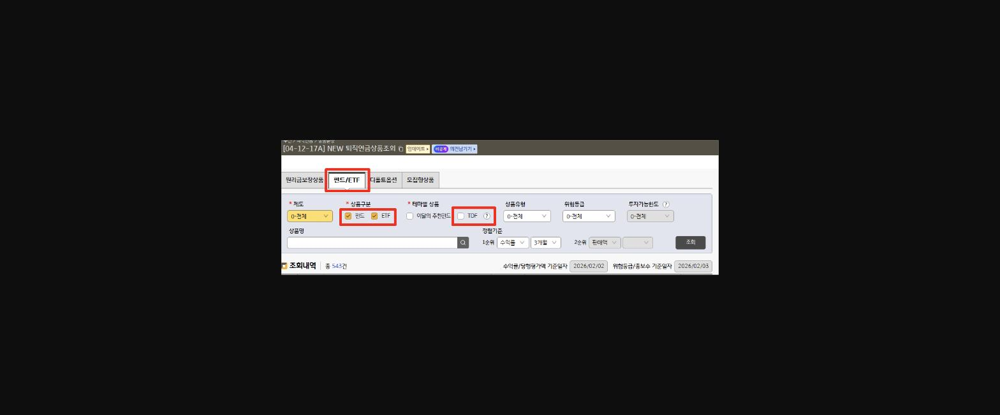
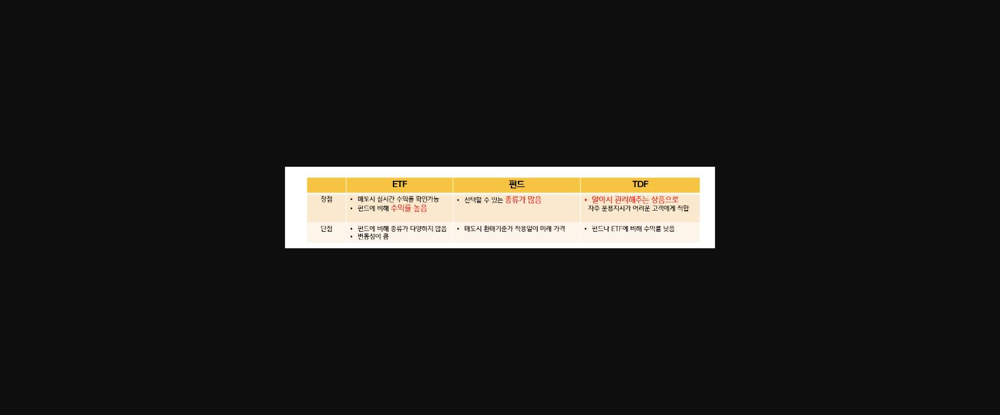
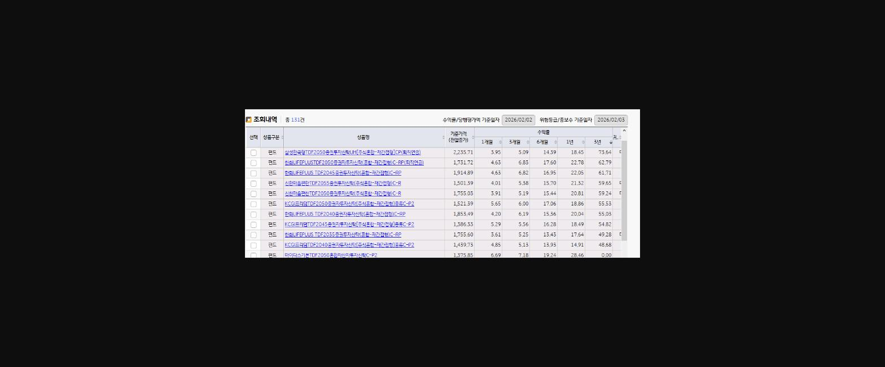
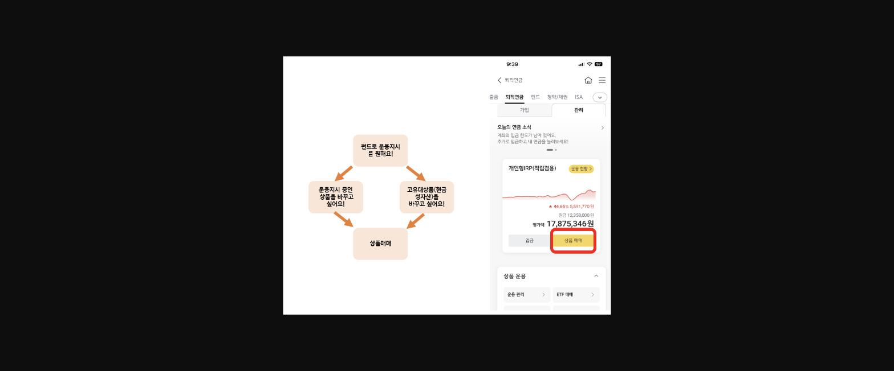
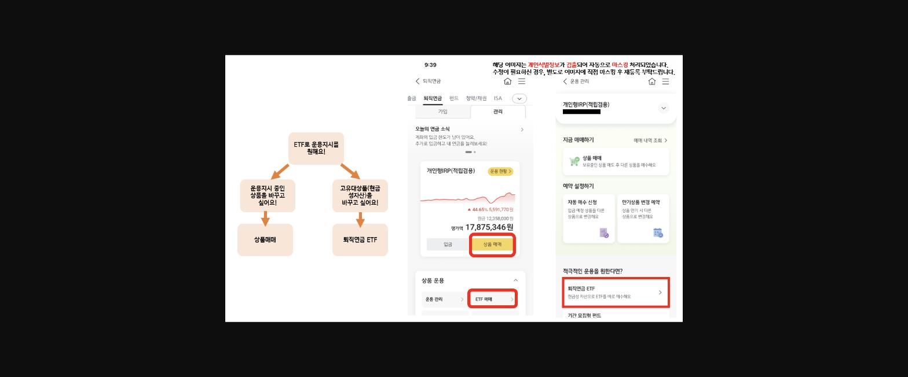

**퇴직연금 디폴트옵션 제도가 시행된 후로 창구로 내점하여 문의주시는 고객님들이 많아졌습니다!**

**DC, 개인형IRP 운용지시를 위해 내점하시는 고객님들은 **

**펀드, 신탁 등을 따로 가입하실 수 있는 잠재고객****이기에 **

**퇴직연금 상품 등을 어느정도 알아놓고 KB스타뱅킹으로 운용지시 해드리면 좋습니다!**

**실제로 개인형IRP 운용지시를 해드린 후 운용자산의 수익률이 높아지면 **

**개별적으로 펀드나 신탁을 권유했을때 8~90% 정도는 신규를 하셨던 경험****이 있습니다!**

**BUT..!**

**퇴직연금 운용지시를 창구에서 하게되면 시간이 매우매우 오래걸리고 투자상품을 편일할 경우 녹취를 진행해야합니다**

**이럴경우에는 고객님의 동의를 구한 뒤 ****KB스타뱅킹 앱으로 운용지시****를 하면 시간을 단축할 수 있습니다!**

**퇴직연금은**

**DC, 기업헝IRP, 개인형IRP**** ****모두 운용지시 대상입니다 !**

**따로 투자를 하지 않는 고객들도 요즘은 광고매체를 통해 퇴직연금 수익률을 워낙 강조하다보니**

**어느정도 투자상품을 편입하고 싶어하고 수익률을 높이고 싶어합니다!**

**이럴때는**

**"고객님, 연금 자산은 10년 이상 장기로 가져가는 자산이다 보니 정기예금으로만 100% 운용해서는 수익률을 높일 수 없습니다!**

**전체 자산의 30%라도 괜찮으니 장기 수익률이 높은 투자상품을 일부 편입해보세요"**

**라고 권하면 관심을 보이실 겁니다!**

**자신있게 상품을 권유하려면 투자 권유를 할 대상과 최근 수익률을 어느정도 제시할 수 있어야하는데요! **

**확인 할 수 있는 화면은**==**  [04-12-17A]**==

**입니다!**

> **이미지1 설명**: 화면 [04-12-17A] NEW 퇴직연금상품조회 화면 — 펀드/ETF 탭, 상품구분(펀드·ETF 체크), 테마별 상품(TDF) 선택 옵션, 조회내역 총 543건.

> **이미지2 설명**: ETF·펀드·TDF 상품유형별 장단점 비교표 — ETF(실시간 수익률 확인, 종류 다양하지 않음), 펀드(종류 많음), TDF(알아서 관리해주는 상품으로 운용지시 어려운 고객에게 적합, 수익률은 낮음).

**두번째 탭을 클릭하면 펀드,ETF,TDF를 클릭해서 상품 리스트 및 최근 수익률을 확인할 수 있습니다!**

**ETF, 펀드, TDF는 각각의 장단점이 있어서 투자를 해본적이 없는 고객이라면 TDF로, **

**따로 개별투자를 하시거나 주식에 관심이 많은 고객이라면 ETF를 추천드리면 좋습니다!**

**TDF는 20XX 과 같은 식으로 뒤에 숫자가 나오는데(빈티지)**

**XX는 은퇴년도로 숫자가 클수록 공격적으로 운용하여 대체적으로 주식 편입 비중이 높습니다!**

**저는 3년 수익률 기준으로 정렬해서 과거 누적수익률이 가장 높았던 상품을 추천드립니다!**

> **이미지3 설명**: TDF 상품 조회 결과 화면 — 삼성한국형TDF2050, 한화LIFEPLUS TDF2050, 신한마음편한TDF2055 등 상품별 기준가격 및 1개월/3개월/6개월/1년/3년 수익률 목록(총 131건).

**운용지시를 적극적으로 해드렸을때 수익률이 높아지면 **

**고객도 투자상품에 긍정적인 인식을 갖게되고 직원에 대한 신뢰도 높아지면서 **

**개별적으로 펀드나 ETF 등을 권유했을때 신규 가능성이 높아집니다!**

**KB스타뱅킹 앱으로 운용지시 하는 방법은 아래 내용으로 정리해보았습니다.**

**메뉴가 여러가지 있어서 헷갈릴 수 있는데**

**ETF로 운용지시를 할 경우에는 현금성자산(고유대상품)으로 만든 다음에 ETF 매수 신청****을 하실 수 있다는 내용만 기억하시면 좋을 것 같습니다!**

1. **1. 고객이 펀드 또는 TDF로 운용지시를 원할경우 **

> **이미지4 설명**: KB스타뱅킹 앱 퇴직연금 관리 화면 및 펀드 운용지시 흐름도 — "펀드로 운용지시를 원해요" → 운용지시 중인 상품 교체 또는 고유대상품(현금성자산) 교체 → 상품매매, 개인형IRP 평가액 17,875,346원 화면 캡처.

1. **2. 고객이 ETF로 운용지시를 원할경우 **

> **이미지5 설명**: KB스타뱅킹 앱 ETF 운용지시 흐름도 및 화면 캡처 — "ETF로 운용지시를 원해요" → 운용지시 중인 상품 교체 또는 퇴직연금 ETF 매매, 운용관리 화면(개인정보 마스킹 처리).