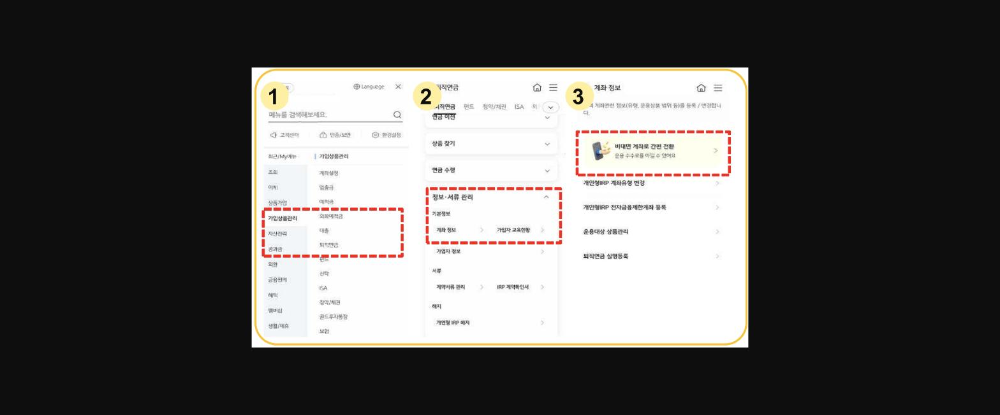
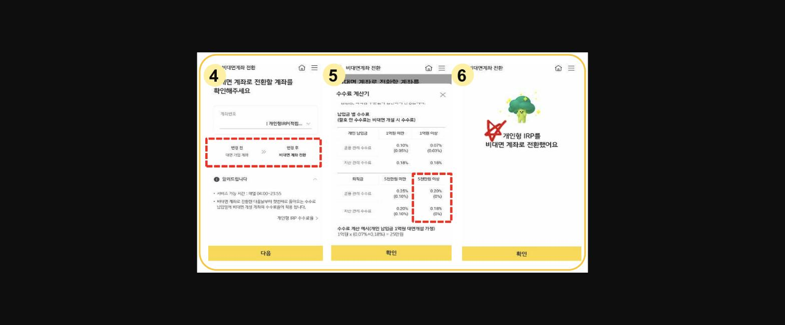

> **이미지1 설명**: 곰 캐릭터 이모티콘(하트, 벽 뒤에서 빼꼼) — 게시글 장식용 GIF 이미지, 특별한 정보 없음.

안녕하세요! **중계동지점 김보배과장**입니다.

일년내내 우리에게 너무도 중요한==** 개인형 IRP**==!

연초에는 퇴직직원 유치 등 **+ 이슈**도 많지만,

업체들의 **<u>많은 퇴직금지급과 공격적인 계약이전</u>**으로 **- 이슈**도 상당히 많습니다.

특히 **개인형 IRP를 과거 오래전에 대면으로 만드신** 고객님

또는** 퇴직금 수령후 잘 운용해오시다가 수수료 관련 이탈상담 고객**이 계시다면

꼭! 이 방법을 먼저 써주세요!

** 바로 **==**[비대면 계좌전환]**==

> **이미지2 설명**: 비대면 계좌 전환 절차 1~3단계 캡처 — ①메뉴 검색(가입상품관리/자산관리/공과금), ②퇴직연금>정보서류관리>계좌정보, ③비대면 계좌로 간편 전환 메뉴 진입.

방법은 고객님 스타뱅킹에서

**가입상품관리****>****퇴직연금****>**==**정보서류관리**==**>**==**계좌정보**==**>****비대면계좌전환**** **만

해주시면 끝!

**변경전 계좌가 대면계좌**로 나오시면 **대상**이시며

변경일 **다음날부터 첫도래하는 수수료 납입일**에

비대면 수수료가 적용되십니다.

> **이미지3 설명**: 비대면 계좌 전환 절차 4~6단계 캡처 — ④전환할 계좌 확인(대면 가입계좌→비대면 계좌 전환), ⑤수수료 계산기(개인납입금/퇴직금 구간별 운용관리·자산관리 수수료 비교), ⑥전환 완료 확인 화면.

특히 **<u>퇴직금이시고 5천만원이상</u>**이시면

비대면계좌로 전환하시면

연금개시 전이라도

==**운용/자산관리수수료가 모두 0원**==!

> **이미지4 설명**: 토끼·공룡 캐릭터 이모티콘(놀란 표정) — 게시글 장식용 GIF 이미지, 특별한 정보 없음.

그리고 수수료 관련하여 추가로 고객님께서

***<u>증권사가 수수료가 싼거 아니냐?</u>***

***<u>(증권사는 비대면거래시 대부분 IRP 자기부담금관련 수수료는 없음)</u>***

라고 고객님께서 물어보신다면....

**연금상품은 1~2년 거래가 아닌 퇴직때까지 끌고가는 장기상품이신데**

**타금융기관에서->KB로 오시면 과거 가입기간 인정으로 장기할인적용!!**

**KB IRP를->미래, 한투, 삼성가시면 타 금융기관에서는 과거 가입기간 미인정, **

**장기할인 없음, 기존 가입기간 사라짐!!**

그리고 **KB는 무조건 연금개시되면 모든 수수료 면제! + **

**개시 전이라도 저렇게 퇴직금이 5000만원 이상 있는 **

**대면계좌는 비대면전환해드리면 모든 수수료 면제!!**

**증권사는 연금개시 후 수령기간 수수료 할인**만 되십니다(**<u>면제없음!</u>**)~!

작은 수수료라도 ==**<u>무언가 관심과 신경을 써드리면 고객님의 마음을 움직일수</u>**== 있지요!

늘 창구에서 많은 상품들과 함께 ==**3월도 모든 직원분들 화이팅**==입니다  :)

> **이미지5 설명**: 토끼 캐릭터 이모티콘(손 흔드는 인사) — 게시글 장식용 GIF 이미지, 특별한 정보 없음.