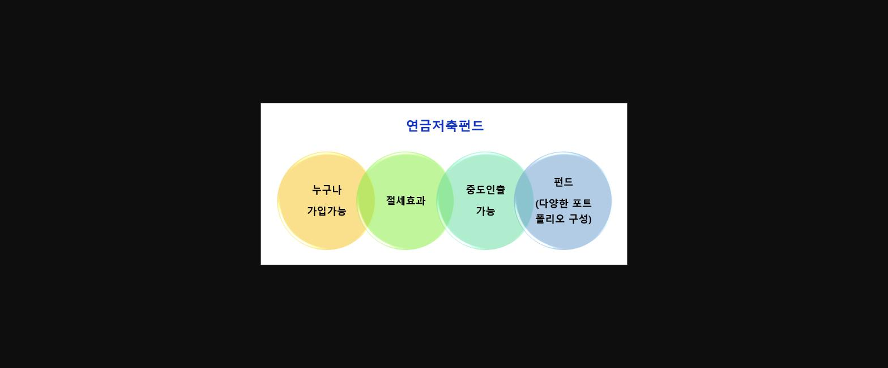
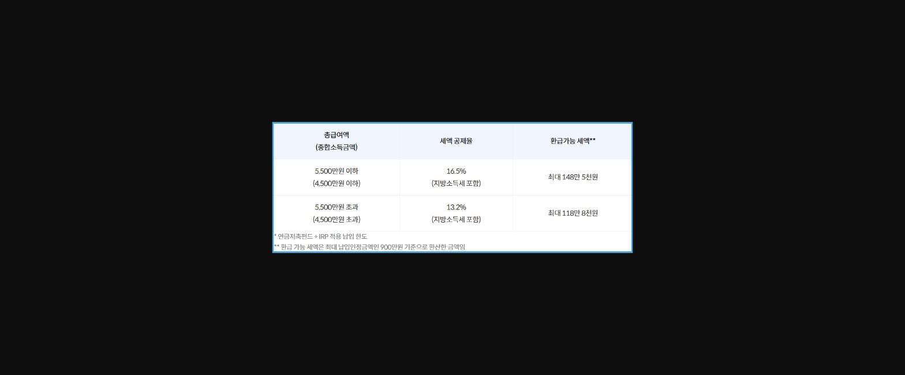
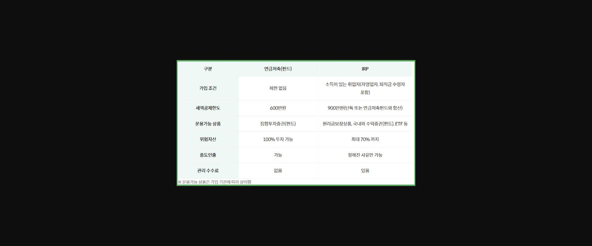
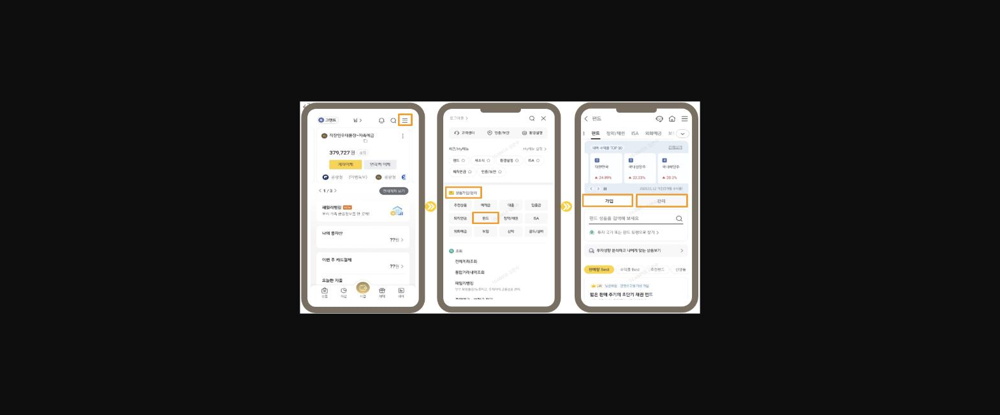
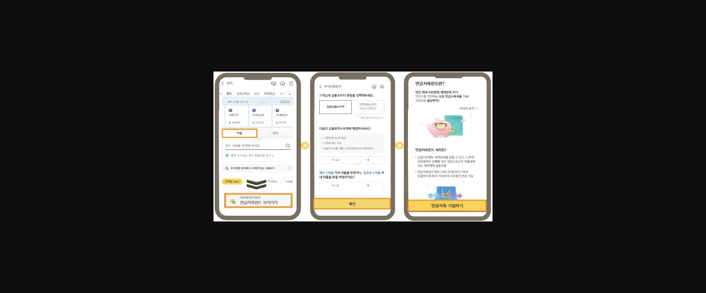
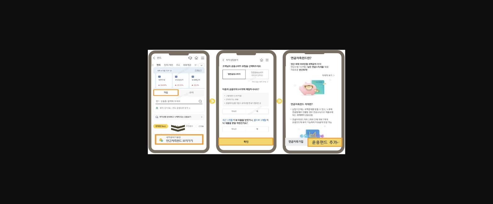
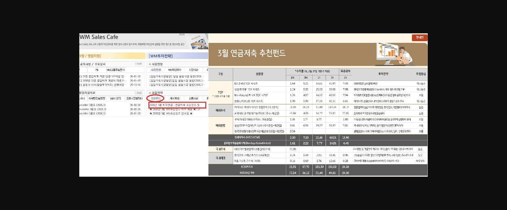
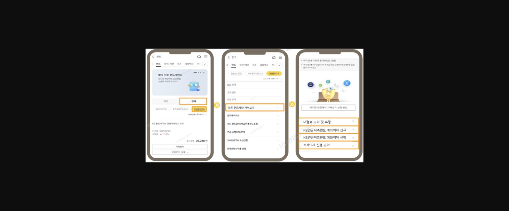
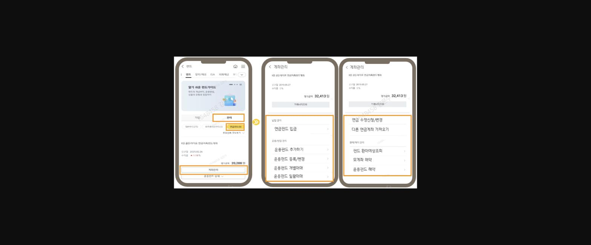
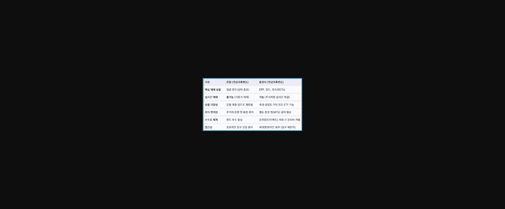

**[ **==**연금저축펀드 마케팅**==** ]**

> **이미지1 설명**: 연금저축펀드 특징 다이어그램 — 누구나 가입가능, 절세효과, 중도인출 가능, 펀드(다양한 포트폴리오 구성) 4가지 원형 도식.

**연금계좌 세액공제 한도는 연간 900만원으로 소득이 있는 개인은 IRP에만 연간 900만원을 다 채워도 세제혜택을 최대한 받을 수 있습니다. **

**하지만 최근 영업점 창구에서 IRP와 더불어 연금저축(펀드)에 대한 고객들의 관심과 문의도 점점 늘어남에 따라 오늘은 연금저축(펀드)의 특징 및 연금저축펀드 마케팅에 대해 알아보겠습니다.**

==**1.**====**  **====**연금저축(펀드)의 특징 **==

● ==**가입 조건**==

- ==연금저축펀드== : **<u>조건없이 누구나  가입 가능</u>(단, 세액공제 대상은 '거주자'만 가능)**

- ==IRP== : **소득이 있는 개인(직장인, 자영업자, 공무원, 프리랜서) - 소득서류 제출 필수**

● ==**세액공제 한도**==

- ==연금저축펀드== : **600만원**

- ==IRP== :** 900만원(연금저축 포함)**

- 연금저축펀드 600만원 + IRP 300만원 → 900만원 공제 가능
- 연금저축펀드 600만원 + IRP 600만원 → 900만원 공제 가능

> **이미지2 설명**: 세액공제율 표 — 총급여액 5,500만원(종합소득 4,500만원) 이하는 16.5% 공제(최대 148만5천원 환급), 초과시 13.2% 공제(최대 118만8천원 환급).

● ==**중도 인출의 유연성**==

- ==연금저축펀드== : ★==**<u>별도의 조건없이 중도 인출 가능</u>**==**★(연금수령 이외 계약기간 중)**

- ==IRP== : **법에서 정한 사유가 아니면 중도 인출이 불가능**하여 계좌전체를 해지해야 하므로 그동안 받은 세액공제 혜택을 반환해야하는 부담이 있음

(▲무주택자가 본인명의로 주택을 구입 ▲무주택자인 가입자가 전세금 또는 임차보증금 부담 ▲6개월 이상 요양 ▲최근 5년 이내 개인회생 또는 파산 선고 ▲자연 재난)

두 상품 모두 납입했던 금액을 연금으로 받지 않고 중도인출하는 경우에는 기타소득세 16.5%를 내야 함. 세액공제를 받지 않은 금액은 따로 세금이 부과되지 않음.

● ==**운용가능 상품 및 위험자산 비율 **==

- ==연금저축펀드== : 계좌 잔액의 100%를 집합투자증권(펀드) 상품으로 운용(**<u>별도의 위험자산 비율 제한 없음</u>**)

- ==IRP== : 원리금 보장상품, 국내외 수익증권(펀드), ETF(상장지수펀드) 등의 다양한 상품으로 운용

**위험자산은 납입금액의 70%까지만 가능하고, 최소 30%는 원리금 보장상품이나 채권형 펀드로 운용해야 함**

예외적으로, 디폴트옵션(사전지정 운용제도)으로 IRP를 운용할 때는 납입금액의 100%를 투자할 수 있음

● ==**비용**==

- ==연금저축펀드== : 별도의 계좌 관리 수수료 없음

- ==IRP== : 금융기관에 따라 운용관리 및 자산관리 수수료가 발생

● ==**담보대출**==

- ==연금저축펀드== : 담보대출 가능(2013년도 이후 출시된 연금저축펀드의 담보인정비율은 40%)

- ==IRP== : 담보대출 불가

> **이미지3 설명**: 연금저축(펀드) vs IRP 비교표 — 가입조건, 세액공제한도(600만원 vs 900만원), 운용가능상품, 위험자산 한도(100% vs 최대70%), 중도인출, 관리수수료 비교.

**※ < **==**연금저축펀드 600만원 + IRP 300만원 조합 >**==

**IRP 미가입 대상 ----------------> 연금저축펀드 가입(연간 1800만원 한도 내)**

**IRP 가입대상(소득이 있는 고객) --------------> IRP 900만원 납입**

**                                                                             또는 **==**연금저축펀드 600만원 + IRP 300만원 납입**==

**공격적인 투자를 원하고 중도 인출 가능성을 염두에 두고 있는 세액공제 목적 고객의 경우 연금저축펀드 600만원을 먼저 채우고 추가 세액공제를 위해 나머지 300만원을 IRP로 납입하는 방법이 유리합니다. **

**최근 주식시장의 상승과 투자문화의 확산으로 각종 온라인 매체 등에서 많이 소개하고 있는 절세 방법으로 이를 본 고객들의 연금저축펀드에 대한 문의가 늘었습니다.**

**은행의 연금저축신탁 상품도 있으나 이는 2017년12월30일 부터 판매가 중단되어 현재는 연금저축펀드 상품만 판매가 되고 있습니다.**

==**2.**====**  **====**연금저축펀드 비대면(스타뱅킹) 가입 **==

▶ ==**전체 메뉴 선택**==

**-** **전체 메뉴 > 상품가입/관리 > 펀드 > ****가입 또는 관리**

> **이미지4 설명**: KB스타뱅킹 앱 펀드 가입/관리 진입 경로 캡처(3단계) — 메뉴에서 펀드 선택 후 가입/관리 탭 진입 화면.

**- 연금저축펀드 상품**

● **KB 골든라이프 연금저축펀드계좌(대표상품)**

- 납입요건 : 60개월 이상 연 1800만원 한도(연금축신탁, 보험 및 퇴직연금계좌 포함 전금융기간 합산)

● **KB 라떼 연금저축펀드계좌(2040 타겟 상품)**

- 커피, 담배 등 소액을 절약하여 목돈을 마련하는 '카페라떼' 효과를 이용해 2040 세대가 스스로 노후를 준비할 수 있도록 설계된 비대면 전용 연금저축펀드 상품

- - 가입대상과 하위펀드 운용 여부는 KB골든라이프 연금저축펀드와 동일. 다만, 부가 서비스로 KB카드 연계 자동적립서비스 및 라떼 상품 포트폴리오를 제공 받을 수 있음

▶ ==**모계좌 및 운용펀드 신규**==

**-** **전체 메뉴 > 상품가입/관리 > 펀드 > 가입 ****『세액공제 가능한 연금저축펀드 보러가기』**** > 투자성향분석 > 연금저축 가입하기**

> **이미지5 설명**: KB스타뱅킹 앱 연금저축펀드 가입 절차 캡처 — 펀드 가입 화면에서 세액공제가능란 연금저축펀드 보러가기, 투자성향분석(금융취약소비자 확인), 연금저축펀드 소개 화면.

▶ ==**운용펀드 추가**==

**-** **전체 메뉴 > 상품가입/관리 > 펀드 > 가입 ****『세액공제 가능한 연금저축펀드 보러가기』**** > 투자성향분석 > 운용펀드 추가**

> **이미지6 설명**: KB스타뱅킹 앱 연금저축 가입 및 운용펀드 추가 절차 캡처 — 투자성향분석 확인 후 연금저축가입/운용펀드 추가 버튼 화면.

**- WM Sales Cafe < 상품전략 < 추천펀드 항목 < 연금저축 추천펀드 활용**

> **이미지7 설명**: WM Sales Cafe 사내 포털 및 3월 연금저축 추천펀드 자료 캡처 — TDF/해외주식/해외채권 펀드별 수익률(1M/3M/1Y/5Y), 표준편차, 위험등급 비교표.

▶ ==**다른 연금계좌 가져오기**==

**-** **전체 메뉴 > 상품가입/관리 > 펀드 > 관리 > 연금펀드 > 다른연금계좌 가져오기**

> **이미지8 설명**: KB스타뱅킹 앱 펀드 관리 및 타기관 연금계좌 가져오기 절차 캡처(3단계) — 펀드 관리 탭, 다른 연금계좌 가져오기, 내정보 조회/계좌이체 신청 메뉴.

▶ ==**추가입금, 운용펀드간 매매, 연금수령, 신청변경 등**==

**-** **전체 메뉴 > 상품가입/관리 > 펀드 > 관리 > 연금펀드 > 계좌관리**

> **이미지9 설명**: KB스타뱅킹 앱 연금펀드 계좌관리 세부메뉴 캡처(3단계) — 연금펀드 입금, 운용펀드 추가/등록변경/매매, 연금 수령신청/변경, 환매/해지 관리 메뉴.

==**3.**====**  **====**연금저축펀드 마케팅 **==

- ✔ **평생 세테크 통장**
- ✔ **강력한 노후준비 수단**
- ✔ **자유롭게 중도인출 가능**

==**✅ 마케팅 대상 **==

● **직장인 **

- 연말정산 환급 통장 마케팅

● **자영업자**

- 5월 종합소득 신고 시 세부담 감소

● **공무원/ 사립학교교직원 등**

- 줄어드는 공적연금 보완수단 및 세액공제 활용

● **주부**

- 배우자 노후 준비(국민연금, 퇴직금, 개인연금)와 별도로 준비 필요

● **금융소득종합과세 대상자**

- 일시금으로 인출해도 수익에 대해 무조건 분리과세, 운용기간 중 과세이연 계좌에서 자금을 인출해야 세금이 발생하므로 세금의 발생시점 조절 가능

● **자녀 증여수단**

- 2010플랜: 증여공제(19세 미만 10년간 2천만원)를 활용한 세금 없이 증여하기

==**✅ ISA 만기자금 활용 마케팅 **==

▶ <u>추가납입 방법</u> : ISA계좌의 계약기간 만료일로부터 60일 이내 연금저축계좌로 납입

※ 은행연합회 한도 조회 [04-10-099]를 통해 납입가능여부 및 금액 확인(저축종류코드 '83'으로 미사용금액 확인 가능)

▶ <u>ISA만기자금 세액공제한도</u> :** **ISA 계좌 만기 자금의 10%(최대 300만원 한도)까지 가능

▶ <u>ISA만기자금 중 한도 초과로 세액공제 받지 않은 금액은 이후년도의 당해년도 납입금액으로 전환 가능</u>

: 이 경우 당해년도 납입금액으로 전환한 금액에 대한 세액공제 한도는 6백만원이며, ISA만기자금에 대한 추가 세액공제는 적용되지 않음

==**✅ 연금 이전 마케팅(보험/신탁 → 펀드)**==

- 낮은 수익률에 정체된 기존 연금저축보험이나 신탁 고객을 펀드로 유도

- 서류 없이 간편하게 가져올 수 있는 비대면 이전의 편리함 강조 및 기존 상품대비 장기 수익률 및 복리효과 안내

==**✅ 증권사 이탈 방어  **==

**※ **==**은행 VS 증권사 연금저축펀드 비교**==

> **이미지10 설명**: 은행(연금저축펀드) vs 증권사(연금저축펀드) 비교표 — 핵심 매매상품, 실시간 매매 가능여부, 상품 다양성, 관리 편의성, 수수료 체계, 접근성 비교.

● ==**일일이 신경 쓸 필요 없는 '전문가 운용'(TDF 강조)**==

- 실시간 ETF 매매가 안 된다는 것은 역설적으로 매수/매도 타이밍을 고민할 필요가 없다는 뜻이기도 함

- "고객님 바쁜 일상 중에 매일 차트 보고 종목 고르기 힘드시죠? 은행 연금저축펀드의 TDF(Target Date Fund)는 전문가들이 은퇴 시점에 맞춰 알아서 주식과 채권 비중을 조절해줍니다. 신경 끄고 계셔도 수익률 관리가 됩니다."

- 타겟은 투자를 시작하고 싶지만 공부할 시간이 없는 3040 직장인

● ==**변동성을 이기는 '적립식 펀드의 힘'**==

- 실시간 매매가 안 되는 대신, 매달 일정 금액이 들어가는 '자동이체 적립식 투자'의 안정성을 강조

- "ETF 실시간 매매는 자칫 감정에 휩쓸려 고점에 사고 저점에 팔 위험이 큽니다. 은행의 적립식 펀드는 '코스트 에버리징(매입단가 하락 효과)'를 통해 장기적으로 안정적인 수익을 낼 수 있습니다."

- 주식 시장의 변동성을 두려워하는 보수적인 투자자가 타겟

● ==**재간접 펀드로 ETF 혜택 누리기**==

- 직접 ETF를 살 수는 없지만, ETF에 투자하는 '재간접 펀드'를 대안으로 제시

- "실시간 매매는 안되지만, 미국 S&P500이나 나스닥100 ETF를 담고 있는 펀드 상품들이 많습니다. 개별 ETF를 고르는 번거로움 없이 검증된 지수 ETF 묶음에 투자하는 효과를 보실 수 있어요."

● ==**은행의 강점 : 종합 자산관리와 대출 상담**==

- 증권사가 가지지 못한 은행만의 '토탈 케어'를 강조하여 계좌 유치를 유도

- "연금은 20~30년 보고 가는 상품입니다. 나중에 연금 대출이나 담보 활용, 자산 상속 상담까지 고려하신다면 주거래 은행에서 통합 관리하시는 게 훨씬 유리합니다."

고객 : "은행은 ETF를 직접 못 사서 불편하던데?"

***☞ "맞습니다. 고객님, 실시간 단타 매매를 원하신다면 증권사가 맞습니다. 하지만 연금은 노후를 위한 장기 레이스거든요. 오히려 잦은 매매로 인한 손실을 막고, 전문가가 알아서 리밸런싱해 주는 TDF 같은 상품으로 '잊고 지내도 불어나는 연금'을 만드시는 게 은행 고객님들 만족도가 훨씬 높습니다."***

**연금저축펀드는 누구나 가입이 가능하다는 장점이 있어 마케팅 대상의 폭이 넓습니다. **

**증권사의 공격적인 마케팅으로 이탈 고객도 있지만, IRP와 더불어 자신감과 관심을 가지고 마케팅을 해보는 것이 중요하다는 생각이 듭니다.^^**