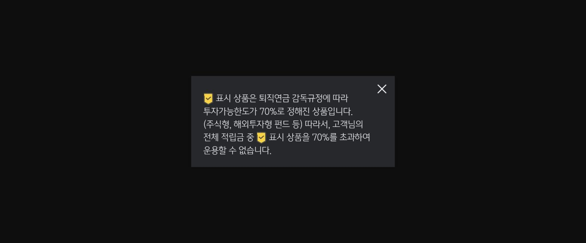
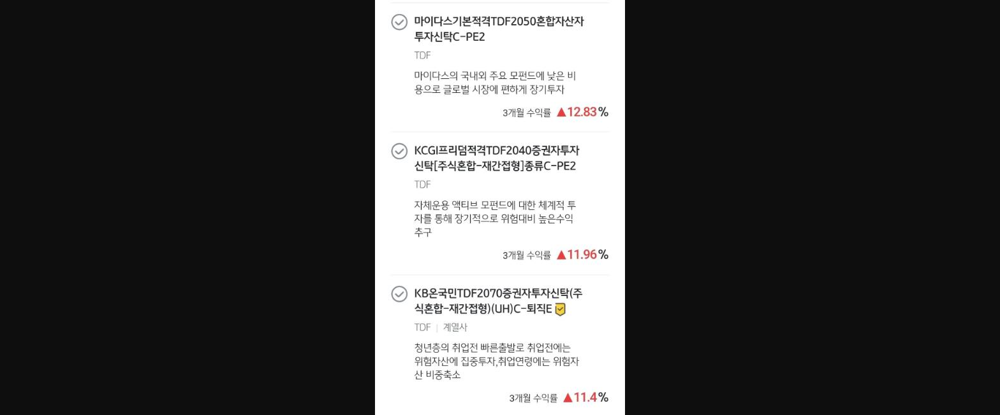
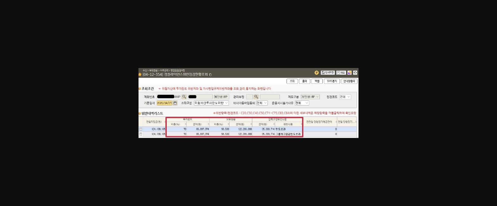
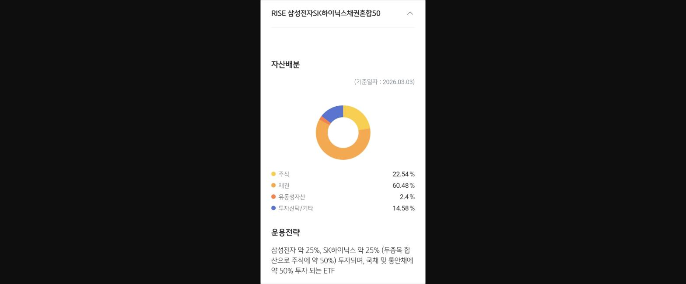
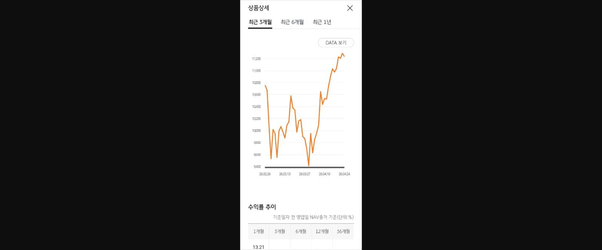
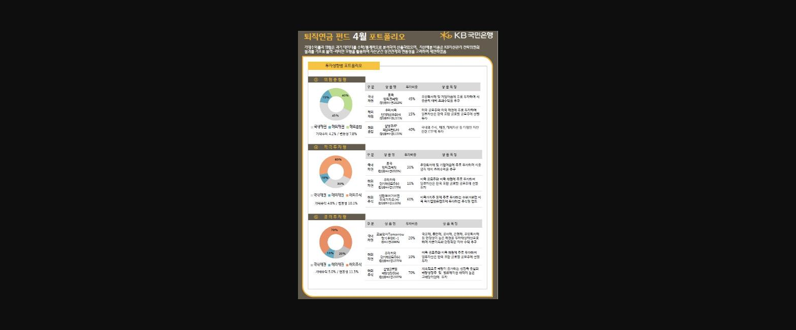
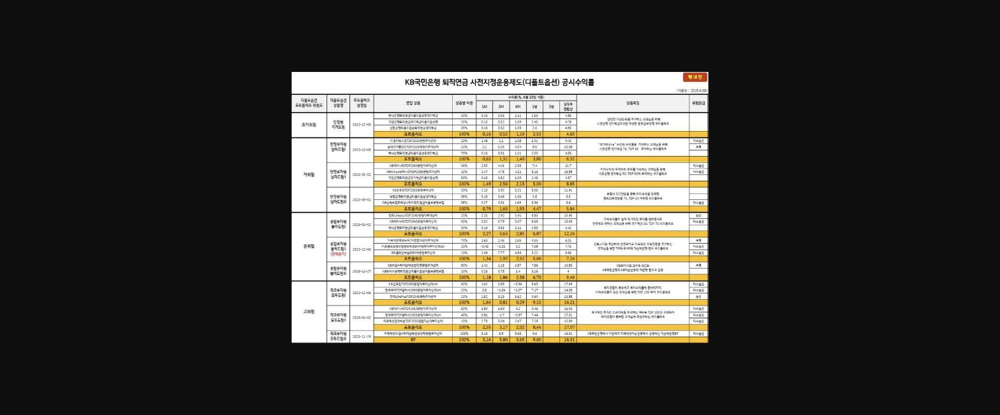
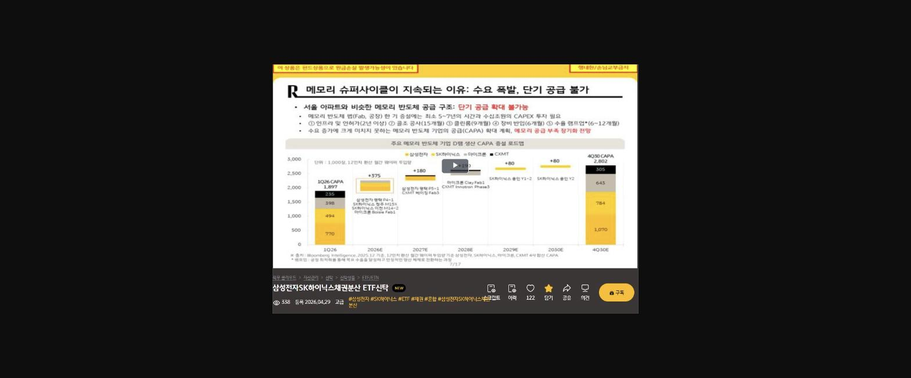

**◈ 퇴직연금 위험자산 투자한도 및 관리 유의사항 ◈**

**1. DC형 및 개인형 IRP**

♣위험자산(주식형·주식혼합형 펀드 및 ETF 포함) 투자한도 : 적립금의 최대 70%

☞ 디폴트옵션,TDF, 채권형·채권혼합형 ETF는 예외적으로 최대 100%까지 투자 가능

(※ KPI 반영 : 연금 고객수익률 산정 시 디폴트옵션(안정투자형·위험중립형·적극투자형) 상품은 가중치 1.2 적용)

> **이미지1 설명**: 위험자산 투자한도 안내 팝업 — 체크표시(✅) 상품은 퇴직연금 감독규정상 투자가능한도 70%로 제한되는 상품(주식형, 해외투자형 펀드 등)임을 안내.

> **이미지2 설명**: TDF 상품 리스트 캡처 — 마이다스기본적격TDF2050(3개월 수익률 12.83%), KCGI프리덤적격TDF2040(11.96%), KB온국민TDF2070(11.4%, 계열사) 상품 설명 및 수익률.

♣ 한도 초과 시 조치 방법

초과 금액을 정기예금 등 안전자산으로 교체매매 또는 추가입금 후 안전자산으로 운용지시

♣ 유의사항

투자한도 초과에 따른 별도 페널티 없음

==**2. DB형**==

- - 사용자별 전체 적립금 기준 위험자산 투자 70% 이내

**3. 위험자산 투자한도 초과 내역 확인 방법**

화면코드 : 컴플라이언스 위반점검 현황조회 [04-12-354] 화면에서 확인 가능

계좌번호 입력

기준일자 입력 (당일 또는 조회 희망일)

조회구분 → "위험자산투자한도위반" 선택

조회 버튼 클릭

☞ 확인 가능 항목

고객명 / 위반기준일 / 위반일수

한도초과상품 / 초과금액 / 보유가능금액

> **이미지3 설명**: 화면 [04-12-354] 컴플라이언스위반점검현황조회 화면 — 위험자산 투자한도 위반계좌 리스트, 투자한도 70% 초과, 그룹회고집중한도초과 위반내용 표시(개인정보 마스킹).

**4. 상품 추천 (운용 대안)**

☞ RISE 삼성전자·SK하이닉스 채권혼합50 ETF

♣위험등급 : 4등급 (보통위험)

♣ 운용전략

삼성전자 25%

SK하이닉스 25%

국내채권 50%

♣ 특징

채권혼합형 ETF로 변동성 완화 + 안정성 보완

분배금: 분기 지급 (1·4·7·10월 말 영업일)

투자한도: 최대 100% 가능 (채권형·채권혼합형 ETF 해당)

> **이미지4 설명**: RISE 삼성전자SK하이닉스채권혼합50 ETF 자산배분 도넛차트 — 주식 22.54%, 채권 60.48%, 유동성자산 2.4%, 투자신탁/기타 14.58%, 운용전략 설명.

> **이미지5 설명**: ETF 상품상세 최근 3개월 수익률 추이 그래프 — 기준가 9,400~11,200원대 등락, 1개월 수익률 13.21% 등 수익률 추이표.

> **이미지6 설명**: "퇴직연금 펀드 4월 포트폴리오" KB국민은행 자료 — 투자성향별(위험중립형/적극투자형/공격투자형) 포트폴리오 구성 도넛차트 및 상품명·투자비중·상품특징 표.

> **이미지7 설명**: "퇴직연금 펀드 4월 포트폴리오" KB국민은행 자료(동일 이미지 재게시) — 투자성향별 포트폴리오 구성 도넛차트 및 상품명·투자비중·상품특징 표.

> **이미지8 설명**: KB국민은행 퇴직연금 사전지정운용제도(디폴트옵션) 공시수익률표 — 초저위험/저위험/중위험/고위험 등급별 상품명, 1M/3M/6M/1년/3년 수익률 및 설정후 수익률, 위험등급 목록.

- ==*** 삼성전자SK하이닉스채권분산 ETF신탁 영상 첨부 (밑에 링크를 클릭해 주세요^^)**==

[==**https://lxp.kbstar.com/app/prep/hrdcloud/375143/detail**==](https://lxp.kbstar.com/app/prep/hrdcloud/375143/detail)

> **이미지9 설명**: 유튜브 영상 캡처 — "메모리 슈퍼사이클이 지속되는 이유: 수요 폭발, 단기 공급 불가" 삼성전자SK하이닉스채권분산 ETF신탁 관련 시황 설명 영상, 반도체 CAPA 증설 로드맵 그래프.