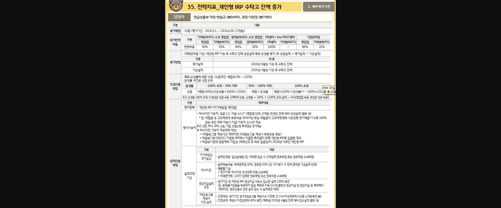
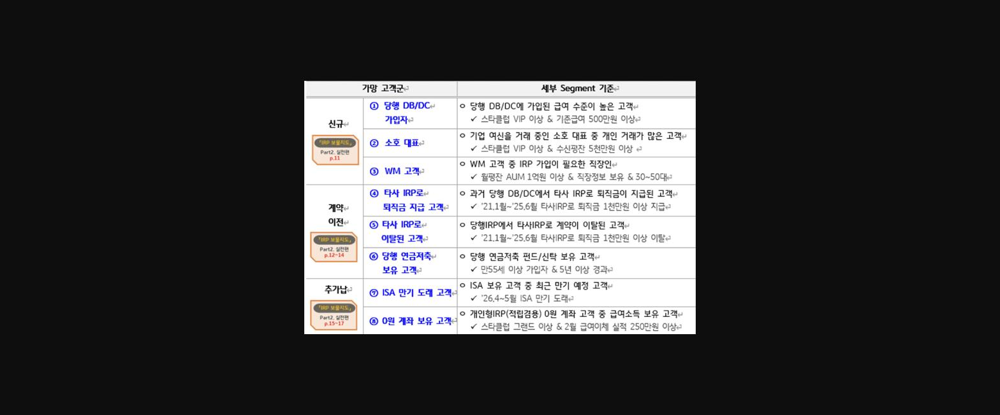

==**'26.上 KPI 전략지표「개인형IRP 수탁고 잔액 증가」 **==

> **이미지1 설명**: "35. 전략지표_개인형 IRP 수탁고 잔액 증가" KPI 평가지표 안내 문서 — 평가배점, 평가반영비율(지역본부/영업점별), 평가방법(가중 후 수탁고 잔액 증감실적), 득점산출법, 타사이전 가중치, 실적조정기준 상세 설명.

**★ 관리방안**

● 개인형IRP 고객관리(리밸런싱 대상)Target 리스트제공

문서번호 <2026.05.11 연금컨설팅부 69>

**-KPI 평가가중치**

타사이전가중치: 입금1.5, **지급△1.5*******

*단, 적립금 중 고유대계정 보유비율 50% 이상 또는 적립금이 고유계정대와 시중은행정기예금 주2)으로 100% 운영중인 계좌 이탕시 지급가중치 **△1.65**  적용

주2) 신한, 하나, 우리, 농협, 기업, 산업은행퇴직연금정기예금

● 경영 – 퇴직연금계좌보유명세 – 개인형IRP

**이탈방지**

- 금액 고액순으로 정렬하여 주기적인 고객관리 필요 (전담 및 상품리밸런싱 등)

● 퇴직연금 고액입금 관리

**입금된 퇴직금 해지방지**

- 퇴직금 고액입금 쪽지 수신시 고객접촉 하여 세금절세 및 상품운영 안내.

● 세액공제 추가 혜택을 위한 <ISA 만기자금 개인형IRP입금> 대고객 이벤트

문서번호 <2026.05.11 연금상품부 336>

- 본부 일괄 마케팅 메시지 발송

대상고객 전원 KB스타알림 발송

본부선정, 핵심가망고객, 대상 카카오 친구톡, LMS발송

**★ 신규/계약이전**

● 개인형IRP 신규/계약이전 영업점 Target 리스트제공

문서번호 <2026.04.07 연금컨설팅부 46>

> **이미지2 설명**: 가망 고객군 및 세부 Segment 기준표 — 신규(당행 DB/DC 가입자, 소호대표, WM고객), 계약이전(타사IRP로 퇴직금 지급/이탈 고객, 당행 연금저축 보유고객), 추가납입(ISA 만기도래 고객, 0원 계좌 보유고객) 등 8개 세그먼트별 기준 정리.

**9 . 세금우대조회 04-10-099 **

< 36- 연금저축 / 55- 퇴직연금(개인형IRP) >

**10. 부점별 계약내역조회 ( 04-51-314 )**

2010년~2021년 사이 연금저축 계약건 조회 <만 55세 이상 이면서 가입일로부터 5년 경과>

==**<u>나도 하자!! 계약이전!!</u>**==

<u>송현진</u>

▲ 대상물색하기

**★ 04-10-099 세금우대 조회**

36- 연금저축

55- 개인형 irp

<u> </u>

▲ 대상조건 알아보기

**<u>● 연금저축 → 당행 개인형 irp</u> 이전시**

- 만55세 이상 + 가입일로부터 5년이상 경과된 고객.

**<u>● 타기관 개인형 irp → 당행 개인형 irp</u> 이전시**

- 없음. (55세 미만 가능, 가입일 5년미만도 가능)

※ 연금수령요건 - 2013.3.1 이전에 가입 된 상품 5년 수령 가능/ 이후 10년 이상 수령

▲ 개설방법

◆ **당행 irp 미보유시**

**0원** 계좌 개설 후 계약이전

기 가입된 상품의 가입일 적용 가능

◆ **당행 irp 보유시**

- 연금 수령 고객 : 추가로 IRP **0원** 계좌 신규 후 계약이전

- 연금 미수령 고객 : 그대로 계약이전 입금. 단, 당행 irp 가입일 적용

▲ 실행하기

■ 06-12-501 후선업무등록

개인형irp 계좌이체 관리 – 개인형irp 계좌이체 신청(전입/전출)

<신청서 – 연금계좌 이체(취소)신청서> , 신분증

■ **스타뱅킹 경로**

스타뱅킹 – 메뉴 –퇴직연금 – 다른 금융사 연금 가져오기

▲ 마무리

★청약과 카드 유무 조회하듯이 세금우대조회(04-10-099) 습관화하기!!

-       현재 연금저축보험 약 2% 초반 (보험사별로 상이)

-       개인형IRP 정기예금 3년 3.8%/ 1년 3.46% (2026.05.13현재기준)

**계약이전 어렵지 않아요~ 안해봤을 뿐입니다!! 파이팅!!**