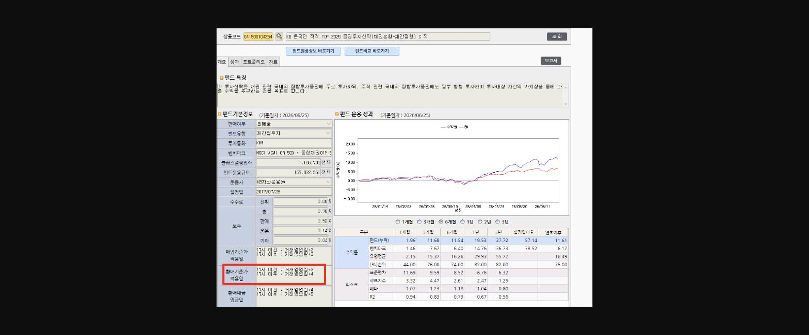
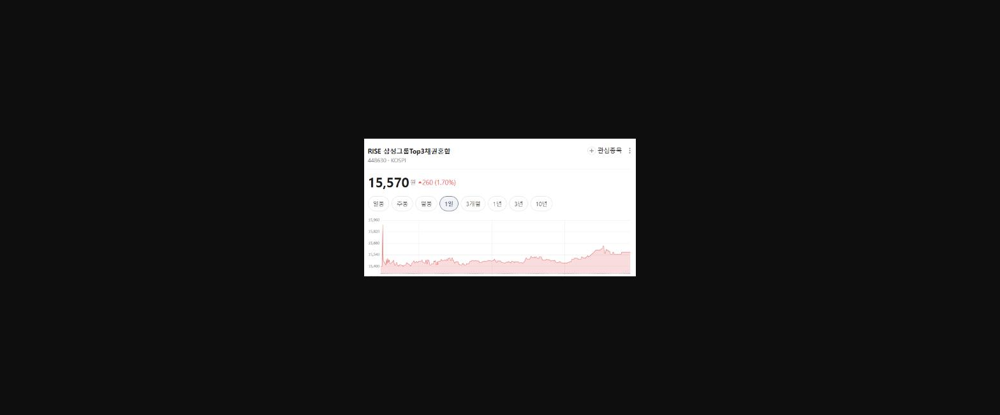
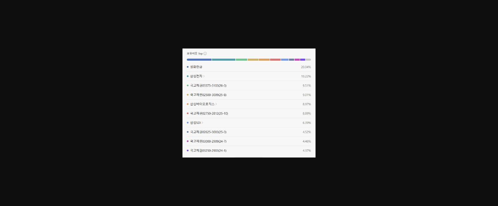
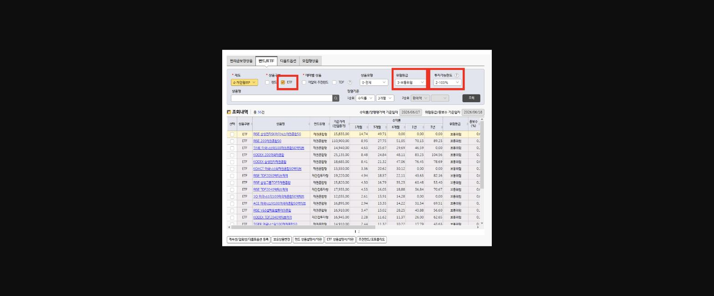

어마어마하게 커진 퇴직연금 시장

버스나 지하철 TV YOUTUBE 등 여러곳에서

퇴직연금 광고 등을 쉽게 접할 수 있는데요,

이에 따라 고객들도 퇴직연금 수익률에 대한 관심이 크고 ETF에 대한 관심도 그 어느때보다 뜨겁습니다!

고객님이 창구에 내점시

어떤 상품으로 운용지시를 해야할지 상담을 요청하시면

막연하게 위험자산은 전체 자산의 70%만 운용 가능하다고 알고 있어

ETF로 70%를 운용지시하고 나머지 30%는 정기예금 또는 TDF펀드로 운용지시를 해드렸습니다!

하지만 최근 아래 방법을 통해 ETF로 100% 투자하여

시장 급변시 좀 더 유연하게 대응할 수 있어

고객 만족도와 수익률 모두 좋아져 해당 방법을 공유하고자 합니다 :)

바로

**주식형/주식혼합형**** ****70% + ****채권형/채권혼합형**** 30% = 100% ETF 투자**

인데요!

---------------------------------------------------------------------------------------------------------

**■ 퇴직연금 운용상품 투자가능한도**

**▶원리금보장상품**

-일반 정기예금(저축은행 포함) 100%

**▶사전지정운용방법(디폴트옵션 상품)(DC/IRP 제도)**

-디폴트옵션 全 상품(초저위험, 저위험, 중위험, 고위험) 100%

**▶수익증권(펀드)상품**

-주식형 + 주식혼합형 = 70%

-채권형 + 채권혼합형 = 100%

**-주식형/주식혼합형 70% + 채권형/채권혼합형 30% = 100% 투자 가능**

※단, 채권형/채권혼합형 상품임에도 불구하고 일부 상품(예: 피델리티이머징마켓 등)은 투자 가능 한도가 70%이내로 제한될 수 있습니다.

TDF펀드로 운용해도 좋지만,

펀드보다는 조금 더 장점이 있는 ETF로 100%운용지시 해드리면

크게 두가지 장점이 있습니다!

1. **1. 장 변동성이 높을때 당일 가격결정이 가능**

> **이미지1 설명**: 펀드 상세정보 화면 — "KB 온국민 적격 TDF 2025 증권투자신탁(채권혼합-재간접형) C 적" 펀드기본정보(설정일 2017/07/25, 운용사 KB자산운용) 및 펀드 운용성과 그래프(수익률/BM 비교), 기간별 수익률·리스크(표준편차, 샤프지수, 베타) 표.

TDF 펀드의 경우

환매기준가 적용일이** T + 3 **일이라

실제 환매시 수익률이 많이 차이나는 경우가 있습니다!

반면 ETF는 오후 15:15분 이전 결재시 기준가 적용일이 당일입니다!

**■ ETF 매매거래 소요기간**

ETF매매/체결 시간 및 결제일은 아래와 같습니다.

※매수/매도 동일

-영업일 **00:05~08:00** 및 **08:00~15:15** 거래 시

⑴등록일 : **매매신청/체결완료**

⑵등록일+1영업일 : 대기

⑶등록일+2영업일 : 결제완료(현금)

-영업일 **15:15~23:55** 및 휴일 **00:05~23:55** 거래 시

⑴등록일 : 대기

⑵**등록일+1영업일 : 매매신청/체결완료**

⑶등록일+2영업일 : 대기

⑷등록일+3영업일 : 결제완료(현금)

**2. 생애주기에 맞게 '알아서'관리해드리는 묻지마 투자가 아닌, 편입자산 상세히 설명 가능**

TDF는 어디에 투자하는거에요?

고객님이 질문하면

운용사에서 생애주기에 맞게 알아서 관리해주는 상품으로 어디에 투자하는지는 안내드리지 못한다고 답변 드렸는데요 !

ETF의 경우 투명하게 편입 상품 등을 공개하고 있어

어떤 자산들을 담고 있는지 고객에게 자세히 안내하고 권유할 수 있습니다!

예를 들면, RISE 삼성그룹TOP3 채권혼합의 경우

삼성전자, 삼성바이오로직스, 삼성SDI 등의 편입주식 및

어떤 국채를 담고 있는지도 자세히 알 수 있습니다!

> **이미지2 설명**: RISE 삼성그룹Top3채권혼합 ETF 주가 차트 — 현재가 15,570원(전일대비 +1.70%), 1일 기준 일중 시세 그래프.

> **이미지3 설명**: ETF 보유비중 Top10 리스트 — 원화현금 20.04%, 삼성전자 19.22%, 국고채권 각 4~9%대, 삼성바이오로직스 8.97%, 삼성SDI 6.39% 등 구성종목 비중.

---------------------------------------------------------------------------------------------------------

운용지시 가능한 상품들은 어디서 조회할 수 있는지 공유드립니다!

**04-12-17A**** **

화면에서

**상품 구분 > ETF**

**위험등급 > 3등급 보통위험**

**투자가능한도 > 100%로**

검색하면

당일 장중매수, 장중매도가 가능한 ETF 상품들을 찾을 수 있습니다!

보통 채권혼합형의 경우 위험등급이 보통위험 이하의 상품들이기 때문에

위험등급을 3,4등급으로 조회하여 가능한 상품들을 조회할 수 있습니다

고객님들은 은행보다는 증권사가 퇴직연금 수익률이 좀 더 좋다고 생각하는 경향이 많기 때문에

정기예금 또는 펀드로 운용시 증권사로 이탈할 수 있는 가능성이 있습니다!

당일 실시간 가격 확인이 가능한 ETF를 최대한 활용하여

고객들의 퇴직연금을 관리하고 증권사로의 이탈을 방어하면 좋을 것 같습니다 :) 읽어주셔서 감사합니다!

> **이미지4 설명**: 화면 펀드/ETF 조회 화면 — 개인형IRP 제도, ETF 체크, 위험등급 3-보통위험, 투자가능한도 2-100% 필터, RISE 삼성전자SK하이닉스채권혼합50 등 36건 조회결과 및 기간별 수익률 목록.