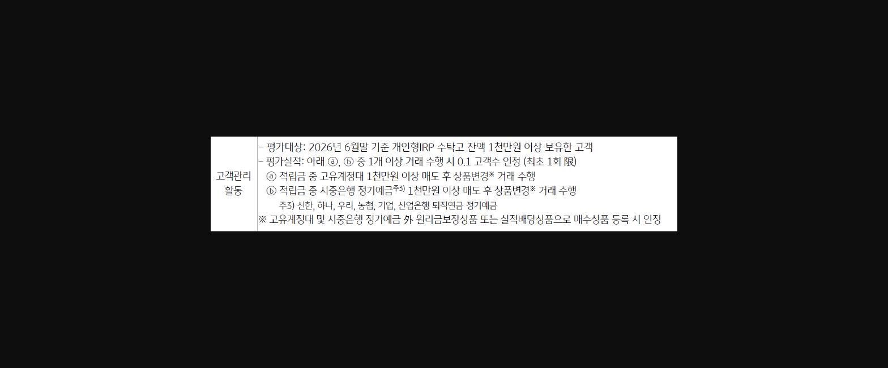
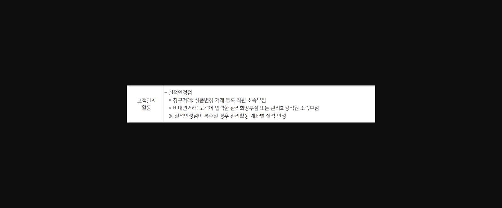
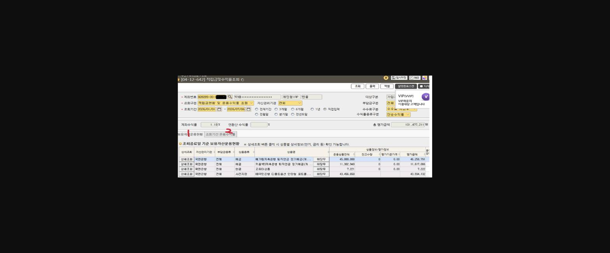
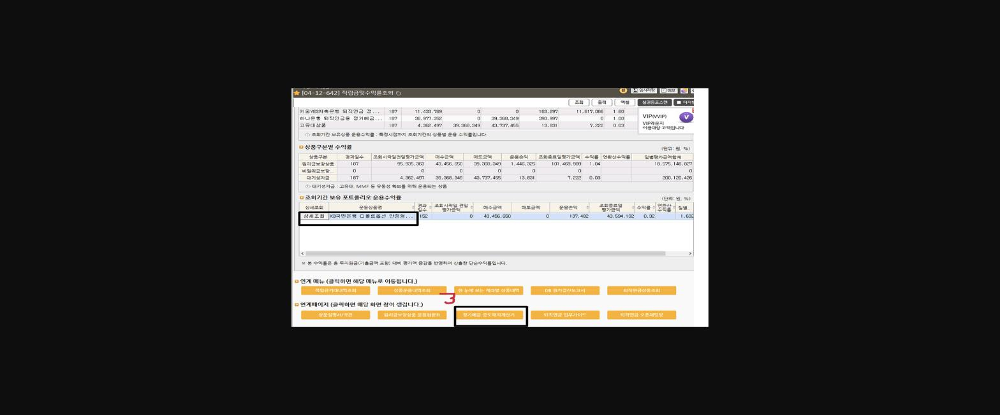
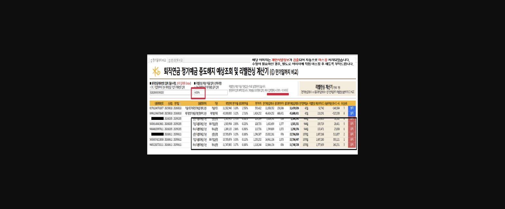

안녕하세요~강동구청역지점 원형미계장입니다.

하반기 개인고객 부분 개인형 IRP 고객수(배점30점) 평가지표 신설로 기존 개인형 IRP 고객관리 및 타행이탈 방어를 위한 수익률 관리등

중요성이 커졌습니다.

고객님의 운영안되고 있는상품의 상품변경을 통해 고객수익률도 올리고, WM고객 연금수익률 관리 득점, 타행이탈방어등 일타삼피 노하우를 공유하겠습니다. ~!

1. 1. 개인형IRP 고객수 30점 배점 신설
2. ㅇ 평가항목 개인형IRP 타사이전 입금/지급, 자기부담금 입금, 퇴직금 입금, 고객관리활동중

- * 고객관리활동 방법 공유

> **이미지1 설명**: KPI 평가체계 배점표 — 전략지표 개편내용, 신규채널전환, 준신영업, 신탁 및 대체투자, 실적목표 관련 항목별 배점(PG/RG 평가반영률 및 배정비율 100%), 개인고객 하단에 "개인형 IRP 고객수" 항목 강조표시.

> **이미지2 설명**: 고객관리 활동 평가기준 안내 — 2026년 6월말 기준 개인형IRP 수탁고 잔액 1천만원 이상 보유고객 대상, 고유계정대 또는 시중은행 정기예금 1천만원 이상 매도 후 상품변경 거래시 고객수 인정 기준(최초 1회 한).

> **이미지3 설명**: 고객관리 활동 실적인정점 기준 — 창구거래는 상품변경 거래 등록 직원 소속부점, 비대면거래는 고객이 입력한 관리희망부점 또는 관리희망직원 소속부점 기준, 복수일 경우 계좌별 실적 인정.

2.  평가대상고객 확인 ->

디폴트옵션 안정형(기업은행,하나은행,신한은행 3년제 상품보유) 해지 후 저축은행, GIC 로 상품변경시 중도해지에 따른 유불리 확인 방법

> **이미지4 설명**: 화면 [04-12-642] 적립금및수익률조회 화면 — 계좌수익률 1.18%, 평가금액 101,477,211원, 보유자산운용현황(예금·현금·사전지정 상품별 운용상품잔액 및 평가금액) 목록(개인정보 마스킹).

> **이미지5 설명**: 화면 [04-12-642] 적립금및수익률조회 화면(하단) — 상품구분별 수익률표(원리금보장상품/비원리금보장/대기성자금), 조회기간 보유 포트폴리오 운용수익률, 연계메뉴 및 연계페이지 버튼(정기예금 중도해지 예상조회기 등).

==   3번 연계 메뉴 정기예금 중도해지계산기 클릭하시면 ~==

> **이미지6 설명**: 퇴직연금 정기예금 중도해지 예상조회 및 리밸런싱 계산기 화면 — 상품별 원리금, 만기전이율, 중도해지이율, 만기가치 vs 중도해지평가액, 리밸런싱 예상가치 비교(개인정보 마스킹).

==        운영중이신 상품이 나오면서 고객님께 유리한 우선순위가 나옵니다.==

==         정기예금을 매도 하는 순서는  다음과 같습니다.==

==         1 분활인출 횟수가 적은 정기예금 계좌.==

==         2 최근 신규일이 빠른 정기예금 계좌.==

==         3 금액이 적은 정기예금 계좌.==

==         4 계좌번호가 빠른 정기예금 계좌.==

==          도움이 되셨으면 합니다  감사합니다.^^==