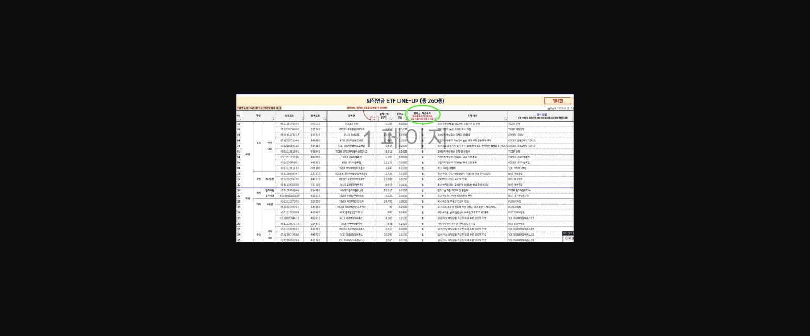
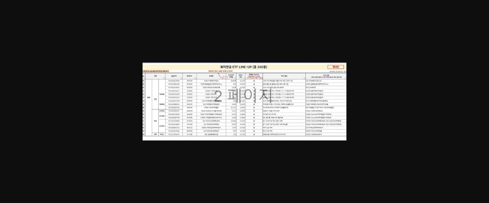
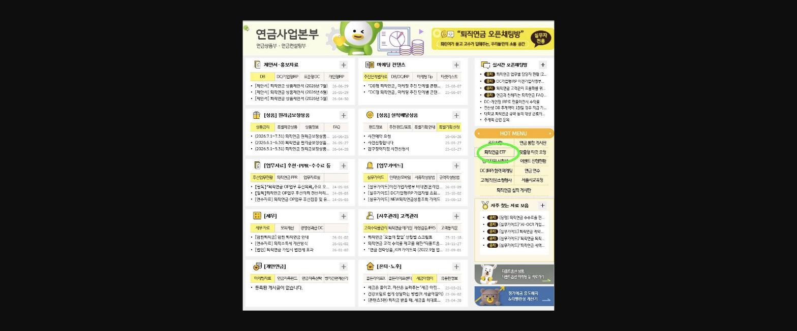
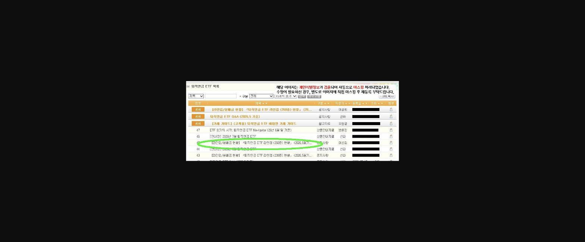
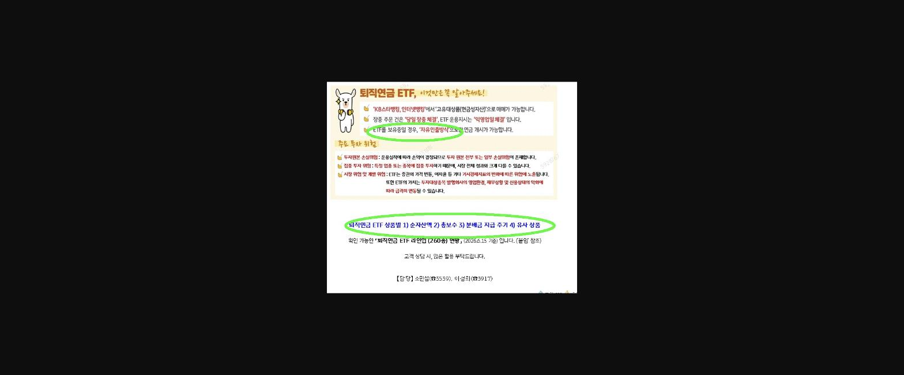

안녕하세요. PB 업무 2년차 홍대리입니다!

제가 오늘은 IRP 고객 응대시 쉽게 할 수 있는 방법에 대해 한 번 가지고 와봤는데요.

저의  IRP를 실질로 운용하고 있고 이런 방식도 고객에게 안내드리면 참 좋겠다라는 생각을 공유드리고자  간단하게 몇 자 적어 올립니다^^

고객님들이 IRP 리밸런싱 관련해서 내점하셨을때 보통 어떤상품을 권유하시나요?

주가가 좋은 최근까지는 인덱스나 반도체가 주로 들어있던 상품들을 안내를 많이 하셨을꺼에요.

==그러나 노후자금은 많은 수익을 내는것도 중요하지만 한편으로는 안정성을 가지고 가야되는데요.==

여기에 관련된 상품들 중에는 우리가 단순히 TDF상품으로 넣어서 자동 리밸런싱을 추구하는것도 좋지만 TDF상품들은 수수료가 운용사에 따라

약간 높은 경우가 대부분입니다. 그래서 고객님들에게 좀 더 좋은 상품을 추천드리고자 하는 경우에는  ==배당주 ETF ==로 추천드리는데요.

생각보다 저희 퇴직연금 상품의 라인업에 많은 배당주 ETF상품들이 있습니다.

==월,분기,년등 배당기간도 다양하고==  길게 갈수록 ==운용보수도 좀더 저렴한 ==상품들이 찾아보면  많이 있는데요.

이런자료들을 저희 연금상품부 퇴연자료실에 등재가 되어있어서 제가 한번 소개시켜 드리겠습니다.

> **이미지1 설명**: 퇴직연금 ETF LINE-UP(총 260종) 목록 일부 — 주식형/채권형 카테고리별 상품코드, 종목명, 순자산액, 보수율, 분배금 지급주기, 투자대상, 유사상품 정리표.

> **이미지2 설명**: 퇴직연금 ETF LINE-UP(총 260종) 목록 일부(채권형·해외자산 섹션) — 상품코드, 순자산액, 총보수, 분배금 지급주기, 투자대상, 유사상품 비교표.

제가 캡쳐해서 올린 상품들은 주로 ==월배당==으로 운용되는 상품들만 모아놨습니다.

당행에서 판매중인 RISE 밸류업 ETF 같은 경우에는 국내주식으로 구성되어있고 매달 15일마다 배당을 드리고 있습니다.

그리고 저의 포트폴리오에  들어있는 ACE 미국배당다우존스 같은 경우에는 10년이상 배당을 주는 코카콜라 같은  꾸준히 수익을 내는

기업체들로 구성되어있어

연 3.5~4%정도의 꾸준한 배당이 나오고 있습니다.

상품 선정은 고객님의 니즈나 취향에 맞춰서 고르셔서 선택하시면 될 것 같습니다.

국내 ETF는 매매차익에 대해서는 비과세이나 배당에 대해선 ==과세대상==이고

해외 ETF는 매매차익 + 배당부분 전부== 과세대상==이니 해외에서 안정적으로 운영되고 배당성향 높은 기업들이  있는

ETF를 잘 발굴해서 고객님의 포트폴리오에 넣어보시는건  어떨까요?

계속 적립하고 운용하시거나 자유인출방식으로 해놨을때에 연금지급 할 경우에도 안정적으로 이자를 받는것 처럼

분배금을 받으면서 재투자 할 수 있는 기회도 있으니 매력적이지 않나요?

단 주의하실부분은== IRP 금액지급이나 기간지급이 될 경우==에는 ==ETF를 전부 매도해야된다는 점==은 알고계셔야 합니다!

이 파일을 보시는 방법은요~

> **이미지3 설명**: KB국민은행 연금사업본부 인트라넷 포털 화면 — 제안서·홍보자료, 성장형 월지급상품, 성적배당상품, 업무가이드, 세무, 개인연금 메뉴 및 HOT MENU(퇴직연금 ETF 항목 강조 표시).

> **이미지4 설명**: 퇴직연금 ETF 목록 게시판 화면 — [라인업/분배금 현황] 퇴직연금 ETF 라인업(260종) 현황, ETF Q&A, 거래 가이드 등 게시물 목록(작성자 등 마스킹).

여기서 보시면 됩니다!!

주의사항은 밑에 잘 올려두셔서 캡쳐로 남겨드렸습니다.

상담하실때 참고 하시고 도움되셨으면 좋겠습니다.

> **이미지5 설명**: "퇴직연금 ETF, 이것만은 꼭 알아주세요!" 안내자료 — KB스타뱅킹/인터넷뱅킹에서 고유대상품(연금성자산)으로 매매 가능, 당일 장중 체결, 자유인출방식 안내, 주요 투자위험(손실위험/집중투자위험/시장위험) 및 ETF 상품별 확인사항(순자산액/총보수/분배금 지급주기/유사상품) 안내.

> **이미지6 설명**: 초록색 캐릭터 이모티콘(응원 폼폼 들고 있는 모습) — 게시글 장식용 이미지, 특별한 정보 없음.

읽어주셔서 감사합니다^^