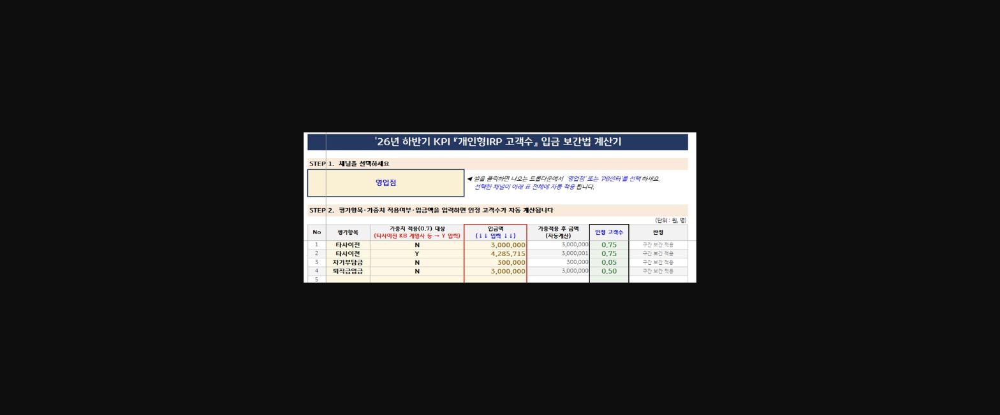
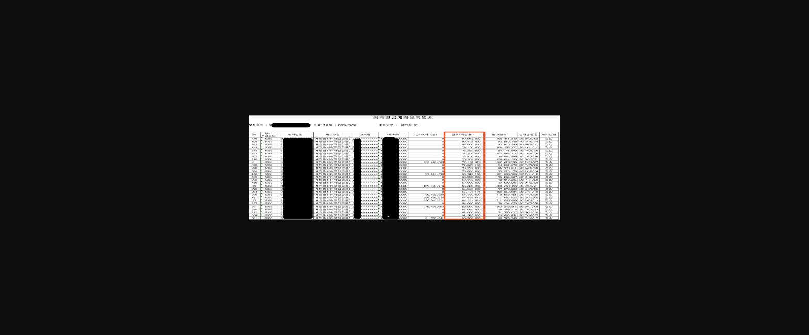
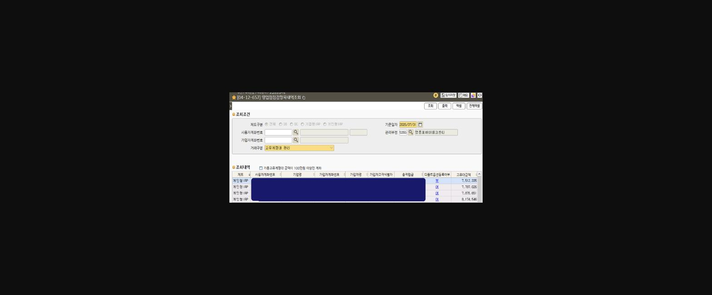
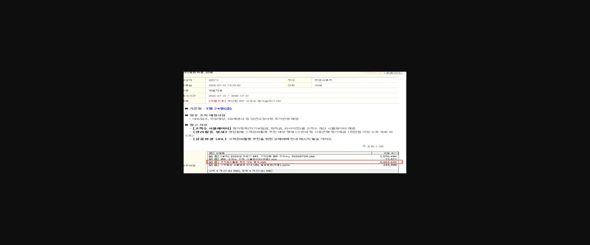
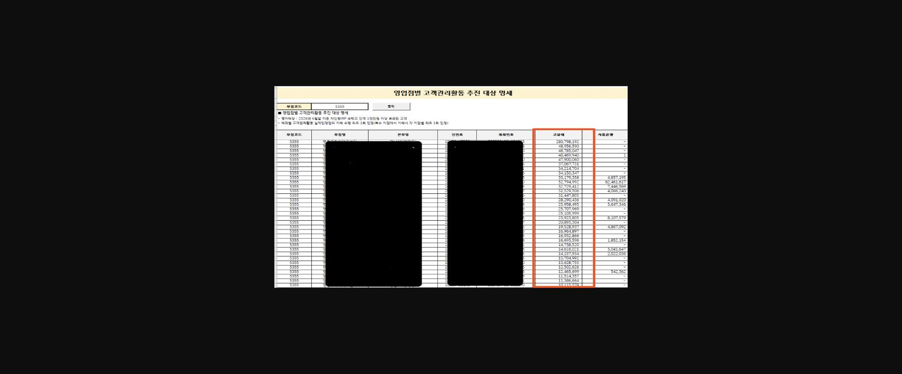
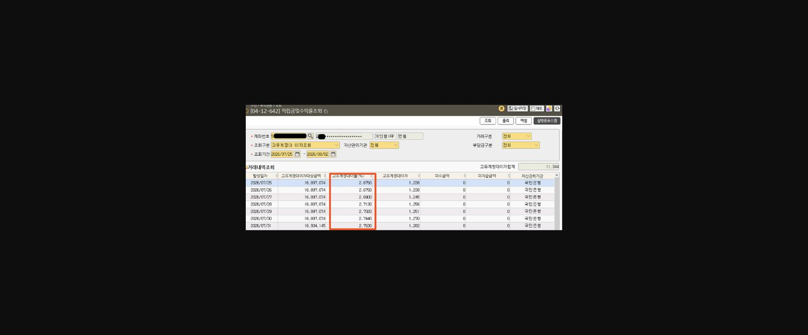
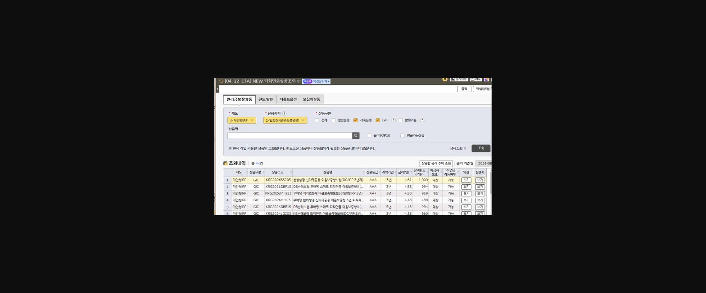
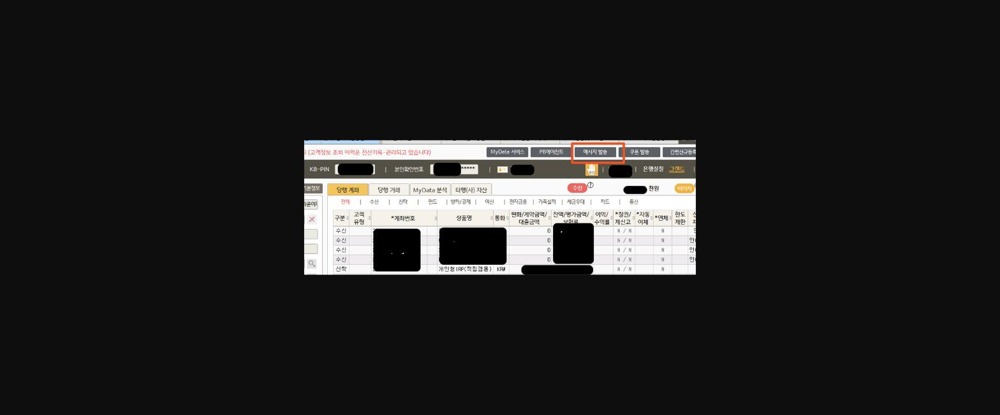
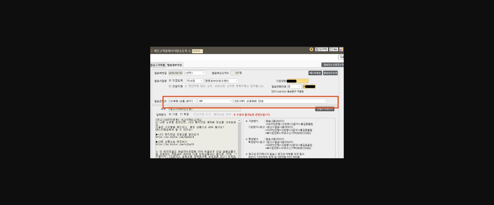

안녕하세요 요번부터 새로 편입된 IRP고객수 항목[30점 배점] 공략방법에 대해 세부적으로 파헤쳐서 <u>반기내 만점</u>을 받아보려고 합니다. 저만 알수없는 유익한 내용이라 함께 공유하고 싶습니다.

먼저, 이 개인형IRP고객수 항목은 최소 입금액을 채운 신규 인정 고객이 많으면 많을수록 고득점을 하게 되지만 워크샾을 하면서 여러가지 방면을 생각해 보아도, 저희 지점은 기업금융점포이다 보니 개인고객이 내점이 많지 않아 개인형IRP 신규계좌를 증가시키기 보다는 기존 보유계좌를 활용하는 방법을 생각해 보았습니다.

그러기에 앞서 각 항목별 **<u>실적기준이 되는 점수</u>**를 알아보겠습니다.

> **이미지1 설명**: '26년 하반기 KPI 「개인형IRP 고객수」 입금 보간법 계산기 — 채널(영업점) 선택, 평가항목별(타사이전/자기부담금/퇴직금입금) 가중치 적용여부·입금액 입력시 인정 고객수 자동계산 표.

◆  **기존 우리지점 적립용 가입계좌 활용하기**

(경영정보시스템 > 영업지원 > 실적관리 > 실적정보 > 수신상품 > 퇴직연금 > 퇴직연금계좌보유명세에서 추출)

> **이미지2 설명**: 퇴직연금 계좌보유명세 목록 — 제도구분(개인형IRP 확정급여형2), 고객명·KB-PIN·잔액(적립원본)·평가금액·신규년월일 목록(개인정보 마스킹).

우리지점 개인형IRP 적립겸용 계좌 접촉을 통해 고객수를 늘리는 방법이며, 접촉순서는 다음과 같습니다.(짧은시간안에 점수올리기에용)

①    <u>자기부담금 30만원 미만인 계좌 우선</u>

(30만원 미만인 계좌는 현재 0점, 30만원 입금하면 바로 0.05점 획득)

②    <u>올해 입금액이 없거나, 입금금액이 1800만원 미만인 계좌</u>

※     관련전산 : 04-12-644, 입금내역조회 / 06-12-151 올해 입금할 가입자한도가 있는지 확인, 02-12-223 연금개시된 계좌는 아닌지 확인(연금개시시 추가입금불가)

③    <u>이외에 모든 계좌</u>

당장 퇴직을 앞둔 고객이 아니면 퇴직금은 입금해줘라 마라 할수없기 때문에 적립겸용 위주로 접촉해 봅니다.

==참고로 퇴직금은 지점의 퇴직연금 담당자인 제가 가입직원들 퇴직급여지급신청서가 접수될떄마다, 개Irp 가입url을 발송드려 저희지점 IRP로 퇴직금 입금을 권해드리고 있습니다.==

◆  **기존 고유대과다고객(1천만원 ↑) 상품변경해주기**

점별 고유대과다계좌 조회는 04-12-657 화면에서도 조회되지만, 단기간 최다득점을 위해

> **이미지3 설명**: 화면 [04-12-657] 영업점검침항목내역조회 화면 — 제도구분(개인형IRP), 관리부점, 고유계정대 관리 거래구분, 조회내역(사용자계좌번호·기업명·가입자계좌번호·총적립금·디폴트옵션등록여부·고유대금액) 목록(개인정보 마스킹).

**[ Wisenet > Info Zone > KPI프로모션 > 핵심성과지표(KPI) > KPI개별지표 > [개별지표]개인형IRP 고객수 평가실적 ]**을 연금상품부에서 마케팅대상리스트를 친절하게 올려주셔서

점별로 어렵지 않게 추출할 수 있었습니다~

> **이미지4 설명**: KPI 개별지표 상세 안내 문서 — 작성자 김민수(연금상품부), "[개별지표] 개인형 IRP 고객수 평가실적(7.24)" 제목, 기준일 7월24일, 향후 조치 예정사항, 첨부파일 목록(2026년 하반기 KPI 개인형IRP 고객수.xlsb 등).

> **이미지5 설명**: 영업점별 고객관리활동 추진 대상 명세 표 — 부점코드 5355, 민번호·계좌번호·고유대금액·사용예정액 목록(개인정보 마스킹, 2026년 6월말 기준 개인형IRP 수탁고 잔액 1천만원 이상 보유고객).

여기서 또 모두 다 접촉하기는 <u>어렵고 1천만원 이상 보유계좌 중 1천만원 이상을 매도하여 저축은행 또는 TDF로 상품변경 시</u>(시중은행 정기예금 매수는 미인정)만 인정되기 떄문에 '고유대'라고 기재된 칸을 금액별로 내림차순해서,

금리가 상대적으로 낮은 상품 미운용자금을 금리높은 상품으로 운용지시해 드리겠다고 안내하여 내점하도록 하거나 유선으로 안내한 후 상품변경 링크*를 발송하여 직접 상품선택하실 수 있도록 안내하시면 됩니다.

참고로, 고유대 금리는 매일 변동되며 금일기준 2.76%

▷ 매일달라지는 고유대금리 확인하는 화면

> **이미지6 설명**: 화면 [04-12-642] 적립금및수익률조회 화면 — 고유계정대 이자조회 탭, 발생일자별 고유계정대이자상당금액 16,897,074원, 이자율 2.68~2.75%, 고유계정대이자 목록(개인정보 마스킹).

▷ 이번달 금리높은 예금금리 확인하는 화면

> **이미지7 설명**: 화면 [04-12-17A] NEW 퇴직연금상품조회 화면 — 원리금보장상품 탭, 저축은행/GIC 상품구분 체크, 상품명·신용등급·계약기간·금리·전매한도·예금자보호·IRP연금가능여부 목록(총 44건).

※     예금상품 금리는 월단위로 확정/변동 됩니다.(7/31일 매수시 8월금리적용됨 유의)

▷ 상품변경링크 발송하기(누르면 바로 로그인 후 상품변경화면 이동)

①    싱글뷰 open

> **이미지8 설명**: KB스타뱅킹 개인고객 계좌 조회 화면 — 당행 계좌 탭, 메시지 발송 버튼 강조, 수신/신탁 상품별 계좌번호·상품명·원금/계약금액·잔액/평가금액 목록(개인정보 마스킹).

②    url발송하기 선택 후 퇴직연금 > 상품변경하기 선택 또는

75-08-110. 개인고객용메시지발송등록 화면에서 고객정보 입력 후

> **이미지9 설명**: 개인고객용 메시지발송 등록 화면 — 발송예정일, 발송예상고객수 107명, 발송직원명, 발송콘텐츠(마케팀 상품_퇴직 IRP, DC/IRP 교체매매 안내), 메시지 본문 미리보기 및 발송방식 안내.

발송하기(SMS거절고객 및 마케팅거절고객앞 발송불가)

단, <u>고객이 URL을 통한 상품변경 시</u> 제가 문자를 발송했지만 제 이름이나 점코드가 자동으로 입력되지는 않기 때문에 고객이 **수기로** 꼭 저희 지점이나 제 이름을 입력해 주셔야 저희지점 실적으로 인정됩니다.

고객관리활동 항목은 ==**타지점 IRP보유계좌도 변경 시에도 **==우리지점 실적으로 인정되고, ==**실적인정점이 복수일 경우** 각 부점모두 실적인정되기때문에==

(예: A고객은 우리부점에서 1천만원 이상 여러번 상품변경했더라도 1번만 실적인정, 옆지점가서 또 1천만원 이상 또변경해도 옆지점에서도 1회 인정)

모든 고객들 대상으로 적극적으로 상품변경해드리고, **지점도 만점, 고객만족도도 만점, 내 리그테이블(리그는 1백만 이상 1P)도 만점** 모두 같이 동반 상승할수있습니다. ㅎㅎ

신규 편입되었지만 어렵지 않은 IRP 고객수 항목 다같이 쉽게 올려보아요

' 티끌모아태산 ' 제가 가장 좋아하는 말입니다~

> **이미지10 설명**: 토끼 캐릭터 이모티콘(폼폼 들고 응원하는 모습) — 게시글 장식용 이미지, 특별한 정보 없음.